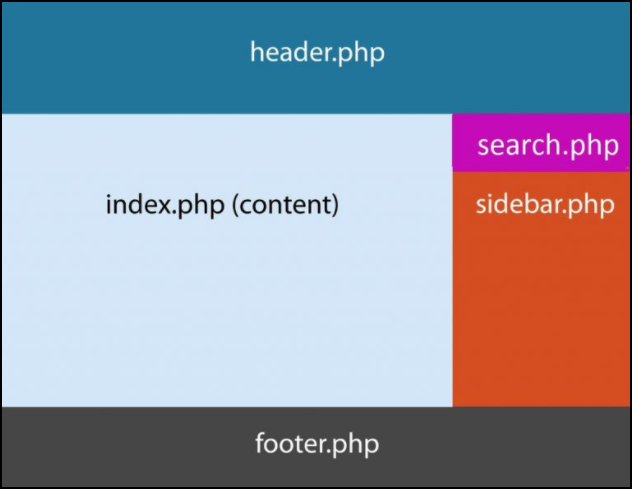

# Anatomia de um tema

Para podermos desenvolver um tema, nós temos que entender a estrutura do mesmo. Temos que saber como este tema será mostrado ao usuário.

Para entender a **anatomia** do tema temos uma imagem, no próprio site do wordpress, que explica o que queremos lhe mostrar. Veja imagem abaixo:

Quando você ver um site, desenvolvido em Wordpress, ele será subdividido em: header, footer, content, seach e sidebars. Nós mostramos o conteúdo com o index, mas podemos também mostrar com outros arquivos, o exemplo não é uma regra.

Podemos ter mais do que uma sidebar em uma mesma estrutura.

# Criando arquivos PHP referentes a anatomia

Sabendo da anatomia, basta que comece a criar os arquivos com os mesmos nomes presentes na imagem.

* header.php
* index.php
* footer.php
* search.php
* sidebar.php

Além destes arquivos, citados acima, existem outro arquivos que são reservados para o Wordpress, mas falaremos mais para frente.

O Wordpress irá reconhecer estes arquivos, porque fazem parte da estrutura defindida por ele. Apesar de existir uma estrutura pré-definida, você tem toda liberdade para criar a estrutura de pasta que quiser, de acordo com a sua regra de negócio. Somente o arquivo index.php deve estar na raiz.

Você pode, inclusive, copiar a mesma estrutura dos temas padrões do Wordpress, caso tenha alguma dúvida, mas o importante é você saber que existe uma anatomia e existem alguns arquivos corretos a serem criados.

Nós iremos criar cada parte desta anatomia, para que você possa entender melhor como cada uma delas funcionam dentro do Wordpress.