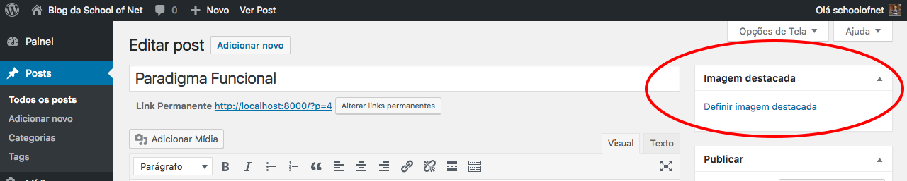

# Mostrando thumbnail

No módulo passado listamos os posts utilizando template tags. Isso foi uma evolução, em relação ao primeiro modo de listagem, mas vamos supor que queiramos melhorar a listagem e também acrescentar uma imagem a cada post. Isso é possível e iremos mostrar neste módulo.

Para inserirmos uma imagem para cada post existe a famosa **imagem destacada** que o Wordpress disponibiliza no painel administrativo. Esta imagem destacada não vem configurada por padrão, teremos que adicionar o suporte a esta funcionalidade para depois conseguirmos trabalhar com as **thumbnails**.

Para ativar as imagens destacadas, em nosso painel administrativo, teremos que criar um arquivo, que faz parte da estrutura padrão de temas Wordpress, chamado **functions.php**. Este arquivo serve para fazermos configuração para o nosso tema e também para criar nossas próprias função. Sempre que precisarmos criar uma função, para facilitar alguma tarefa de nosso site ou aplicação, é indicado que sejam criadas neste arquivo.

Depois de criar este arquivo teremos que adicionar o código abaixo:

```php
<?php
add_theme_support('post-thumbnails');
?>
```

Somente com esta linha já podemos atualizar a tela de edição ou adição de posts que já teremos esta opção na barra lateral. Veja imagem abaixo:



Não se assuste se a sua imagem destacada aparecer em outro local, geralmente ela aparece na última posição da barra lateral, mas nós arrastamos ela para primeiro, para você visualizar melhor. Caso você queira pode alterar as posições dos elementos na barra lateral apenas arrastando e soltando.

Também é possível configurar o tamanho da thumbnail padrão. Veja o código:

```php
<?php
add_theme_support('post-thumbnails');
set_post_thumbnail_size(120,120);
a
?>
```

Depois de tudo configurado nós adicionaremos uma imagem a um dos posts, faça este procedimento também em seu post teste e atualize. Você pode também criar um novo post com thumbnail, caso não queira atualizar.

# Listando posts com imagens

```php
<?php get_header(); ?>
<?php get_header('personalizado'); ?>

<div class="container">
    <div class="row">
        <div class="col-md-6">
            <?php
            if(have_posts()):
                echo '<ul class="media-list">';
                while (have_posts()) : the_post();
                    // Formando estutura da thumbnail com Bootstrap
                    $image = sprintf('<div class="media-left"><a href="%s">%s</a></div>',
                    get_the_permalink() , get_the_post_thumbnail());

                    // Formando estrutura de conteúdo com Boostrap
                    $body = sprintf('<div class="media-body"><h3 class="media-heading"><a href="%s">%s</a></h3><p>%s</p></div>',
                    get_the_permalink(), get_the_title(), get_the_content());

                    // Imprimindo estrutura completa de imagem com conteúdo
                    printf('<li>%s%s</li>', $image, $body);
                    echo '<hr>';
                endwhile;
                echo "<ul>";
            else:
                echo "<p>Ainda não temos post.</p>";
            endif;
            ?>
        </div>
        <div class="col-md-3">
            <?php get_sidebar(); ?>
        </div>
        <div class="col-md-3">
            <?php get_sidebar('personalizado'); ?>
        </div>
    </div>
</div>

<?php get_footer('personalizado'); ?>
<?php get_footer(); ?>
```

# Conclusão

Reparem que o Loop ainda é o mesmo, e as função iguais as anteriores. Somente uma função foi novidade neste módulo: `get_the_post_thumbnail()`.

Esta função nos retorna uma tag **img** completa vinda de cada post relacionado. Portanto se o post tiver uma imagem destacada ele irá retornar esta imagem, caso contrário retornará vazia. Em outro módulo iremos melhorar, para que não retorne nada quando não houver imagem, mas por enquanto queríamos apenas mostrar uma estrutura de conteúdo mais organizada e com thumbnails. Este objetivo foi atingido neste módulo.

O restante do código é implementação de Bootstrap, que não abordaremos neste conteúdo. Caso não tenha conhecimento de Boostrap você pode procurar este conteúdo na School Of Net, que você irá encontrar.

Partimos do princípio que conheca as funções **sprintf** e **printf**. Caso não saiba também pode procurar sobre as funções para que entenda o que foi feito no código acima.