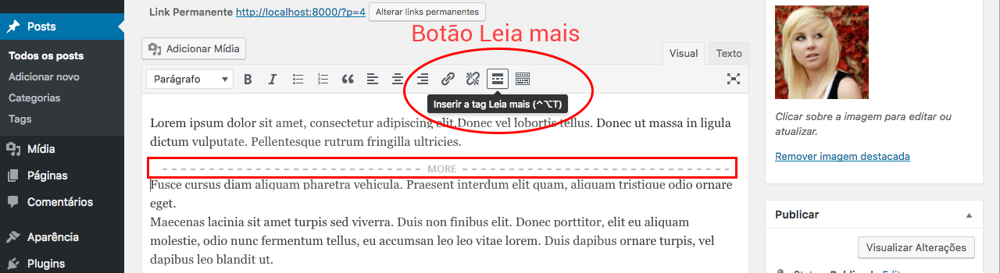

# Leia mais

Iremos reduzir o texto do conteúdo de acordo com o número de palavras que quisermos definir. Desta forma conseguimos manter um layout mais padronizado e fazer com que o usuário clique em um botão **leia mais** caso ele queira continuar lendo o conteúdo do post. Isso é muito comum em páginas de listagem de posts, porque não faz sentido listar todos os posts completos. Basta colocar um trecho do conteúdo para que o usuário saiba do que está falando e depois adicionamos um botão para acessar o conteúdo completo.

Antes de proceguir com o conteúdo iremos adicionar um título ao nosso exemplo, para que possa ficar mais visual, e organizada, a listagem dos posts. Veja trecho do código abaixo:

```php
<div class="container">
    <h3>Posts Recentes</h3>
    <div class="row">
        <div class="col-md-6">
```

Adicione, antes da **div class row**, um título, para que saiba onde começa listagem dos posts.

Agora que já adicionamos o título iremos ao que interessa a este módulo, que é a exibição de apenas uma pedaço do conteúdo. Não queremos que fique aparecendo o texto completo do post, imagine um texto muito grande sendo mostrado na íntegra? Não é o que queremos né? Então veja como é simples fazer esta edição com o Wordpress.

No painel administrativo edite algum post já criado. Dentro da tela de edição você vai encontrar o botão abaixo:



Veja que depois que clicamos no botão o Wordpress já insere uma separação no texto do post. Quando a função **get\_the_content()** que restaga o conteúdo do post ele verifica se não existe este recurso adicionado no painel administrativo, se existir ela oculta o restante do post e adiciona um link com a classe **more-link**.

O texto padrão que o Wordpress adiciona. no link. é **(mais...)**. Porém você pode configurar o texto que você quiser, basta inserir um parâmetro para a função, como no exemplo abaixo:

`get_the_content('Continue lendo...')`

O primeiro parâmetro que a função aceita é exatamente o texto de **leia mais**. Então desta maneira o Wordpress passa a imprimir o que você passou como parâmetro e não mais o padrão.

Você pode configurar o leia mais, no editor, em qualquer local do texto que você quiser, basta colocar o cursos no local exato onde quer que esteja o botão de leia mais. Cada post terá uma posição de acordo com o que você configurar.

Faça o teste em todos os seus posts, inserindo em cada post um local diferente.

Desta forma você irá fixar tranquilamente este recurso do Wordpress.

Não esqueça também de inserir o parâmetro para a função **get\_the_content**, para alterar o valor padrão do link do botão.