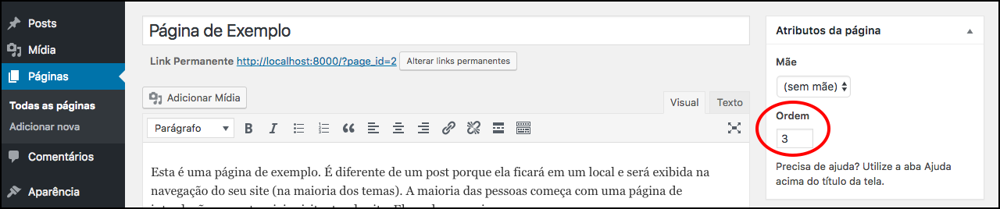

# Mostrando páginas no menu

Agora iremos finalmente adicionar as páginas, criadas no painel administrativo, ao menu, que criamos no módulo anterior.

Para exemplificar melhor, nós criamos mais duas páginas, além da página de exemplo que já vem com a instalação do Wordpress. Criamos: contato e Cursos.

Utilizando a estrutura anterior, basta que acrescentemos as tags **li** dentro da tag **ul**, que deixamos vazia no exemplo anterior.

Nós iremos comentar a chamada do arquivo **header-personalizado.php**, para que você possa brincar depois com os exemplos. Estamos comentando para que este exemplo não fique muito poluído.

# Forma manual de criar o menu

```html
<ul class="nav navbar-nav">
    <li><a href="?p=14">Cursos</a></li>
    <li><a href="?p=16">Contato</a></li>
</ul>
```

Desta forma acima nós conseguimos criar o menu, mas teríamos que ficar verificando, no painel, qual o ID de cada página para criar manualmente. Porém não é nada funcional e muito menos dinâmico.

O Wordpress disponibiliza uma forma para que fique dinâmica a criação, ou seja, assim que criar a página no painel, ela já aparece direto no site, assim que for recarregada a página. É o modo que iremos ensinar agora.

# Forma dinâmica de criar o menu

```php
<ul class="nav navbar-nav">
    <?php
        $pages = get_pages();
        foreach ($pages as $p):
            $link = get_page_link($p->ID);
            $title = $p->post_title;
            printf('<li><a href="%s">%s</a></li>',$link,$title);
        endforeach;
    ?>
</ul>
```

Desta forma já estamos tendo as páginas de uma forma dinâmica. Reparem que primeiro pegamos todas as páginas existentes com a função **get\_pages**, depois só fazemos um foreach para percorrer todas as páginas e listá-las com os links. Os links são resgatados pela função **get\_page_link**, onde passamos o ID da página.

Mas você pode se perguntar, se existe uma forma de ordenar estas páginas. Nós falamos que sim, basta passar o array de configuração para a função get_pages. Vejam as formas de ordenação possíveis, de acordo com a documentação:

```php
<?php
// Ordenando por ordem alfabetica
$pages = get_pages(array(
    'sort\_column' => 'post_title',
    'sort_order' => 'asc' // ou desc
));

// Ordenando por ordem de menu
$pages = get_pages(array(
    'sort\_column' => 'menu_order',
    'sort_order' => 'asc' // ou desc
));
?>
```

Lembrando que para utilizar a ordenação por ordem de menu, você deverá configurar a ordem no painel administrativo de acordo com a imagem abaixo:



Você pode pesquisar os parâmetros possíveis pesquisando no codex a função get_pages. Nós deixaremos a função sem parâmetro, para pegar o modelo padrão, que será por ordem alfabetica.

Para partirmos para outro próximo conteúdo pedimos que crie uma página chamada PHP, no painel administrativo, para testar se a mesma irá aparecer no menu. Caso apareça está tudo correto e podemos ir para o próximo módulo.