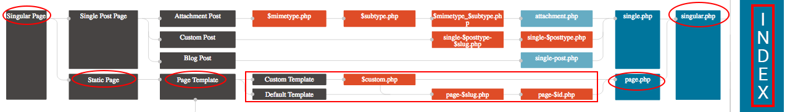

# Hierarquia de template

Um dos assuntos mais importantes, quando falamos em criação de temas, é a hierarquia de templates.

O Wordpress irá avaliar toda estrutura e hierarquia de templates antes de montar a página. Você pode ler com mais calma a documentação no link abaixo:

<https://developer.wordpress.org/themes/basics/template-hierarchy/>

De qualquer forma iremos tentar resumir o conceito básico neste módulo.

Para entendermos tente imaginar você acessando um site Wordpress. Logo que você coloca a url no browser e acessa ele já faz a primeira verificação de hierarquia. Até ai tudo bem, ele irá mostrar a home do site, de acordo com a nossa configuração. E na maioria das vezes ele ira utilizar o arquivo index.php para mostrar esta home.

Para entender melhor existe um diagrama, que foi criado pelos desenvolvedores do framework, que você pode consultar mais facilmente o fluxo. Deve analisar da esquerda para direita qual o rumo que a hierarquia leva e as considerações que o Wordpress faz ao escolher o template a ser mostrado.

Você deve analisar a hierarquia completa no link abaixo:

<https://wphierarchy.com>

Como falamos é um assunto muito importante e neste link existe a hierarquia completa, iremos mostrar o nosso caso, em específico na imagem abaixo para que possa entender:

Na imagem acima mostramos todo o caminho que foi percorrido até chegar no index.php e mostrar nossas páginas estáticas. Caso nós tivéssemos criado algum template anterior o Wordpress iria parar e executar, mas como ele não encontrou nenhum caso ele vai até chegar no index.php.

Por este motivo falamos, bem no início do conteúdo, que o index.php é o template mais importante do Wordpress e não é a toa que ele é obrigatório em seu tema. Porque qualquer falta de arquivo ou erro encontrado o index.php é acionado. Basta analisar a hierarquia no site acima e verá que todos os caminhos levam ao index como fechamento de processo.

No próximo módulo iremos mostrar como criar um template para página estática e você verá que o Wordpress não chegará mais no index, porque ele encontrará este template no meio do caminho e o mostrará.