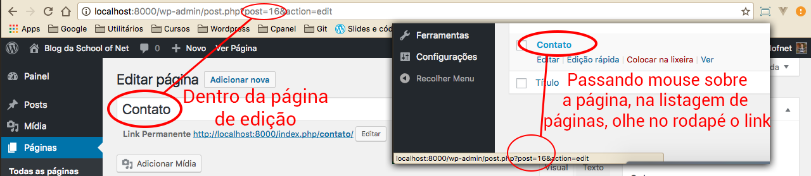

# Template para páginas estáticas

No módulo passado, falamos sobre a hierarquia de templates. Acredito que vocês tenham entendido que o Wordpress trabalha com um processamento hierárquico, até a escolha final do template a ser exibido.

Como estamos falando de páginas estáticas, criaremos um template chamado **page.php**. Assim, todas as páginas estáticas utilizarão este template para exibição dos conteúdos. O **index.php** não será utilizado como estrutura final.

Copiaremos o conteúdo do index.php, mas faremos alterações, para agilizar o processo. Façam o mesmo.

# Arquivo page.php

```php
<?php get_header(); ?>
<?php //get_header('personalizado'); ?>
    <div class="container">
        <h3><?php single_post_title(); ?></h3>
        <div class="row">
            <div class="col-md-9">
                <?php
                if(have_posts()): the_post();
                    the_content();
                else:
                    echo "<p>Ainda não temos post.</p>";
                endif;
                ?>
            </div>
            <div class="col-md-3">
                <?php get_sidebar(); ?>
            </div>
            <!--<div class="col-md-3">
                <?php //get_sidebar('personalizado'); ?>
            </div>-->
        </div>
    </div>
<?php //get_footer('personalizado'); ?>
<?php get_footer(); ?>
```

As mudanças foram:

1. Colocamos o título, dinamicamente, utilizando a função `single_post_title();`.
2. Alteramos o loop, deixando apenas o **if** e utilizando a função `the_content();`, que já imprime todo conteúdo pra nós.
3. Comentamos todo código desnecessário, para que possamos testar depois. Não utilizaremos mais, daqui pra frente.
4. Alteramos a estrutura de colunas do Bootstrap, deixando 9 colunas para o conteúdo e 3 colunas para sidebar, mantendo a proporção de 12 colunas.

Agora, toda e qualquer página estática, não utilizará mais o arquivo index.php, mas sim o arquivo page.php. Existe uma maneira de criar outro template, para que atenda uma página em específico, antes de chegar no template page. Vejam a imagem abaixo:


Notem que, antes do template page, existem duas estruturas: **page-$slug.php** e **page-$id.php**. Lembrem-se que, a hierarquia deve ser analisada da esquerda para direita.

Criaremos primeiro, um arquivo utilizando o ID para vocês verem que ele será mostrado antes do template page e em seguida, criaremos um outro template com slug, para vocês observarem que ele será mostrado antes do template com ID e o template page. É um ótimo exemplo para que vocês entendam a hierarquia.

# Arquivo page-16.php

```php
Página personalizada de contato por ID
```

Em nosso exemplo, a página de contato tem o ID 16, por isso criamos este arquivo com o número 16. No projeto de vocês pode ser que tenha outro ID. Vocês devem criar com o ID da página correta. Assim, somente a página **contato** que tem o ID **16**, utilizará este template, o restante das páginas estáticas continuarão utilizando o template **page**.

Para descobrir o ID de uma página, acessem o painel administrativo em **Páginas** e sigam como a  imagem abaixo:



Depois de criado o arquivo acima, acessem o navegador e atualizem a página contato ou acessem-na. Vocês verão a alteração, porque uma nova página será exibida. Em seguida, acessem outra página, para checarem que continua sendo exibida a page.php.

# Arquivo page-contato.php

Depois de criarmos o arquivo com ID, criamos o arquivo com slug, para observarem a hierarquia funcionando. O template a ser mostrado deverá ser com slug, porque vem antes, na hierarquia.

```php
Página personalizada de contato por slug
```

Desta forma, conseguimos mostrar a hierarquia funcionando. Se apagarmos o arquivo **page-contato.php** o Wordpress mostrará o **page-16.php** e, se apagarmos este também, ele voltará a mostrar o **page.php**. Se, por acaso, quiserem apagar o page.php, para testarem, verão que ele retornará ao index.php.

Observem que, se existe, o template mostra. Se não existe, busca um substituto. Este é o conceito de hierarquia do Wordpress.

Com este conceito, vocês conseguem customizar uma página específica sem alterar o layout padrão de todas as outras páginas.