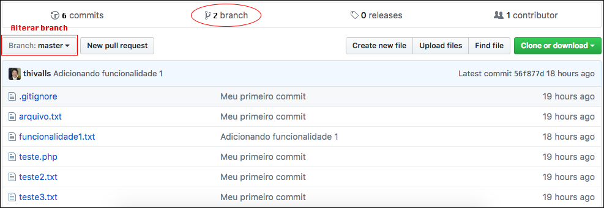

# Dando push em outro branch

Agora que já fizemos o push normal, enviando o branch master para o repositório remoto, ensinaremos como enviar um novo branch.

Temos, em nosso exemplo, um branch chamado **funcionalidade1**. O procedimento é acessar este branch e, em seguida, dar um push deste repositório, para o Github.

`$ git checkout funcionalidade1`

Depois de acessarem, rodem o push.

`$ git push origin funcionalidade1`

Após rodarem o push, teremos a seguinte mensagem do Git.

```
Total 0 (delta 0), reused 0 (delta 0)
To https://github.com/schoolofnetcom/git-code-education.git
 * [new branch]      funcionalidade1 -> funcionalidade1
```

Vejam que ele informou que foi enviado de funcionalidade1 local para funcionalidade1 remoto. Quando não existe o branch, ele cria, automaticamente. Vocês poderiam colocar outro nome no repositório remoto, caso quisessem, mas não é muito indicado, para não haver confusão.

Depois de terem enviado, vamos conferir se, realmente, o branch foi criado, remotamente.



Na imagem, mostramos os dois branchs criados e onde vocês podem alterar o branch online.

Vocês já sabem como enviar seus branchs para o repositório remoto. Daremos continuidade ao conteúdo.