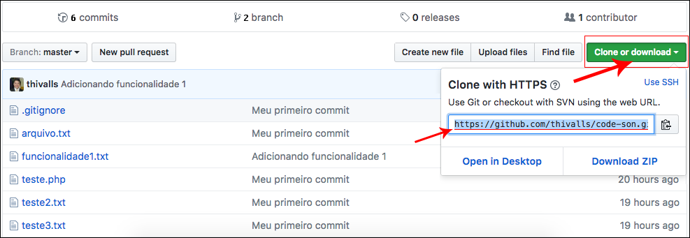

# Fazendo clone

Neste módulo, mostraremos como fazer um clone de um repositório e para que ele serve.

Vamos supor que vocês, por engano, apagaram o repositório local, ou estão em outro computador e precisam daquele repositório. Para exemplificar esta situação, apagaremos a pasta **aulagit**, que criamos como exemplo.

`$ rm -rf aulagit`

Desta forma, não existe mais nenhum arquivo em nosso repositório na nossa máquina. Para termos, novamente, precisaremos baixar do repositório remoto. Para isto que serve o comando **clone**.

Para conseguirmos rodar o comando, precisaremos do link de clonagem, que é fornecido pelo próprio Github.



Todo repositório terá um link para clonagem e vocês podem encontrá-lo na imagem acima.

Existem dois modos para fazermos a clonagem:

1. Utilizando https
2. Utilizando ssh

No repositório remoto vocês terão o link, para ambos. Com estes dados, vocês podem escolher qual formato preferem. Na maioria das vezes, o mais utilizado é o protocolo **https**, porque o ssh nem sempre está configurado, ou às vezes, pode estar bloqueado pelo proxy.

`$ git clone https://github.com/schoolofnetcom/git-code-education.git` ou `$ git clone https://github.com/schoolofnetcom/git-code-education.git aulagit`

Observem que, colocamos dois exemplos: um com parâmetro e outro sem parâmetro, depois da URL. Este parâmetro é para dar um nome à pasta da clonagem, caso não passem nada, vocês terão o mesmo nome do repositório.

Para clonarmos o repositório, utilizamos o primeiro comando, sem parâmetro, e obtivemos a seguinte mensagem:

```
Cloning into 'git-code-education'...
remote: Counting objects: 7, done.
remote: Compressing objects: 100% (3/3), done.
remote: Total 7 (delta 1), reused 7 (delta 1), pack-reused 0
Unpacking objects: 100% (7/7), done.
Checking connectivity... done.
```

Clonar um repositório é relativamente fácil, mas se rodarem o comando **git branch**, verão que, na clonagem só veio o branch master. Existe um outro branch, que deveria fazer parte do clone, agora mostraremos o detalhe.

Quando vocês rodam o comando git branch, sempre virão, somente, os branchs que estiverem, localmente. Mas, vocês podem ver os branchs remotos, também. Basta acrescentarem o parâmetro **-a** no comando. Neste caso, vocês terão os branchs locais e remotos.

`$ git branch -a`

```
* master
  remotes/origin/HEAD -> origin/master
  remotes/origin/funcionalidade1
  remotes/origin/master
```

Observem que ele mostra os branchs locais e os remotos. Sabendo destes dados, podemos fazer a ligação de um branch local com um branch remoto.

Primeiro, vocês devem criar o branch, normalmente, no repositório local, como já aprenderam, só que o comando deve receber um parâmetro a mais, que é o branch que vocês desejam ligar com o repositório remoto. Vejam o comando:

`$ git checkout -b funcionalidade1 origin/funcionalidade1`

Vejam que o comando retorna a mensagem, informando que o branch foi criado de acordo com o branch remoto.

```
Branch funcionalidade1 set up to track remote branch funcionalidade1 from origin.
Switched to a new branch 'funcionalidade1'
```

Se vocês rodarem um `$ ls` já listará os arquivos que estiverem dentro do branch funcionalidade1, mas não, necessariamente, os arquivos do branch remoto, funcionalidade1, estarão dentro desta pasta. Temos como garantir que todos os arquivos do branch remoto estejam no branch local, rodando o seguinte comando:

`$ git pull`

Este comando verifica se todos os arquivos já estão sincronizados, se não estiverem, ele atualizará.

Temos dois branchs locais e mais dois branchs remotos. Para terem certeza destas quantidades e informações, rodaremos, novamente, o comando **git branch -a**.

`$ git branch -a`

E teremos o seguinte resultado:

```
* funcionalidade1
  master
  remotes/origin/HEAD -> origin/master
  remotes/origin/funcionalidade1
  remotes/origin/master
```

Podemos concluir que, existem os mesmos branchs locais, no repositório remoto e, o comando ainda traz a informação de que o branch remoto principal, é o master, porque ele mostra que o **HEAD** está apontando para o **origin/master**.

Agora vocês já conseguem clonar, completamente, qualquer repositório do Github.