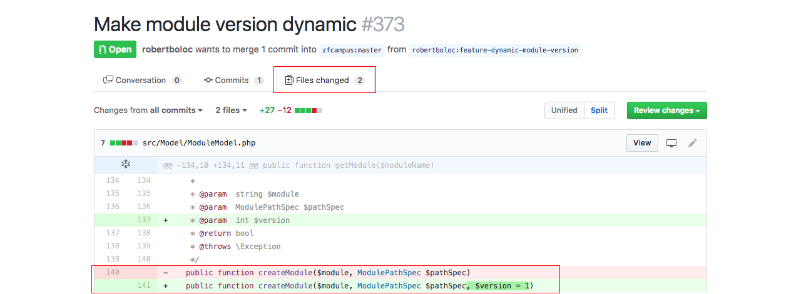

# Github - Dicas gerais

Queremos mostrar algumas dicas gerais do Github para que você possa trabalhar da melhor forma possível com a ferramenta.

Vai ser muito comum, quando se trabalha em equipe, que alguém peça que você faça um **Pull Request**.

Imagine que o nosso repositório de exemplo seja um projeto e que disponibilizamos online, como um projeto open source. Assim que disponibilizamos tiveram outros desenvolvedores interessados no projeto e quiseram contribuir com a melhoria do mesmo.

Este desenvolvedor pode contribuir com o projeto, mas a princípio ele não terá como fazer alterações diretamente no projeto, a não ser que você de permissão a ele, mas não aconselhamos que isso seja feito. Por este motivo que existe o pull request.

Para começar a contribuir com um projeto no Github, em primeiro lugar, precisamos dar um **Fork**. Quando damos um Fork estamos criando uma cópia do repositório, que nos interessamos, para a nossa conta do Github.

A partir do fork, nós podemos fazer qualquer alteração que quisermos porque este é o nosso repositório. E depois das alterações nós podemos enviar um pull request para o repositório original do projeto que demos o fork.

O dono do repositório irá comparar o código original dele com suas alterações e se ele achar que foi válido ele vai aceitar seu pull request dando um **merge** no repositório dele. A partir daí suas implementações farão parte do repositório original e você já contribuiu com sua parte.

Na primeira imagem nós mostramos um exemplo, de um repositório qualquer, que possuem 3 pull requests. Isso quer dizer que são 3 colaboradores querendo aplicar modificações, ou melhorias, no projeto.

Na segunda imagem mostramos uma parte das alterações que foram feitas. Seria estas diferenças que o dono do repositório iria avaliar, e caso seja válida a mudança ele aprovaria e faria o merge com seu repositório principal. Isso é uma forma de permitir que outras pessoas melhores seus projetos e de uma forma segura. Caso você identifique qualquer código malicioso você só precisa recusar o pull request, mas caso seja uma melhoria sadia, você pode aprovar sem problema algum.

Existe uma maneira de você acompanhar todas as alterações e evoluções de um projeto no Github, basta você selecionar o **watch** e o **star**. Com isso você está dizendo para o Github que você se interessa por aquele repositório e que cada alterações que ele tiver você quer ser informado.

Estas são as dicas básicas para que você consiga trabalhar com o Github, não só como um repositório para seus projetos, mas como uma comunidade que pode ser ajudar e melhorar os códigos uns dos outros.