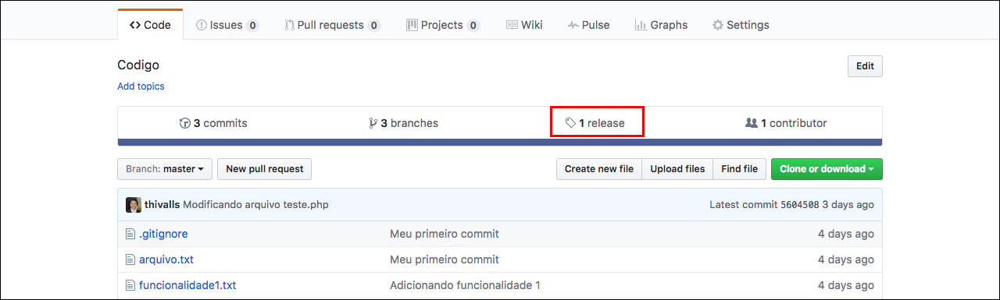

# Trabalhando com tags

Neste módulo vamos falar sobre as tags e como elas podem ser úteis.

Tags são marcadores e funcionam como releases de nosso projeto, ou seja, versões. A cada nova versão podemos gerar uma tag e desta forma as pessoas conseguem ter acesso a versões anteriores ao projeto.

Tags podem ser vistas como ponteiros que apontam para um determinado commit. Quer dizer que uma determinada tag aponta para um determinado commit e sua atual situação e arquivos.

### Gerando a primeira tag

Acesse o branch master do seu projeto e rode o seguinte comando.

```
$ git tag 0.1.0
$ git tag -l
```

O primeiro comando gera a tag e o segundo lista todas as tags que existirem localmente.

Subindo a tag para geração do release/versão:

`$ git push origin master --tags`

Desta forma estamos subindo todas as tags locais para o repositório remoto.




Você pode ver na imagem que existe a opção de baixar a versão no formar zip e tar.gz e isso vale para todas as demais versões que você criar.