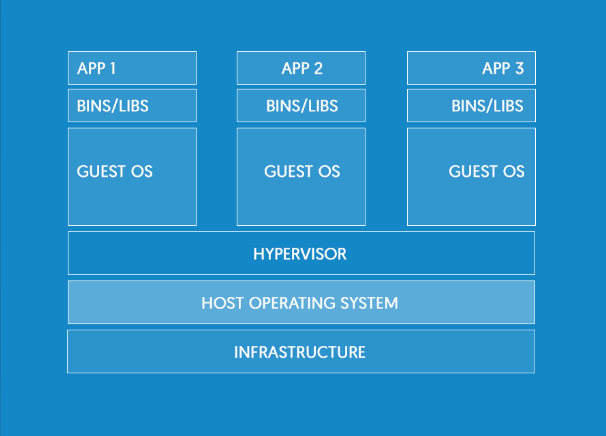
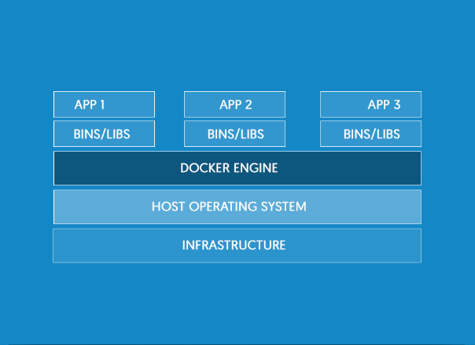

# Docker Engine

Na introdução anterior, falamos que o **Docker** é uma ferramenta maravilhosa que vem facilitando a vida dos desenvolvedores e assegurando que o mesmo ambiente seja utilizado para desenvolvimento, produção e qualquer outro terminal, de sua equipe, que pertença ao projeto.

Para entendermos melhor esta ferramenta podemos utilizar o próprio logo do Docker para fazermos uma analogia, pois, assim fica mais fácil de descobrir o real objetivo do _Docker_.

Na imagem acima a **_baleia_** seria uma pré-configuração ou base de um ambiente de desenvolvimento, que você pode levar para qualquer projeto. É conhecido também como **Docker Engine**.

 Isso significa que todos os membros de equipe teriam o mesmo padrão e os mesmos recursos, facilitando assim o desenvolvimento e evitando erros de diferentes sistemas operacionais.

***

# Containers

As **_caixas_** ou **_containers_** em cima da **_baleia_** seriam fragmentos ou instâncias necessárias para o desenvolvimento do projeto.

**_Exemplos_**

1. _Mysql_
2. _Apache/Nginx_
3. _PHP-FPM_
4. _Redis_
5. _ELASTICSEARCH_

Estes containers rodam de forma isolada, mas podem ter uma comunicação entre eles.

O mais interessante é que estes containers possuem **somente** o necessário para serem rodados. Isso significa que podemos utilizar o kernel de um sistema operacional, sem precisar instalar o sistema operacional completo.

Vale a pena ressaltar que não existe um limite de containers para serem adicionados em sua **Docker Engine**, pois, como não tem um sistema operacional rodando junto com eles, os containers se tornam muito leves e esta é, sem dúvida, uma grande vantagem de utilizar o **Docker**, além da padronização do seu ambiente de desenvolvimento e a praticidade de subir um servidor.

**_Veja um exemplo abaixo:_**

Conforme imagem acima, podemos verificar que o sistema possui um **kernel** comum para toda aplicação, mas depois disso exitem vários containers.

**Exemplos**

1. Debian image
2. Apache image
3. EMACS image
4. BUSY BOX Image

O mais interessante, é que o Debian não está instalado como uma _máquina virtual_, sendo um sistema operacional completo. Neste _container_ Debian está somente o necessário para meu projeto e para os outros _containers_ relacionados.

> ## O desnecessário é descartado

E tudo que for comum entre os containers será reaproveitado, sem duplicação de código.

É possível criar vários **Dockers** e, de acordo com o projeto, podemos adicionar os containers necessários.

> ### Iremos ensinar a criar containers e subir, rapidamente, um ambiente de desenvolvimento utilizando o **Docker**.

Terá uma surpresa ao saber o quão simples é fazer tudo isso. Seus problemas e conflitos com ambientes de desenvolvimento chegarão ao fim. Então aproveite ao máximo os recursos que o Docker pode lhe oferecer.

***

# Diferença entre Máquinas Virtuais e Containers com Docker Engine

Máquinas virtuais | Containers
------------ | -------------
 | 

## Máquinas Virtuais

Podemos ver que quando utilizamos máquinas virtuais, precisamos da instalação **completa** de um sistema operacional para cada aplicação em desenvolvimento. O responsável, por virtualizar várias máquinas, é o **HYPERVISOR**.

Este processo utiliza muito espaço em seu disco local e exige muito de sua máquina principal, porque roda um sistema operacional em cima de outro.

## Containers

Com **Docker** utilizando **containers** tudo fica mais simples e fácil.

O gerenciador de ambiente de desenvolvimento deixa de ser o _HYPERVISOR_ e passa a ser o **_DOCKER ENGINE_**. Ele utiliza o próprio sistema operacional de sua máquina principal sem virtualização nenhuma. E em ambos os processos conseguimos ter o mesmo ambiente de desenvolvimento.

> ## Não é maravilhoso utilizar o Docker?

**Resumo:** Conseguimos criar uma infinidade de containers, dentro de uma mesma máquina. Podemos compartilhar dados entre os containers adicionados. Tudo isso de uma forma extremamente leve e segura.

***

# Objetivo da Aula

O nosso objetivo principal é mostrar a **diferença** entre **máquinas virtuais** e **containers**.

Apesar de ser muito vantajoso e prático utilizar o **Docker**, não quer dizer que não precise mais de **máquinas virtuais**, mas com Docker você pode adequar seus projetos de acordo com suas necessidades e recursos.

***

# Aprofundamento

Neste eBook encontrará um conteúdo bem técnico, mas caso queira se aprofundar no assunto é muito válido e indicado a leitura do mesmo.

