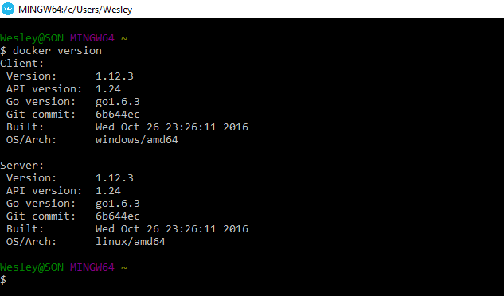
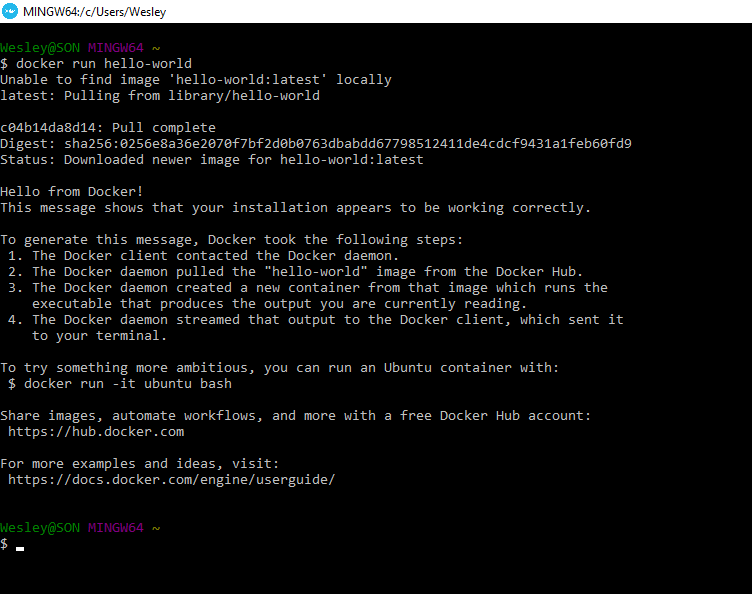
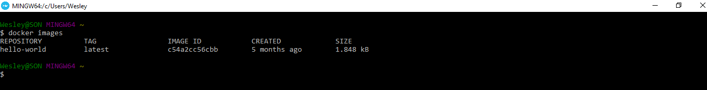
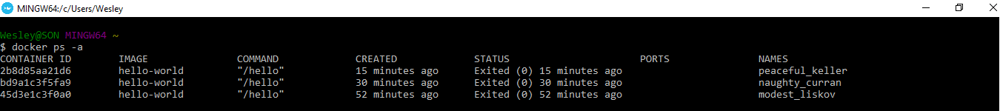

# Fazendo hello world e comandos básicos

Não é nosso objetivo criar um módulo com todos os comandos do Docker, porque ficaria massante e talvez não entendessem ou fixassem o que é mais importante.

Portando, vamos apresentar os comandos principais, para que o conteúdo seja melhor aproveitado e assimilado por todos. 
Iremos utilizar dois principais comandos:

1. Docker File
2. Docker Compose

Para entendermos a ideia e o objetivo destes arquivos, precisamos, antes, entender como funcionam os containers do Docker, como subir um novo container e alguns outros comandos.

Passaremos as ideias básicas e os comandos que iremos utilizar no Docker, até chegarmos nos comandos principais, citados acima.

***

# Iniciando com Docker

Após termos finalizado a instalação e rodado o terminal para iniciar o Docker, já podemos iniciar com os primeiros comandos.

No terminal digite `$ docker` e abrirá uma lista de comandos disponíveis. São muitos, por este motivo iremos focar nos principais, que nos auxiliam no dia a dia do desenvolvimento.
Sempre que necessitarmos, poderemos consultar a lista com este comando.

O próximo da lista é `$ docker version` que trará os seguintes dados:

Se analisarmos a imagem acima, veremos que possui duas informações importantes:

1. Client
2. Server

**Client:** É a máquina onde estamos rodando os comandos. 

**Server:** É a máquina virtual onde o Docker irá acessar a **_Docker Engine_** , os **_containers_** e onde irá rodar todas as aplicações.

***
`$ docker run hello-world` é utilizado para verficar se o Docker está rodando corretamente.

Este comando solicita que o Docker rode a **imagem hello-world**. Em breve falaremos mais sobre _imagens_, mas já adiantando, **imagem** é como se fosse um **snapshot** de uma aplicação, máquina ou configuração. E no caso deste comando, será realmente um Hello World, somente para testar nosso Docker.

Quando rodamos este comando, o Docker envia uma mensagem de que não foi possível encontrar a **imagem**, localmente, mas ele faz um **download**, e nos mostra a mensagem acima, no terminal. Após isso, sabemos que está tudo ok com nosso Docker e já fizemos a nossa primeira impressão e subimos nosso primeiro container.

Caso o rode novamente, o Docker nos mostrará a imagem **Hello World**, porque já foi baixada, anteriormente, e agora ele a encontra localmente.

Caso queira saber quais imagens você já possui, localmente, basta rodar o comando `$ docker images` e terá o seguinte resultado:

***

## Docker PS

`$ docker ps` é muito utilizado.

Este comando é responsável por retornar todos os **containers** que estão rodando em nosso Docker. Um comando muito importante para nós, que iremos trabalhar com os _containers_.

Na imagem acima você pode observar que não existe nenhum container listado, porque ainda não ativamos nenhum.

Para visualizar todos os containers existentes, inclusive os que não estão rodando, basta utilizarmos o comando: `$ docker ps -a`

Visualizamos que os containers foram criados, automaticamente, porém eles não estão rodando.

Analisando a listagem de containers, podemos observar que eles possuem as seguintes informações:

1. **Names:** Como não setamos nenhum nome às _imagens_, o Docker cria, automaticamente, o ID e o nome da imagem.
2. **Image:** Significa que foi baseado na imagem _hello-world_.
3. **Command:** Informa o comando que foi rodado pelo Docker, internamente.
4. **Created:** Informa a data de criação.
5. **Status:** Informa quando este comando foi rodado.

Existem outros dados que a listagem traz, mas estas são as mais relevantes.

Cada vez que rodarmos o `$ docker run hello-world`, um container será criado e listado no comando `$ docker ps -a`, pois o Docker vai salvando os registros e as ocorrências.

Caso queiram remover algum container, basta utilizar o comando `$ docker rm ID/Nome`. No lugar do **ID/Nome**  substituímos por **ID ou Nome** do container desejado.

**Exemplo**

`$ docker rm 2b8d85aa21d6` - Estamos utilizando um ID da imagem acima. Depois que  rodarmos este comando, o container não será mais listado porque terá sido removido.

Caso queiramos remover uma imagem o comando é muito parecido:

`$ docker rmi ID/Nome`

***

# Lista de Comandos

Comando | Função
------------ | ------------
`$ docker` | Listar todos os comandos
`$ docker version` | Mostrar informações de versão **Client** e **Server**
`$ docker run image_name` | Rodar uma determinada imagem
`$ docker images` | Listar todas as imagens locais
`$ docker ps` | Listar todos os containers em execução
`$ docker ps -a` | Listar todos os containers existentes, independente se está em execução ou não
`$ docker start ID/Nome` | Iniciar um container existente, basta informar **nome ou ID** no comando
`$ docker stop ID/Nome` | Finalizar um container existente, basta informar **nome ou ID** no comando
`$ docker rm ID/Nome` | Remover um container existente, basta informar **nome ou ID** no comando
`$ docker rmi ID/Nome` | Remover uma imagem existente, basta informar **nome ou ID** no comando