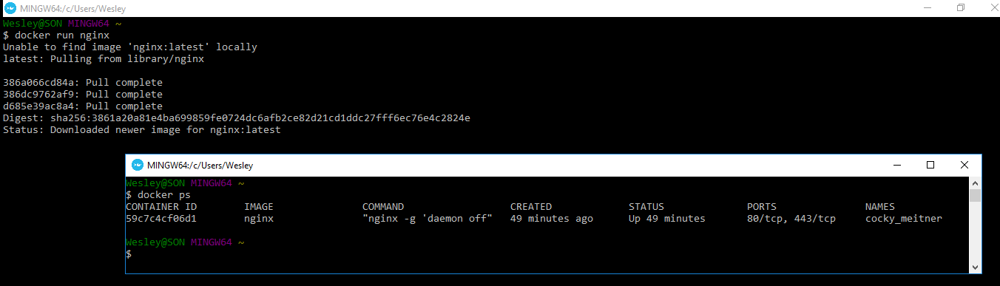
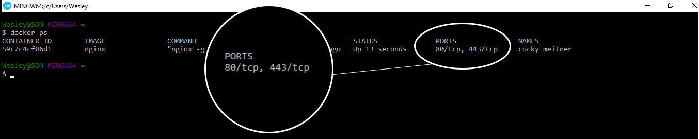

# Criando Container do Nginx e expondo porta

Na aula passada falamos um pouco sobre alguns comandos básicos muito importantes para o uso do Docker no dia a dia.

Agora, queremos dar um exemplo mais concreto para que consigamos trabalhar com o Docker de uma forma mais produtiva e efetiva. Não queremos utilizar somente uma **imagem** chamada _Hello World_, que não faz nada além de exibir um conteúdo pronto.

### Como saber qual imagem já existe no repositório do Docker, para iniciarmos?

Acessando o [Docker Hub](https://hub.docker.com), podemos pesquisar pelas mais diversas imagens existentes e também poderemos criar uma conta para hospedarmos, nossas próprias imagens. Neste site teremos, também, acesso à todos os detalhes de cada imagem encontrada, mas, **atenção**, existem imagens **oficiais** e de terceiros.

Devemos ler com atenção as especificações de cada imagem antes de rodar no Docker. Fiquem tranquilos, os tutoriais costumam ser muito bons.

***

# Rodando nosso primeiro Container - Nginx

`$ docker run nginx` para quem não se lembra, este comando irá procurar a imagem **nginx**, localmente, se existir, ele irá rodar. Caso não exista, o Docker vai baixar.

Para quem está iniciando com Docker, irá se deparar com uma situação estranha quando rodar este comando, porque ele subirá o container e **travará** o terminal. Se abrirmos um outro terminal e rodarmos o comando `$ docker ps` veremos que o nosso container já está funcionando. 
Outra forma de verificarmos se o container está funcionando é digitar `Ctrl + c` para destravar o terminal e depois basta rodar o mesmo comando `$ docker ps` para verificarmos seu funcionamento.

Portanto, caso o terminal trave, não se assustem, isso é normal, uma vez que existe uma máquina rodando, ele fica exatamente desta forma, como se estivesse travado.

Segue imagem:

Verifiquem que o primeiro terminal ficou travado, mas o segundo que foi aberto, observamos que o container está rodando normalmente. Esta imagem é só para tranquilizar os iniciantes.

***
Para pararmos o processo de um determinado container, basta rodarmos o comando `$ docker stop ID/Nome`. No nosso caso seria `$ docker stop 59c7c4cf06d1`.

***

# Rodar container nginx sem travar o terminal

Basta acrescentarmos **-d** ao comando **run**.

**Exemplo:** `$ docker run -d nginx`

Desta forma ele irá rodar nosso container em **background** e teremos nosso terminal livre pra continuarmos trabalhando e não precisaremos abrir outro terminal ou matar o processo no terminal atual.

***

# Acessando Nginx, via terminal

O comando `$ docker ps` nos mostra os containers que estão rodando e também as portas disponíveis para acessá-los.

Se estivermos utilizando o Windows, Mac ou Linux de forma nativa, por exemplo, não precisaremos descobrir o IP da máquina virtual, porque o Docker estará rodando em sua própria máquina. Então poderemos acessar o seu browser, diretamente.

Como em nosso caso estamos utilizando uma máquina virtual para rodar o Docker, precisaremos descobrir o IP desta máquina virtual para conseguirmos acessar as portas. Existem duas formas para isso:

1. Logo que abrimos o terminal do Docker o IP é mostrado.
2. Podemos rodar o comando `$ docker-machine ls`

Agora que já sabemos como descobrir o IP da máquina, basta tentar acessar, via browser, pra saber se o **Nginx** está realmente rodando e funcionando. **Exemplo:** _http://192.168.99.100:80_

Apesar de estar rodando, de acordo com nosso comando `$ docker ps`, a porta só está liberada em nossa máquina virtual. Precisamos apontar uma porta da nossa máquina para esta porta da nossa máquina virtual para conseguirmos, finalmente, fazer funcionar corretamente.

Precisamos seguir os passos abaixo:

1. Parar o container atual com o comando: `$ docker stop 59c7c4cf06d1`
2. Remover este container com o comando: `$ docker rm 59c7c4cf06d1`
3. Subir, novamente, o container com o comando: `$ docker run -d -p 8080:80 nginx`

O passo 3 indica que estamos atribuindo a porta 8080 da **nossa máquina** para a porta **80** da nossa máquina virtual.

Veja a imagem do processo completo:

Feito isto, poderemos acessar o browser, novamente, com o endereço **_http://192.168.99.100:8080/_** que teremos o nosso container **nginx** funcionando corretamente.

***

# Nomeando Containers

Já devem ter visto que o Docker cria nomes estranhos para os containers quando não passamos nenhum parâmetro informando o nome que queremos. Podemos melhorar isto, também, para que possamos trabalhar de forma mais organizada e não termos que ficar pesquisando,a todo instante, o nome ou o ID do nosso container, para poder rodar **stop, start, rm**, entre outros comandos do Docker, que precisam do parâmetro **nome ou ID**.

Se soubermos o nome que demos ao container, tudo ficará mais fácil na hora de subir, parar ou excluir o mesmo.

Basta incluir o parâmetro **--name** ao rodar o comando **run**.

**Exemplo:** `$ docker run -d -p 8080:80 --name webserver nginx`

***

# O que aprendemos nesta aula?

1. Pesquisar as imagens disponíveis no Docker Hub.
2. Rodar um container em background para não travar o terminal
3. Descobrir IP da máquina virtual, caso estejamos utilizando o Docker Toolbox para rodar o Docker
4. Expor uma porta da máquina principal para acessar a porta do nosso container
5. Nomear nossos containers para um melhor controle e organização

Entre outros comandos que já tínhamos visto, anteriormente, e fixamos um pouco mais.