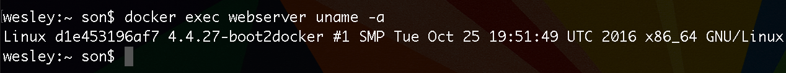
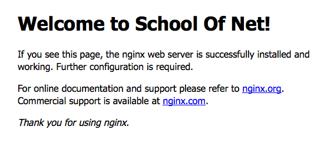

# Trabalhando de forma interativa com exec

Estamos evoluindo bastante com o Docker, já aprendemos a instalar uma imagem, nomear container, rodar um container em background e expor portas. 

> ### Muitos devem estar se perguntando: Como rodar comandos dentro de nossos containers?

Na verdade a resposta é muito simples e para facilitar e resumir, informamos que o comando para execução será sempre o mesmo: `$ docker exec`.

**Exemplo: ** `$ docker exec webserver uname -a`

Pronto! Facilmente conseguimos rodar um comando, dentro de um container, que estamos rodando.

Lembrando do **Hello World**, que já foi mostrado, o Docker fez exatamente a mesma coisa. Pegou o comando e executou, uma vez que já tinha instalado a imagem.

Certamente, deve estar querendo ir além destes comando relacionados ao nosso container. Você deve estar querendo acessar este container e fazer configurações em seu servidor.

Portanto, para acessarmos o nosso servidor, de forma interativa, rodamos o comando abaixo:

`$ docker exec -i -t webserver bash` ou `$ docker exec -it webserver bash`

Gostariamos de alertar, que o `-i -t` ou `-it` é muito necessário neste caso, porque caso não coloquemos, o nosso terminal irá travar. Da mesma forma que trava quando rodamos o **run** sem o parâmetro **-d**.

Quando queremos executar um comando que tenha entrada e saída, precisamos destes parâmetros para executar de forma interativa.

A imagem acima nos mostra que foi possível acessar o nosso servidor. 

Para concretizarmos nosso acesso, vamos executar, dentro do nosso servidor, os seguintes comandos:

1. `$ apt-get update`
2. `$ apt-get install vim`
3. `$ cd /usr/share/nginx/html`
4. `$ vim index.html`

Atualizamos o sistema do nosso servidor, instalamos o **Vim** e acessamos a pasta do nosso **Nginx**, que possui o arquivo inicial do webserver. Agora vamos alterar este arquivo, para ver se conseguimos, de fato, alterar o mesmo em nosso servidor, através do bash.

Alteramos a frase **Welcome to Nginx!** para **Welcome to School of Net!**. Portanto sucesso! Conseguimos acessar e alterar arquivos dentro de nosso container Nginx.

E desta forma, queremos lhe mostrar, que é possível customizar, da maneira que quiser, o seu ambiente. Mais do que isso! Você pode criar uma imagem do seu ambiente, customizado, e subir no **Docker Hub** para outras pessoas utilizarem também.

Usando de uma maneira inteligente, você pode criar várias imagens, uma para cada projeto diferente. Depois você terá tudo pronto e em questão de segundos terá um servidor prontinho. Esta é a vantagem de se utilizar o Docker.

**Veja a imagem depois da alteração**

***

# Comandos

1. `$ docker exec`
    * `$ docker exec webserver uname -as`
    * `$ docker exec -it webserver bash`

 