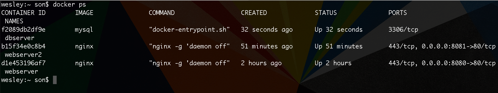
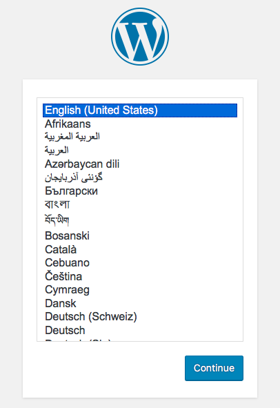
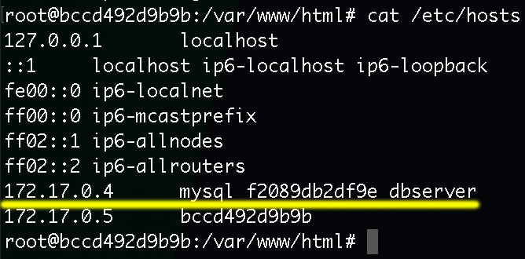

# Linkando containers com Wordpress

Este tópico é extremamente importante. Falaremos sobre **como linkar um container ao outro**.

Vamos imaginar que temos um **Wordpress** rodando em um container e um **Mysql** rodando em outro. 

> ### Neste módulo iremos aprender como fazer para que o container mysql seja visto pelo container Wordpress

***

# Criando container mysql

Para criar um container, rode o seguinte comando:

`$ docker run -d --name dbserver -e "MYSQL_ROOT_PASSWORD=root" -e "MYSQL_DATABASE=wordpress" mysql`

Note que `-e` é um parâmetro que ainda não vimos. O **-e** ou **--env** são variáveis de ambiente que, em certos casos, são necessárias. 

Neste caso, é necessária para configurar o **mysql** durante o carregamento.

Durante a criação do container, o Docker já irá setar o password e criar o banco de dados **wordpress**.

O mais importante é entendermos que existem containers que dependem de variáveis de ambiente, para que eles consigam rodar suas configurações iniciais.

Estamos criando nosso container baseado na imagem oficial do **Mysql**.

**Nota:** Existem outras variáveis de ambiente, como: 

**MYSQL_USER** e **MYSQL_PASSWORD**, caso queiram criar um usuário e uma password para seu ambiente, além do root.

 
 

***

# Criando container Wordpress

Para criar o container, rode o seguinte comando:

`$ docker run -d --name wordpress -p 8085:80 wordpress`

Rodando o comando acima, o container wordpress não reconhecerá nosso container **Mysql**. O Wordpress necessita do mysql para sua instalação.

Para resolver esta questão, devemos inserir mais um parâmetro importante do comando **run**, que segue abaixo.

`$ docker run -d --name wordpress --link dbserver:mysql -p 8085:80 wordpress`

O parâmetro `--link dbserver:mysql` cria o vínculo entre nosso container **mysql** e o container **wordpress**. 

O comando informa o Docker: "Gostaria que meu container **dbserver** fosse reconhecido dentro do container **wordpress** como **mysql**. Isso quer dizer que, o que vem após o `:` será o registro no container wordpress, podendo assim escolher o nome que quiser. Em nosso caso utilizamos o **mysql**.

 

***

Após rodar os dois comandos, quando acessarmos a porta **8085**, em nosso browser, teremos a tela de instalação do Wordpress. Isso significa que está tudo certo e funcionando.

 

***

Agora, iremos acessar o container **wordpress** e testar a comunicação com o container **mysql**, utilizando o comando **exec**, attravés dos seguintes comandos:

`$ docker exec -it wordpress bash`

`$ ping mysql`

 

É possível verificar de outra forma, acessando o arquivo **hosts** do container **wordpress**.

`$ cat /etc/hosts`

Como visto na imagem acima, temos 3 identificadores para o nosso container mysql dentro do wordpress:
 
 1. **mysql** que nós nomeamos no comando `--link`
 2. **dbserver** que é o nome do container
 3. **ID** do container

# Acessando mysql client

Para conseguirmos ter acesso ao banco de dados no container wordpress precisamos instalar o **mysql-client**. Dentro do container vamos executar os seguintes passos:

1. `$ apt-get update`
2. `$ apt-get install mysql-client`
3. `$ mysql -uroot -h mysql -p` ou `$ mysql -uroot -h Name_Container -p` ou `$ mysql -uroot -h ID_Container -p`

**Observação: ** _Note que podemos acessar, utilizando qualquer identificador listado no arquivo **hosts** , como indicado acima._

Após digitar a senha, que provavelmente será **root**, teremos acesso ao container **mysql** de dentro do container **wordpress**.

Perceba como os containers vão se comunicando, de acordo com as nossas configurações.

***

Após ter executado todos os comandos, basta seguirmos com a instalação do **Wordpress**, via browser, que tudo ocorrerá de acordo, pois os nossos containers estão devidamente linkados.

