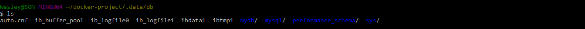
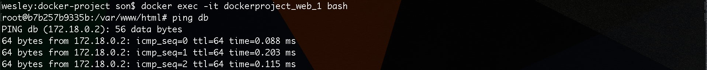

# Trabalhando com docker-compose

Agora estamos na reta final e iniciaremos nossos conhecimentos com **docker-compose**. 

Criamos um arquivo chamado **docker-compose.yml**, na pasta raiz do projeto, para iniciarmos. 

Vamos exibir o conteúdo abaixo para agilizar o processo de aprendizagem. Assim você poderá copiar e colar o conteúdo em seu arquivo, para facilitar sua vida e poupar seu tempo.

```yml
version: '2'
services:
    db:
        image: mysql:5.7
        volumes:
            - "./.data/db:/var/lib/mysql"
        restart: always
        environment:
            MYSQL_ROOT_PASSWORD: root
            MYSQL_DATABASE: mydb
            MYSQL_USER: root
            MYSQL_PASSWORD: root
    web:
        volumes:
            - "./src:/var/www/html"
        depends_on:
            - db
        image: my-php
        links:
            - db
        ports:
            - "8000:80"
        restart: always
```

> ## O que significa toda esta configuração acima?
  
É tudo mais simples do que você imagina.

O **docker-compose** é um software desenvolvido para o Docker. Ele é capaz de ler um arquivo `.yml` e criar os containers baseado neste arquivo.

Vale a pena informar que, arquivos do tipo YAML tem uma sintax baseada em identações. São blocos delimitados por espaços ou tabulações formando uma indentação visual muito forte. Caso não siga este padrão terá problemas.

***

# Explicando melhor o arquivo .yml

Neste arquivo existem duas seções:

1. version
2. services

Em **version** basta informar a versão, porém em services eu posso configurar vários **containers**.

Neste exemplo acima, nomeamos dois containers:

1. db
2. web

Se prestar atenção na **_identação_** da pra perceber, facilmente, a hierarquia dos serviços.

***

# Explicando banco de dados - db

```yml
    db:
        image: mysql:5.7
        volumes:
            - "./.data/db:/var/lib/mysql"
        restart: always
        environment:
            MYSQL_ROOT_PASSWORD: root
            MYSQL_DATABASE: mydb
            MYSQL_USER: root
            MYSQL_PASSWORD: root
```

Parâmetro | Função
--------- | ------
image | Devemos informar o nome da tag oficial do mysql e podemos passar a versão
volumes | Informamos o caminho de onde serão gravados todos os arquivos gerados pelo mysql
restart | **always** para que seja reiniciado o processo caso o mesmo caia
environment: | São as variáveis de ambiente que vamos passar como configuração. Estas informações você pode escolher.

Ainda não fizemos o **mapeamento** do volume, portanto temos que criar a pasta que foi passada como configuração.

`$ mkdir .data/db -p`

A princípio esta pasta estará vazia, mas quando o processo iniciar e o container subir, o **mysql** irá começar a gravar dados nesta pasta e assim teremos acesso a eles posteriormente.

***

# Explicando webserver - web

Agora vamos configurar nosso **webserver**. Precisamos alterar o arquivo **.yml** inicial, porque aquele é um conteúdo padrão.

Veja abaixo:

```yml           
    web:
        volumes:
            - "./html:/var/www/html"
        depends_on:
            - db
        image: wesleywillians/php7
        links:
            - db
        ports:
            - "8000:80"
        restart: always
```

Parâmetro | Função
--------- | ------
volumes | Informamos o caminho de onde serão gravados todos os arquivos gerados pela nossa imagem durante a criação
depends_on | Informamos todas as dependências existentes
image | Informamos o nome da imagem que queremos rodar, neste caso, será a nossa imagem criada anteriormente
links | Informamos para que possa haver comunicação entre containers
ports | Responsável por expor as portas locais para as portas liberadas pelo container
restart | **always** para que seja reiniciado o processo caso o mesmo caia

O **docker-compose** nada mais é do que um automatizador de tarefas. Ao invés de termos que digitar todos os comandos manuais, ele faz isso por nós.

> #### Lembra destes comandos gigantes?

`$ docker run -d --name webserver2 -p 8081:80 -v /c/Users/wesley/docker-project/html:/usr/share/nginx/html nginx`

`$ docker run -d --name wordpress --link dbserver:mysql -p 8085:80 wordpress`

O docker-compose está fazendo tudo isso pra gente, porém de forma automática, basta que a gente configure corretamente este arquivo **.yml**.

***

Após devidamente configurado, basta acessarmos a pasta, onde o arquivo **.yml** está presente, e rodar o seguinte comando:

Windows | MAC
------- | ---
`$ docker-compose.exe up -d` | `$ docker-compose up -d`

O **-d**, como já sabemos, é para rodar em **background** e o **up** é responsável por subir o servidor.

Depois deste comando ser rodado, você já pode acessar o browser e terá o resultado do seu arquivo **index.html** devidamente funcionando.

> ### http://192.168.99.100:8000/

O **docker-compose** subiu nosso servidor automaticamente baseado em nosso arquivo **.yml** de configuração.

***

# Teste de compartilhamento de volume

Iremos apagar o arquivo **index.html** e acessar novamente o nosso browser. Deverá ocorrer um erro **Forbidden**.

Após este teste, vamos criar um arquivo **index.php** no mesmo local. Com o seguinte conteúdo:

```php
<?php
    phpinfo();
```

E como resultado, deveremos obter a página das configurações do php instalado.

Está tudo correto, caso tenha êxito nestes dois testes.

***

Podemos concluir que nosso compartilhamento de volume está funcionando também para o nosso container **db**. Basta acessarmos a nossa pasta oculta e veremos que os arquivos do mysql estão indo para nossa pasta.

Desta forma temos o controle do banco de dados em nossa máquina local, isso é maravilhoso e com o Docker podemos fazer isto também.

`$ cd .data/db`

`$ ls`



Para mais um teste podemos acessar o container principal e tentar conexão com o banco de dados, para ter completa certeza do funcionamento. Afinal precisamos saber se o nosso **docker-compose** está criando o link corretamente.

`$ docker exec -it dockerproject_web_1 bash`

`$ ping db`



***

# Conclusão

O nosso objetivo chegou ao fim. Queriamos passar os conceitos básicos desta ferramenta maravilhosa chamada **Docker**.

Tudo que ensinamos, anteriormente, foi para chegar nestes dois arquivos, que são a base de tudo para o Docker.

1. Dockerfile
2. docker-compose.yml

O primeiro é responsável por criar a imagem de seu ambiente e o segundo é capaz de mapear todos os serviços do docker, fazer todo compartilhamento de volumes que for necessário e também criar conexão entre os containers pra você.

Tudo isso em questão de segundos. A vantagem de utilizar o Docker com sua equipe é que você pode somente clonar o repositório git e rodar um comando, na pasta raiz, onde se encontram os arquivos **Dockerfile** e **docker-compose.yml** e pronto! Você já está com a aplicação pronta para testes e desenvolvimento.

O conteúdo passado é básico, porém lhe tornar capaz de utilizar o Docker no seu dia-a-dia.

Continue estudando e se aprimorando para chegar à excelência.
