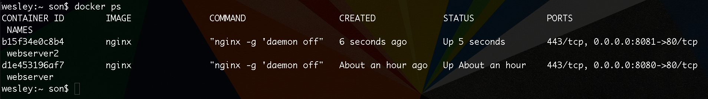
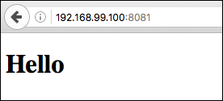

# Compartilhando Volumes

Iremos ensinar, específicamente, como conseguimos montar volumes, dentro de nosso container docker. Falaremos também sobre a funcionalidade deste recurso.

Na verdade, você montará volumes o tempo todo, quando for desenvolver utilizando Docker.

No exemplo que iremos seguir, temos a seguinte estrutura:

1. /docker-project
    * /html
        * index.html
        
Onde minha pasta principal se chama **docker-project**, com uma subpasta chamada **html** e um arquivo **index.html** dentro desta pasta.

Esta estrutura está em minha máquina local, não em nosso servidor.

# Qual objetivo de compartilhar volumes?

O que queremos é, basicamente, que o **Nginx**, quando for carregado, deixe de ler o diretório padrão que vem configurado. Ele passará a ler o **nosso** diretório como base de inicialização.

Ao invés de ler o arquivo **index.html**, padrão, que está em `/usr/share/nginx/html` do servidor, passará a ler o **nosso** arquivo **index.html**, presente em nossa máquina.

Desta forma, se fizermos uma alteração local, em qualquer arquivo de nosso projeto, terá efeito direto no servidor, porque o container está criando um apontamento ou compartilhamento com nossa pasta local.

Para conseguirmos este apontamento basta rodar um novo comando que iremos aprender agora:

`$ docker run -d --name webserver2 -p 8081:80 -v /c/Users/wesley/docker-project/html:/usr/share/nginx/html nginx`

Subindo novo servidor (**webserver2**) | Preview Index
---------------------------------------| -------------
 | 

Podemos verificar que deu tudo certo nas imagens acima. Ao rodarmos o comando, acima da imagem, nós subimos um novo servidor chamado **webserver2**. 

A única diferença foi o `-v` onde informarmos o caminho da pasta local e o caminho da pasta do servidor para criar o vínculo e a substituição.
 
 Isso quer dizer que o **Nginx** irá passar a ler nossa pasta e quando acessamos a porta **8081** que foi exposta para o servidor, teremos a exibição do nosso projeto, e não mais a tela inicial do **Nginx**
 
 Por tanto funcionou e agora temos dois containers rodando:
 
 1. **webserver** - _Apontando para o index.html padrão do Nginx_
 2. **webserver2** - _Apontando para o index.html do nosso projeto local_
 
 > ## Esta é a ideia do compartilhamento de volumes.
 
 ***
 
 Caso queira e goste de economizar código podemos otimizar ainda mais o comando anterior:
 
 `$ docker run -d --name webserver2 -p 8081:80 -v $(pwd)/html:/usr/share/nginx/html nginx`
 
 Desta forma o **$(pwd)** pega, automaticamente, o caminha da pasta do seu projeto, desde que, você esteja rodando o comando de dentro dela.
 
 Esta é uma dica de otimização que nos trás o mesmo resultado na hora de subir nosso servidor com apontamento de volumes.
 
 Existem recursos um pouco mais avançados, no processo de criação de volumes. Você poderia criar um **volume docker** depois apontar este volume, pelo nome registrado no Docker. Falamos deste outro método, porque é nosso dever informar todas as maneiras de trabalhar com apontamento de volumes, mas vamos focar somente no primeiro método, pois estamos interessados apenas em desenvolvimento por enquanto. 