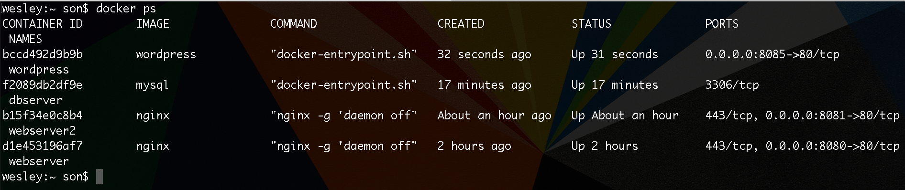

# Linkando containers, na prática, com Wordpress

Iremos falar sobre um assunto extremamente importante, que seria **como linkar um container no outro**.

Vamos imaginar que eu tenho um **Wordpress** rodando em um container e um **Msql** rodando em outro. 

> ### Como que eu faço para que o container mysql seja visto pelo container Wordpress?

***

# Criando container mysql

`$ docker run -d --name dbserver -e "MYSQL_ROOT_PASSWORD=root" -e "MYSQL_DATABASE=wordpress" mysql`

Gostaria de informar que `-e` é uma nova opção e vou explicar o que significa.

O **-e** ou **--env** seriam variáveis de ambiente que, em certos casos, são necessários. Neste caso, é necessário para configurar o **mysql** durante o carregamento.

Durante a criação do container, o Docker, já irá setar o password e criar o banco de dados **wordpress** pra gente.

O mais importante é você entender que, existem containers que dependem de variáveis de ambiente, para que eles consigam rodar suas configuração inciais.

Estamos criando nosso container baseado na imagem oficial do **Mysql**.

**Informação:** Existem outras variáveis de ambiente, para este caso, que são: **MYSQL_USER** e **MYSQL_PASSWORD** caso queira criar um usuário e uma password para seu ambiente, além do root.

 
 

***

# Criando container Wordpress

`$ docker run -d --name wordpress -p 8085:80 wordpress`

Poderíamos rodar o comando acima, porém o wordpress não reconheceria nosso container **Mysqle**. Porém o Wordpress necessita do mysql para sua instalação.

Desta forma abrimo o caminho para mais uma opção importante no comando **run** e segue abaixo.

`$ docker run -d --name wordpress --link dbserver:mysql -p 8085:80 wordpress`

A opção `--link dbserver:mysql` cria o vínculo entre nosso container **mysql** e o container **wordpress**. 

O comando diz para o Docker: "Gostaria que meu container **dbserver** fosse reconhecido dentro do container **wordpress** como **mysql**. Isso quer dizer que o que vem após o **:** será o registro no container wordpress, podendo assim escolher o nome que quiser. Em nosso caso utilizamos o **mysql**.

 

***

Após rodados os dois comandos, quando acessarmos a porta **8085**, em nosso browser, teremos a tela de instalação do Wordpress. Isso significa que está tudo certo e funcionando.

 

***

Temos agora os seguintes containers rodando até o momento:

 