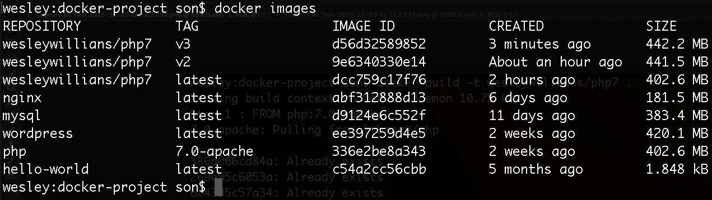

# Trabalhando com Dockerfile

Chegamos, finalmente, em um momento muito importante.

O que aprenderam até aqui, servirá de base para o que iremos aprender agora.

> ##Começaremos a trabalhar com _Dockerfile_

O **Dockerfile** é um arquivo, que tem por finalidade nos orientar na criação de nossas imagens. Isso significa que, depois que tivermos o nosso Dockerfile, podemos rodar o comando **build**, e todo o processo será carregado, de acordo com nossas instruções.

Este arquivo facilita demais a nossa vida, quando precisamos trabalhar.

***

# Iniciando com Dockerfile

Precisamos criar um arquivo chamado **Dockerfile** e, de preferência, em nossa pasta raiz do projeto.

`$ touch Dockerfile` ou `$ vim Dockerfile`

Note que este arquivo inicia com **D** maiúsculo e não tem nenhuma extensão.

Iniciamos com o seguinte conteúdo:

```
FROM php:7.0-apache
MAINTAINER atendimento@schoolofnet.com
```

Estas informação são básicas e tem os seguintes objetivos:

1. **FROM** - Informar uma _imagem_ que será um ponto de partida. À partir desta imagem iremos rodando os demais comandos.
2. **MAINTAINER** - Informamos o e-mail do mantenedor do projeto.

> #### Precisamos nos atentar ao real objetivo do arquivo. Ele não é um arquivo que você utiliza para criar um container, mas um arquivo que lhe ajuda a construir uma imagem do **Docker**.

# Rodando o comando build

Depois que tivermos nosso arquivo criado e com o conteúdo acima, rodaremos o seguinte comando para criar a imagem.

`$ docker build -t wesleywillians/php7 .`

Comando | Função
------- | ------

`build` | responsável por gerar a imagem
`-t wesleywillians/php7` | responsável por gerar a tag nomeado nossa imagem
`.` | O ponto indica que a base de configuração será o diretório atual, caso queira pode passar um outro caminho.


A imagem acima mostra o processo rodando e também uma listagem das imagens após o processo finalizado.

Podemos ver que agora temos a nossa imagem **wesleywillians/php7**, conforme queríamos. Agora sim podemos criar um container e acessá-lo.

# Rodando e acessando a nossa imagem

`$ docker run -it --rm wesleywillians/php7 bash`

Note que passamos um parâmetro `--rm`. Ainda não tínhamos falado sobre ele, mas vamos explicar agora:
 
 `--rm` :  Este parâmetro é muito utilizado quando vamos fazer testes rápido dentro do container. Quando acessamos o container nada acontece, porém quando saímos ele é removido automaticamente.
  
Pronto! Agora acabamos de criar um container baseado na nossa imagem criada. Este container ainda está vazio, mas já temos acesso a ele ao rodar o comando acima.
  
  ***
  
  # Continuando com Dockerfile
  
Acrescentaremos um comando para que, ao construir a imagem, ele atualize o sistema e instale um editor de texto.

```
FROM php:7.0-apache
MAINTAINER atendimento@schoolofnet.com

RUN apt-get update && apt-get install -y vim
```

`$ docker build -t wesleywillians/php7:v2 .`
  
Lembrando que o `-y` é para a instalação ser concluída sem confirmação nenhuma. Caso não coloque, o processo não será finalizado.

***

Podemos, também, incluir a instalação da extensão do **PDO** para o **PHP**, que por padrão não vem instalada.
  
Depois você pode pesquisar melhor sobre comandos do docker, mas estamos lhe dando uma introdução a respeito. Por exemplo: `docker-php-ext-install`.
  
Você verá, abaixo, que ele pode instalar qualquer extensão do php pra gente.
  
```
FROM php:7.0-apache
MAINTAINER atendimento@schoolofnet.com

RUN apt-get update && apt-get install -y vim
RUN docker-php-ext-install pdo pdo_mysql
```

Iremos rodar outra vez o comando **build** porém com uma nova TAG para acompanharmos a evolução da nossa imagem baseada no Dockerfile.

`$ docker build -t wesleywillians/php7:v3 .`

Perceba que, conforme vamos rodando o **build**, os primeiros passos não são executados novamente, porque eles possuem cache dos comandos anteriores, então só é executado pelo `$ docker build` os novos comando acrescentados.

### Verificando se a extensão foi adicionada

`$ docker run -it --rm wesleywillians/php:v3 bash`

`$ php -m | grep mysql`



  

