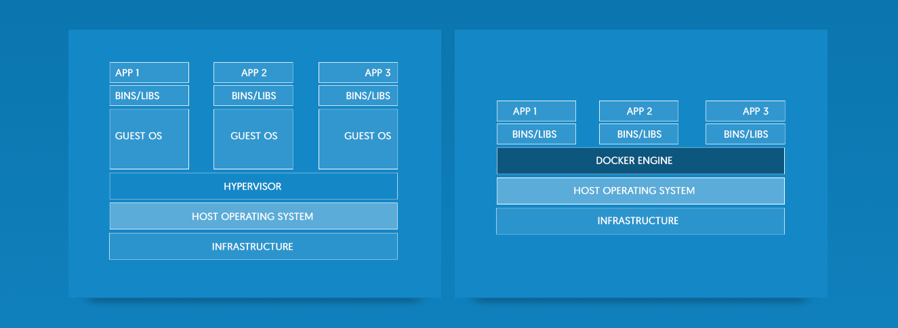

# O que é Docker

Podemos utilizar o logo do Docker para fazermos uma analogia e facilitar o entendimento da ferramenta, assim fica mais fácil de descobrir o real objetivo da mesma.

### Docker Engine

Análogamente a `baleia` seria uma pré-configuração ou a base de um ambiente de desenvolvimento que você pode levar para qualquer projeto e é conhecido também como `Docker Engine`.

 Isso significar que todos os membros da equipe teriam o mesmo padrão e os mesmos recursos, facilitando assim o desenvolvimento e evitando erros de diferentes sistemas operacionais.

### Containers

As `caixas` ou `container` em cima da `baleia` seriam fragmentos ou instâncias necessários para o desenvolvimento do projeto.

**_Exemplos_**

1. Mysql
2. Apache/Nginx
3. PHP-FPM
4. Redis
5. ELASTICSEARCH

Estes containers rodam de forma isolada, mas podem ter uma comunicação entre eles.

O mais interessante é que estes containers possuem **somente** o necessário para serem rodados. Em outras palavras somentes pedaços de códigos extremamente necessários para o funcionamento correto dos mesmos.

Vale a pena ressaltar que não existe um limite de containers para serem adicionados em sua `Docker Engine`, pois, como não tem um sistema operacional rodando junto com eles, os containers se tornam muito leves e esta é, sem dúvida, a grande vantagem de utilizar a ferramenta para o desenvolvimento do seu projeto.

**_Veja um exemplo abaixo:_**

Conforme imagem acima, podemos verificar que o sistema possui um `kernel` comum para toda aplicação, mas depois disso eu tenho diversos containers.

**Exemplos**

1. Debian image
2. Apache image
3. PHP-FPM
4. Redis
5. ELASTICSEARCH

O mais interessante, e já foi falado anteriormente, é que o Debian não está instalado como uma máquina virtual com toda a distribuição. Nesta imagem do Debian está somente o que ele necessita para rodar e o que os outros containers, que estão citados, necessitam para se relacionar com com ele. Por este motivo os containers são extremamente leves. **_O desnecessário é descartado. Tudo que for em comum entre as imagens são reapoveitados, sem duplicação de códigos_**.

Nós podemos criar vários tipos de `Dockers` de acordo com o que precisamos e ir adicionando os containers a eles.

Neste curso iremos aprender a criar containers fácilmente. Vamos aprender também a subir, rapidamente, um ambiente de desenvolvimento.

Você ficará maravilhado em saber o quanto é simples fazer tudo isso e vai querer dar adeus às antigas e trabalhosas práticas de desenvolvimento onde você tinha que ter muito espaço em disco e uma máquina para cada projeto que fosse desenvolver.

### Diferença entre Máquinas Virtuais e Containers com Docker Engine

#### Máquinas Virtuais
Podemos ver que quando utilizamos máquinas virtuais precisamos da instalação **completa** de um sistema operacional para cada aplicação em desenvolvimento, gerenciadas através do **HYPERVISOR** responsável pela virtualização de suas diversas máquinas.

Este processo utiliza muito espaço em seu disco local e exige muito de sua máquina principal porque está rodando um sistema operacional em cima de outro.

#### Containers
Com **Docker** associado com **containers** tudo fica mais simples e fácil. O gerenciador de ambiente de desenvolvimento deixa de ser o _HYPERVISOR_ e passa a ser o **_DOCKER ENGINE_** que não utiliza espaço nenhum a mais em sua máquina, pois ele utiliza o próprio sistema operacional da máquina principal sem virtualização nenhuma. E em ambos os processos conseguimos ter o mesmo ambiente de desenvolvimento. **Não é maravilhoso utilizar o Docker?**