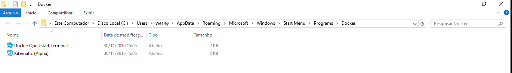
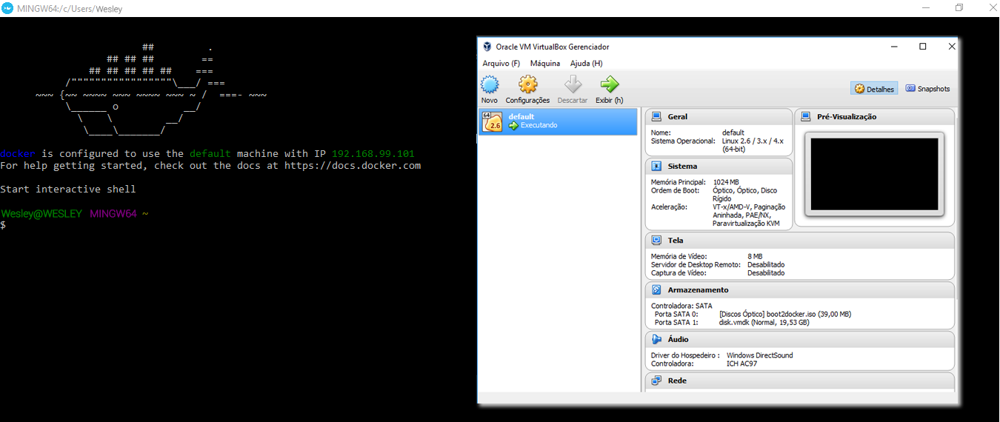

# Instalando Docker

Vamos finalmente colocar a mão na massa, acabando um pouco com toda a teoria. Mas precisamos ficar ligados em alguns pontos importantes.

O **Docker** _inicialmente_ foi feito para rodar no **Linux**. Porém o Docker conseguiu se tornar um pouco mais agnóstico em relação a outros sistemas operacionais e ele acaba rodando também em outros sistemas.

Além do Linux ele roda **nativamente** no **Windows 10** nas versões **Professional e Enterprise**, pois estas versões já possuem um recurso chamado **Hyper-V**, porém em outras versões do Windows e outros sistemas operacionais é necessário fazermos uma adaptação utilizando uma ferramenta chamada Docker Toolbox.

Para iniciarmos com a instalação do Docker podemos ir até o link https://www.docker.com/products/overview. Neste link possui o start para instalação do Docker emm qualquer sistema operacional.

Neste curso não iremos focar na instalação do Docker para Linux, porque realmente é muito simples sem nenhuma complicação. Iremos focar na instalação para **MAC** e **WINDOWS**.

#### Por que focar em MAC e WINDOWS?

Porque tanto no MAC quanto no WINDOWS, durante a instalação, o Docker não consegue rodar diretamente para criar os seus **containers**.

No caso do Windows algumas versões não possuem o **Hyper-V** citado acima.

Por este motivo é necessário fazermos uma **_adaptação_** para conseguirmos rodar o Docker nestes sistemas operacionais de forma correta.

#### Docker no Windows

A adaptação citada acima será rodar o Docker em cima de uma _máquina virtual_. Isso significa que não rodaremos o Docker dentro do Windows diretamente, mas sim dentro de uma **_máquina virtual Linux_** que estará **_dentro do Windows_**.

Teremos então que ter uma camada a mais para que o Docker consiga rodar no Windows. Isso somente em ambiente de desenvolvimento, porque quando subir para produção o servidor será Linux e não terá que fazer esta adaptação.

**PASSOS:**

1. Faça o download do Docker no link: https://www.docker.com/products/overview
2. Clique em **Learn More** para ter mais informações e detalhes da instalação.
3. Caso tenha Windows 10 Professional ou Enterprise 64-bit poderá instalar o arquivo do download diretamente. Caso contrário precisará de uma outra ferramenta, chamada **Docker Toolbox**, presente no seguinte link: https://www.docker.com/products/docker-toolbox
4. Caso necessite utilizar o Docker Toolbox precisará também baixar o programa VirtualBox seguinte link: https://www.virtualbox.org/wiki/Downloads

Este **Docker Toolbox** é exatamente a ferramente que precisamos para criar a camada Linux responsável por rodar o Docker no seu Windows que não possui o **Hyper-V**.

É muito importante entender a diferença entre rodar o Docker nativamente em seu sistema operacional e rodar o Docker utilizando o Docker Toolbox.

Caso tenha uma versão do Windows que possua o **Hyper-V** não se esqueca de habilitar este recurso, no setor de adição e remoção de recursos do Windows, antes de instalar o arquivo baixado com a extensão **.msi**.

Após feito o download do Docker Toobox e também do VirtualBox vamos instalar os dois programas. _É importante vefiricar, na instalação do Docker Toolbox, se a opção do Git está marcada para que possa utilizar o Git Bash posteriormente._

A instalação do Docker Toolbox vai trazer com ela o **Boot to Docker** que é responsável por subir a máquina virtual para que você consiga rodar o Docker dentro dela automaticamente.

Dentro da pasta de **programas** será criada uma pasta chamada **Docker** com dois arquivos:

1. Docker Quickstart Terminal
2. Kitematic (Alpha)

Mais tarde falaremos deste arquivo _Kitematic_, porém basta dar dois cliques no Docker Quickstart Terminal para darmos início ao processo e ter o Docker rodando.

No terminal, após inicialização do Docker, ele mostrará o símbolo do Docker e também mostrará o IP da máquina criada, caso o processo tenha sido concluído corretamente. Porém caso siga todos os passos corretos de instalação não terá problema algum.

#### Docker no MAC

**PASSOS:**

1. Faça o download do Docker no link: https://www.docker.com/products/overview
2. Clique em **Learn More** para ter mais informações e detalhes da instalação.
3. Faça o download da ferramenta, chamada **Docker Toolbox**, presente no seguinte link: https://www.docker.com/products/docker-toolbox
4. Faça o download do programa VirtualBox no seguinte link: https://www.virtualbox.org/wiki/Downloads

Após feito o download do Docker Toobox e também do VirtualBox vamos instalar os dois programas.

A instalação do Docker Toolbox vai trazer com ela o **Boot to Docker** que é responsável por subir a máquina virtual para que você consiga rodar o Docker dentro dela automaticamente.

Dentro da pasta de instalação de **programas** será criada uma pasta chamada **Docker** com dois arquivos:

1. Docker Quickstart Terminal
2. Kitematic (Alpha)

Mais tarde falaremos deste arquivo _Kitematic_, porém basta dar dois cliques no Docker Quickstart Terminal para darmos início ao processo e ter o Docker rodando.

No terminal, após inicialização do Docker, ele mostrará o símbolo do Docker e também mostrará o IP da máquina criada, caso o processo tenha sido concluído corretamente. Porém caso siga todos os passos corretos de instalação não terá problema algum.

## Imagens

Arquivos criados após instalação do **Docker Toolbox**

Docker rodando depois da instalação e execução do **Docker Quickstart Terminal**

