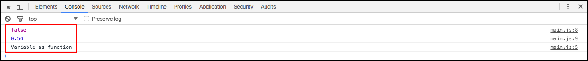

# Variáveis

Falaremos agora sobre variáveis no javascript.

Como todos sabem variável é um ponto na memória que conseguimos alocar valores dinamicamente. Estes valores podem ser alterados, a qualquer momento, durante a execução dos sistemas ou aplicações que a utilizam.

 O javascript trabalha com a tipagem dinâmica, isso quer dizer que a variável irá assumir o tipo de acordo com o valor que nela está alocado.

 Veja o exemplo abaixo:

```javascript
var number = 0;
console.log(typeof number);

var number = "0";
console.log(typeof number);
```

Resultado:


Reparem que a mesma variável modifica o tipo de acordo com o valor atribuído a ela, por isso chamamos de tipagem dinâmica.

# Operações Aritméticas

Quando queremos somar dois números ou variáveis utilizamos sempre o sinal de adição (**+**), mas no javascript temos que tomar muito cuidado com isso. Como a variável é dinâmica podemos ter ações diferentes ao utilizar o sinal de adição.

```javascript
var number = 0;
var number1 = 5;

var newNumber = number + number1;
console.log(newNumber);

var newNumber = "0" + number1;
console.log(newNumber);
```

Reparem que no primeiro exemplo temos a soma corretamente, no segundo, como a variável é uma string, o javascript interpreta o sinal de adição de outra forma e concatena o número, como se fosse uma string, não mais um número.

O sinal (+) só irá somar quando os dois valores forem inteiros ou flutuantes, mas precisam ambos serem números. Se um deles for string ele passa a concatenar.

# Entendendo escopo da variável

Falamos anteriormente sobre escopo ou contexto. Falamos também que é necessário tomar cuidado, mas na maioria das vezes isso mais nos ajuda do que atrapalha, não precisam se assustar.

```javascript
var number = 0;

function myFunction(){
    var number = 5;
    console.log(number + " - dentro da função myFunction");
}

myFunction();
console.log(number + " - Fora da função myFunction");
```

O resultado no console será:


Percebam que a variável criada dentro da função está inserida em outro contexto então, apesar de ter o mesmo nome, ela tem o valor diferente, saindo da função a variável **number** não é mais a que foi utilizada, mas sim a primeira variável, criada antes da função. Por isso é importante entenderem a relação de contexto.

### Outros tipos de variáveis:

* `var bool = false;`
* `var double = 0.54;`
* `var myFunction = function(){ console.log("Variable as function") }`

Para chamar uma variável, que é um função, basta chamar como se realmente fosse uma função. A função, que atribuímos a uma variável pode, ou não, ter um nome, isso não interfere em nada.

```javascript
//Atribuindo valores às variáveis
var bool = false;
var double = 0.54;
var myFunction = function(){
    console.log("Variable as function")
}
//Imprimindo valores no console
console.log(bool);
console.log(double);
myFunction();
```

Resultado do código acima:



Percebam como é fácil trabalhar com variáveis com javascript, você pode alterar a qualquer momento, só precisa tomar cuidado para não se perder ou confundir o contexto de cada uma delas.