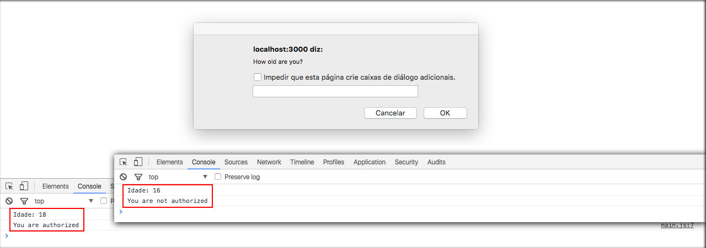

# Condições

Como qualquer outra linguagem, o javascript também tem estruturas condicionais, e é sobre elas que iremos falar agora.

Em qualquer tipo de desenvolvimento de software ou aplicações, principalmente web, você já deve ter visto ou se deparado com uma situação que exigisse uma condição lógica.

Se uma condição é verdadeira ele executa **x** e se for falsa executa **y**.

Temos as seguintes opção de condições lógicas:

* If
* Else
* Switch

# Utilizando estrutura condicional If/Else

Iremos criar uma caixa de diálogo onde o usuário digitará a idade e à partir da idade, que for digitada, iremos tratar uma estrutura condicional, para que você veja, na prática, as lógicas sendo executadas.

```javascript
var age = prompt("How old are you?");

var ageParser = parseInt(age);

if(ageParser >= 18){
    console.log('Idade: ' + age);
    console.log('You are authorized');
}else{
    console.log('Idade: ' + age);
    console.log('You are not authorized');
}
```

Reparem que fizemos uma lógica ao receber o valor do prompt. Se a idade for maior ou igual ele executa o if, senão ele executa o else. Ambas as lógicas imprimem a idade digitada e a mensagem referente. Veja imagem abaixo:



A imagem mostra os dois resultados possíveis.

# Utilizando estrutura condicional switch

```javascript
switch(true){
    case (ageParser >= 18):
        console.log('Idade: ' + age);
        console.log('You are authorized switch');
    break;
    case (ageParser < 18):
        console.log('Idade: ' + age);
        console.log('You are not authorized switch');
    break;
    default:
        console.log('default function');
    break;
}
```

Esta lógica é indicada quando podemos ter muitas opções de resultados. Perceba que podemos ter infinitos **cases** e quando um case é verdadeiro ele executa o bloco abaixo até encontrar o break.

Podemos configurar o **default** que será executado caso não exista nenhum case verdadeiro. Caso o valor seja nulo ou se o usuário clicar em cancelar, por exemplo.

Os cases sempre irão se basear no valor passado para o switch. Passamos true, caso quisesse fazer os testes negativos poderiamos passar false e inverter a lógica.

# Conclusão

Com estes dois operadores de condicional podemos fazer todo tipo de lógica. Treinem bastante porque este assunto é a base para a criação das lógicas ou regras de negócio.

Façam testes e brinquem à vontade caso queiram criar outras estruturas condicionais.