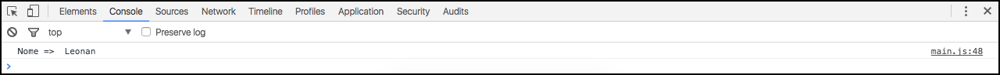

# Trabalhando com funções

Prestem bastante atenção neste assunto, pois ele é, com certeza, um dos mais importantes.

Função nada mais é do que um grupo de código reutilizável. Isso significa que tudo que você utiliza a todo momento, pode virar uma função para que você consiga economizar tempo e código. Seria uma lógica que já foi feita e que você pode reutilizar em vários locais do seu projeto.

Uma função pode receber parâmetro ou não. Você pode ter uma função para formartar data, string ou números. Isso faz com que você pouco muito tempo e trabalho, e pode utilizar em todos os seus projetos, não somente um um, basta você levar este função para qualquer projeto que for criar.

## Estrutura de uma função

```javascript
//modelo
function nameFunction(Param1, Param2, Param3){
    
}

//chamada 
nameFunction(Param1, Param2, Param3);
```

Podemos ter quantos parâmetros quisermos em cada função, ou pode também não existir nenhum.

### Exemplo

```javascript
function myFunction(name){
    console.log('Nome => ', name);    
}

myFunction("Leonan");
```

### Resultado



Veja na imagem acima que imprimimos um nome, passado como parâmetro. Isso significa que podemos passar qualquer nome e quantas vezes quisermos e teremos o mesmo resultado só alterando o nome. É um recurso maravilhoso.

Esta é uma função simples, mas tente imagina o poder que você tem nas mãos e que pode utilizar de maneira muito fácil.

Então basta declarar a função depois chamar onde quiser em seu código.

## Estrutura função auto executável

```javascript
//anônima sem parâmetro
(function() {
  console.log('Função anônima automática');
})();

//anônima com parâmetro
(function(name) {
  console.log(name);
})('Leonan');

//nomeada sem parâmetro
(function check() {
  console.log('Função nomeada automática');
})();

//nomeada com parâmetro
(function check(name) {
  console.log(name);
})('Leonan');
```

Este tipo de função dispensa a chamada porque ela é executada automaticamente quando o código é carregado. Pode ou não ter parâmetros.

Você tem a possibilidade de retornar valores também, assim como outras linguagens:

```javascript
(function check(name) {
  return console.log(name);
})('Leonan');
```

# Contexto

Vale a pena relembrar que, quando falamos de funções, temos dois contextos: global e interno.

O global é o contexto que temos fora da função e o interno é o contexto de dentro da função. Portanto dentro da função pode existir uma variável com o mesmo nome que uma variável do contexto global que não afetará o valor da mesma. Sempre fique atento nestes contextos. O que acontece dentro da função fica dentro da função, a menos que você retorne um valor para o contexto global.

# Considerações finais

Vale a pena informar que o `console.log()` que estamos utilizando é um código pronto do javascript. O console seria uma classe e o log seria um método ou uma função.

Isso quer dizer que estamos utilizando da maneira que queremos e a hora que queremos, então não falamos nenhuma mentira referente a funções.

Para finalizar vamos criar um exemplo para conclusão do conteúdo, utilizando função com retorno de dado dinâmico.

```javascript
var prop = prompt("What is your name?");

function yourName(name) {
    return name + " School Of Net";
}

console.log(yourName(prop));
```

Agora o nome que digitarmos no prompt será mostrado no console, porque a função apenas retorna o mesmo parâmetro passado à função, concatenando com a string **School Of Net**.

E assim finalizamos o assunto funções com javascript.