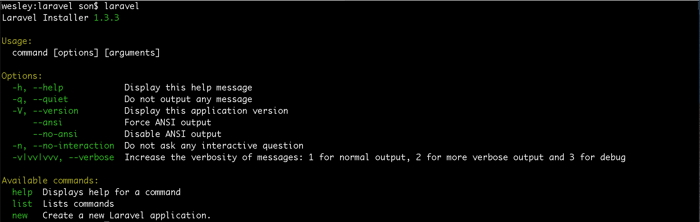

# Criando uma aplicação Laravel 5.3

Vamos começar a praticar o Laravel. 
Costumamos falar que, quando se começa a trabalhar com Laravel, a página do framework se tornará sua amiga mais fiel, principalmente o setor de documentação do framework. 
Faça com que ela se torne a bíblia do seu desenvolvimento. É nesta documentação que está tudo que você precisa para trabalhar com o framework, será a base para a sua curva de aprendizagem e desenvolvimento.

Prepare-se, você irá consultar esta documentação a todo momento. Dê preferência à documentação, para as diversas consultas que precisar, em vez de consultar qualquer outro fórum. A escrita é muito simples de entender, mesmo se você não tiver conhecimento de inglês, porque existem muitos exemplos através de código e isso facilita o entendimento.

Para que possamos trabalhar com este framework, precisamos instalá-lo em nossa máquina. 
Antes disso precisaremos de alguns pré-requisitos para trabalhar com o Laravel. 

Um deles é o PHP:

1. A versão do PHP que será instalada deverá ser, no mínimo a 5.6.4, senão o framework não rodará na sua máquina. 
   Se não tiver esta versão instalada, faça-a, antes de prosseguir.

   Para verificar a versão do PHP em sua máquina basta abrir o terminal, ou o bash se estiver utilizando Windows. Caso não tenha o Git Bash instalado, instale também, porque o utilizaremos no decorrer do conteúdo.

`$ php -v`
 
 O comando, acima, será responsável por trazer a versão do PHP instalada em sua máquina.

2. Precisaremos ativar algumas extensões do PHP
    * Open SSL
    * PDO
    * Mbstring
    * Tokenizer
    * XML

O comando, abaixo, trará as extensões ativas, para que possa verificar se todas as extensões exigidas estão ativadas em suas configurações.

`$ php -m`

Caso não tenha alguma destas extensões, digite o comando abaixo, se estiver utilizando Windows.

`$ php --ini`

O comando acima, informará onde está sendo carregado o seu arquivo php.ini. Sabendo onde está, você irá abrir este arquivo, descomentar a extensão, salvar e fechar.

Caso esteja utilizando MAC ou Linux você deve procurar, na internet, como adicionar as extensões, porque é possível fazer de forma automatizada em vez de abrir o arquivo e fazer manualmente.

***

Além dos pré-requisitos, citados acima, precisaremos ter o composer instalado. Para saber se já está instalado basta rodar o comando abaixo,em seu terminal:

`$ composer`

Este é o comado do nosso gerenciador de ferramentas ou bibliotecas PHP. Na verdade, você não precisa ter o composer instalado de forma global, mas é muito importante tornar a ferramente, global, para agilizar o trabalho. 
Atualmente, trabalhamos com o composer o tempo inteiro.

No caso do Windows, você pode ir no <https://getcomposer.org/> e fazer o download do executável e a instalação já adicionará o composer às suas variáveis de ambiente, para que possa executar de forma global. 
No Mac ou Linux você irá baixar o composer.phar e depois irá rodar um comando para enviar este arquivo para uma pasta que seu Sistema Operacional irá enxergar.

Exemplo:

`$ mv composer.phar /usr/local/bin/composer`

Pronto, o seu sistema operacional poderá rodar de forma global o composer, digitando apenas composer em seu terminal. Isto, porque você direcionou o arquivo executável para a pasta do seu usuário.

# Formas de criar aplicação Laravel

Basicamente, temos duas formas para criação de uma aplicação com Laravel:

1. Utilizando a ferramenta Laravel Installer
    * `composer global require "laravel/installer=~1.1"`
2. Via composer. Utilizando o Create-Project do composer.
    * `composer create-project laravel/laravel {directory} "5.0.*" --prefer-dist`

Quando utilizamos o primeiro método, após rodar o comando teremos uma ferramenta chamada laravel, instalada em nossa máquina. Depois disso, bastará digitar o seguinte código em nosso terminal:

`$ laravel new blog`

Estará concluído. Esta ferramenta irá instalar uma aplicação do laravel com o nome blog.

Quando utilizamos o segundo método, o composer irá acessar o repositótio **laravel/laravel** e irá realizar a instalação de acordo com a versão que selecionarmos.

# Criando aplicação utilizando composer

Iremos utilizar o segundo método para criar a nossa aplicação Laravel, para iníciarmos os estudos.

`composer create-project --prefer-dist laravel/laravel iniciando-com-laravel53`

Caso queira saber mais sobre os arquivos do repositório você pode acessar o link: <https://github.com/laravel/laravel>. 
Este repositório não é o framework Laravel, ele é o esqueleto da aplicação que iremos instalar. Quando rodamos o comando create-project estamos criando um clone desta estrutura e é em cima dela que iremos trabalhar.

O framework Laravel está no seguinte link: <https://github.com/laravel/framework>. 
Veja a diferença na estrutura dos arquivos. Neste repositório nós temos todas as bibliotecas do framework.

Rodando o comando de instalação, em seu terminal, você poderá verificar os passos da instalação, vendo os históricos do terminal.

1. Primeiro ele clona o repositório laravel/laravel, onde está o esqueleto da aplicação. Quando falamos esqueletos estamos nos referindo à estrutura de pastas do projeto.
2. Depois ele vai criar um arquivo **.env**. Este arquivo é criado através do arquivo .env.example, que iremos falar adiante.
3. Em seguida ele irá instalar todas as dependências PHP do esqueleto laravel/laravel.
4. A instalação irá gerar os arquivos de autoload.
5. Finalmente, irá gerar a chave da aplicação, baseada no sistema de criptografia **base64**

Esta chave, citada acima, é muito importante ao trabalhar com as sessões do Laravel, as sessões serão criptografadas e a criptografia destas sessões será baseada na chave da aplicação.

# Acessando estrutura após instalação

Primeiro, acessamos a pasta do nosso projeto com o comando:

 `$ cd iniciando-com-laravel53`. 

 Depois listamos os arquivos de nosso projeto:

  `$ ls`.

Podemos verificar que a estrutura é muito parecida com a do repositório, visto anteriormente. 

Aparecendo esta estrutura, já podemos rodar a aplicação e, em teoria, ela está funcionando corretamente.

Para rodar nossa aplicação utilizaremos um arquivo chamado **artisan**, que está na pasta raiz do projeto. 
Este arquivo é o **command line** do Laravel e será o seu amigo fiel quando estiver desenvolvendo. 
Você verá, no decorrer do capítulo, que este arquivo é muito importante no Laravel e nos ajuda muito, poupando-nos muito tempo. 

No momento, iremos apenas utilizar o comando, abaixo, para subir o nosso servidor.

`$ php artisan serve`

Depois de executar este comando, basta ir até o seu browser e acessar este endereço: 

**http://localhost:8000**.

Deverá obter a imagem abaixo:

Se conseguiu chegar até esta tela, você já iniciou uma aplicação com o Laravel. 
Esta é a primeira forma de iniciar uma aplicação.

# Criando aplicação utilizando Laravel Installer

Esta ferramenta é construída em PHP para nos ajudar a criar uma aplicação Laravel.
Imagine se precisássemos digitar o comando, abaixo, sempre que fôssemos  criar uma aplicação:

`composer create-project --prefer-dist laravel/laravel iniciando-com-laravel53`

Seria muito código para digitar e decorar, a cada instalação. Este instalador foi desenvolvido para facilitar a nossa vida, assim como o Laravel.

Iremos fazer a instalação desta ferramenta, de forma global, utilizando o composer. 
Desta forma, poderemos executar uma instalação do Laravel, em qualquer local, utilizando o terminal.

Esta é a imagem da instalação. Marcamos o diretório onde ficam armazenadas as instalações globais do composer. 
Esta view foi capturada em um terminal de Mac, porém se estiver utilizando Windos ficaria na pasta 

**c:/Users/Luiz/AppData/Roaming/Composer**, por exemplo.

Após a instalação, e depois de ter configurado sua variável de ambiente, ao digitar o comando 

`$ laravel`, em seu terminal, você deverá ter este resultado:

De todas as opções listadas do comando, a que mais iremos utilizar, de fato, será a opção **new**. 

Veremos mais sobre este comando:

`$ laravel new --help`

Digitando o comando acima, no terminal, ele trará uma listagem de opções para o comando new. 

Podemos adicionar `--dev` e teremos a última versão de desenvolvimento, ou 

 `--5.2` para instalar a versão 5.2.

Se rodarmos o comando abaixo, teremos a mesma aplicação anterior, porém com um comando menor.

`$ laravel new iniciando-com-laravel53`

Você poderá verificar que, após a primeira instalação, o processo fica muito mais rápido, porque ele roda utilizando cache da instalação. Para verificar se, realmente, está tudo correto, iremos rodar nossa aplicação com artisan.

`$ php artisan serve`

# Conclusão

Se chegou até o final deste arquivo, saiba que você aprendeu as duas formas de instalação do Laravel. Você pode utilizar a que mais lhe agradar, pois o resultado final é o mesmo. Ambas formas lhe trarão a instalação completa do Laraval Framework.

Agora, basta sair desenvolvendo, que é o próximo passo.