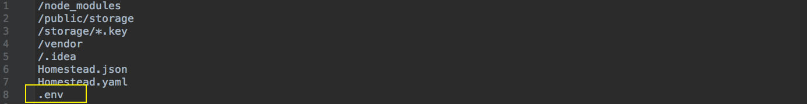

# Entendendo .env

Iremos começar a trabalhar com nossa aplicação Laravel 5.3. 
Abriremos a aplicação na IDE PHPStorm. Você pode utilizar a IDE que achar melhor. Adianto que, o PHPStorm é uma das melhores IDEs que temos no mercado, para trabalharmos com uma aplicação PHP.

O PHPStorm tem suporte ao Laravel, logo, você terá acesso ao auto-complete e configurações necessárias para trabalhar.

Começaremos com dois arquivos muito importantes. 

 São eles: .env e .env.example

Muitas pessoas começam a trabalhar com Laravel, vai utilizando o framework e nunca ouviu falar destes dois arquivos, mas desta forma não estarão desfrutando de todos os recursos que o Laravel disponibiliza para os desenvolvedores.

## Qual a diferença entre os dois?

Quando você clona uma aplicação laravel/laravel ela possui somente o arquivo .env.example. Teremos que criar o arquivo .env, manualmente, porque toda aplicação carrega as variáveis configuradas, neste arquivo, ao iniciar.

O arquivo .env.example deve ficar no controle de versão do projeto, porque é nele que centralizaremos o modelo das variáveis necessárias da aplicação. 
Vamos supor que precisamos configurar uma nova variável, deveremos incluir esta variável no .env.example. 
Quando outro membro da equipe for clonar o repositório ela saberá que, no arquivo .env, ele precisará configurar a mesma variável para que o sistema funcione corretamente.

Resumindo, nosso .env.example é um modelo e deverá ser atualizado sempre, ou seja, sempre que adicionar uma variável no .env, automaticamente, coloque no .env.example e se apagar faça a mesma coisa. 
O importante é garantir que o .env.example seja sempre uma cópia fiel do arquivo que deverá ser executado. Assim ele servirá de guia para outros desenvolvedores que forem dar continuidade ao projeto.

# Por que tantas variáveis?

Este é o diferencial do Laravel, pois este arquivo é uma forma fácil de identificar as configurações iniciais da aplicação.

Lembra quando falamos, no conteúdo anterior, da chave que é gerada na instalação da aplicação?

Este arquivo nos traz esta chave, caso precise consultar. 
Todas estas variáveis serão acessadas pelo Laravel para que ele possa montar a configuração inicial. Um exemplo interessante para citar é,  a configuração com banco de dados. 
Podemos fazer através deste arquivo também. O importante é você saber que a configuração, inicial e básica, para o funcionamento do Laravel, já vem junto com a instalação na duplicação do arquivo .env.example.

# Como este arquivo é lido?

Como falamos, anteriormente, este arquivo será lido pelo Laravel, para que ele consiga carregar estas configurações. Mas como isso é feito?

Existe uma biblioteca que se encarrega de ler toda esta configuração. Ela se encontra no seguinte caminho de pastas:

 * iniciando-com-laravel53
    * vendor
        * vlucas
            * phpdotenv

Quando iniciamos um projeto, esta biblioteca será chamada e daí pra frente tudo acontece. Toda esta configuração é compilada e depois o Laravel segue seu processamento natural.

# Entendendo todo processo

Podemos verificar que temos uma pasta chamada public, em nossa raiz do projeto. Esta pasta é o document root da aplicação Laravel, ou seja, somente esta pasta vai estar acessível ao público. O restante das pastas não devem estar acessíveis, diretamente, aos usuários no browser. Isto iria tornar a aplicação insegura.

Esta pasta possui um arquivo chamado index.php, responsável por iniciar a aplicação. Este arquivo está chamando o bootstrap e no final deste arquivo temos o início de uma classe chamada **kernel**. Esta classe é responsável por capturar uma requisição, processar e devolver ao usuário uma resposta.

Se inserirmos, no final deste arquivo, um `var_dump($_ENV);` e depois ir até nosso terminal e rodar `$ php public/index.php` teremos, além do html renderizado de nossa página, a listagem das variáveis, inicializadas no arquivo .env.

Para concretizarmos este teste, iremos adicionar uma variável e um valor no arquivo .env e depois rodar este comando, novamente. Veja o resultado:

Arquivo .env:

Resultado do comando no terminal:

Esta variável estará disponível em nosso PHP para que possamos utilizar sempre que necessário. 
Vamos supor que estamos fazendo uma integração com o Facebook, podemos colocar chave de acesso ou algo do tipo, referente ao acesso do Facebook, para utilizarmos na aplicação.

Este arquivo, na verdade, é uma forma de separar responsabilidade de dados. Em vez de colocar uma informação que seja importante, diretamente, em algum arquivo php, você adiciona em um arquivo específico para este fim. Este arquivo é disponibilizado pelo Laravel e se chama .env.

Se quisermos um acesso fácil e rápido a uma variável, que nós configuramos no arquivo .env, basta acessarmos:

`var_dump($_ENV['MINHA_CHAVE']);` ou `var_dump(getenv('MINHA_CHAVE'));`

Ambas as formas trarão o valor da variável. Caso queira conferir, rode 

`$ php public/index.php` 

e terá impresso o valor em seu terminal.

Como teremos o mesmo resultado, você pode escolher qual forma deseja utilizar, caso precise resgatar algum dado configurado no arquivo .env.

# Controle de versão

O arquivo .env nunca deve fazer parte do controle de versão, porque contém credenciais de banco de dados e outras informações sensíveis. 
Portanto o .env deve estar somente no servidor local, do desenvolvedor ou no ambiente de produção. 
Caso o coloque no controle de versão, você estará tornando sua aplicação insegura, porque as pessoas terão acesso às suas credenciais e senhas de banco de dados, por exemplo.

Você deve colocar as variáveis importantes de sua aplicação no .env.example, porém as senhas ou dados sensíveis não devem estar neste arquivo. Caso insira estes dados e o arquivo esteja no controle de versão, ou até mesmo deixe os dados no .env, você estará jogando todo o conceito pelo ralo. 
O conceito é este: .env fora do controle de versão e o .env.example no controle de versão, porém com variáveis em branco, somente para servir de modelo. A pessoa que quiser utilizar, deverá saber os dados para preencher estas variáveis.

Arquivo **.gitignore**

Se você analisar o arquivo .gitignore verá que o arquivo .env já estará adicionado. Porque ao instalar a aplicação, os instaladores já adicionam, automaticamente, por saber deste problema de segurança. 
Logo, não retire este arquivo do .gitignore e estará seguro neste quesito.