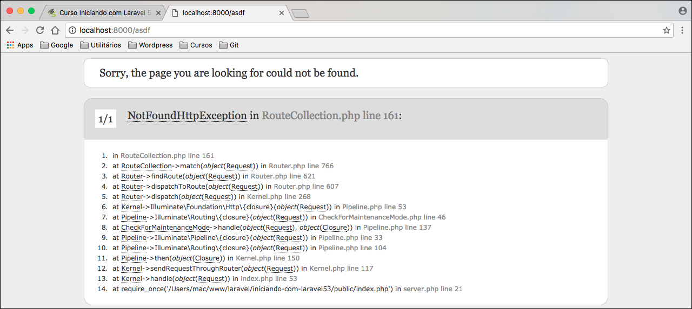
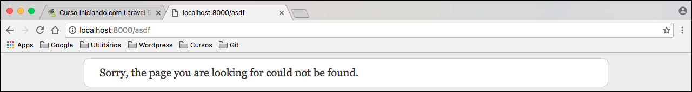

# Ambientes de trabalho

Quando trabalhamos com uma aplicação Laravel, nós podemos configurar modos desta aplicação. Quando trabalhamos com desenvolvimento, nós desejamos que todos os erros sejam mostrados, não queremos trabalhar com cache, porque a todo momento estamos mudando algum código ou implementando uma funcionalidade nova. Então queremos sempre um novo resultado para ver se realmente tudo está funcionando.

O Laravel trabalha com estes modos. O modo desenvolvimento já vem ativo por padrão, quando instalamos.

É interessante que ativemos o modo de produção somente em produção, porque a aplicação ficará mais rápida, os erros mostrados serão mais simples do que os mostrados em desenvolvimento, porque o usuário não precisa ficar vendo aqueles erros cabulosos, basta que ele veja uma mensagem de erro.

Toda esta configuração de ambiente é feita no arquivo .env. Para configurarmos o ambiente de desenvolvimento que falamos acima basta observarmos as seguintes variáveis do arquivo .env:

```
APP_ENV=local
APP_DEBUG=true
```

# Falando sobre APP_ENV

Quando temos **APP_ENV=local** significa que estamos em ambiente de desenvolvimento. Esta é a configuração que devemos trabalhar durante o desenvolvimento, mas nunca em produção.

Caso queira rodar em modo produção, basta alterar o valor de APP_ENV PARA **prod**. Lembrando que se você estiver rodando sua aplicação durante a alteração desta variável, utilizando o artisan serve, você terá que parar a aplicação e rodar o comando `$ php artisan serve` novamente para que ele possa **recarregar** as variáveis de ambiente novamente, caso contrário ele entenderá que ainda está em ambiente de desenvolvimento. Isso é um erro recorrente aos iniciantes de Laravel, porque alteram as variáveis, porém o código não surti o efeito esperado, ai ficam achando que é um erro, mas não é. Portanto sempre lembre de rodar novamente o servidor embutido, com artisan, após qualquer alteração no arquivo .env.

# Falando sobre APP_DEBUG

Esta variável é muito interessante, pois podemos alterar fácilmente o modo debug de nossa aplicação. Quando estamos trabalhando, em modo de desenvolvimento, é muito interessante que ela esteja configurada como **true**, porque teremos acesso aos erros, completos, que a aplicação pode retornar.

Vamos mostrar, em imagens, a diferença de estar com o modo debug ativado e inativo.

Primeiro temos que tentar acessar uma rota, que não exista, em nossa aplicação. Iremos acessar a seguinte rota:

**http://localhost:8000/asdf**

Imagem com APP_DEBUG=true.



Alterando APP_DEBUG para false: Lembre-se de rodar novamente o seu servidor, com artisan, para recarregar as configurações.

Imagem com APP_DEBUG=false.



Repare que com o o modo debug ativo o erro é mostrado desde o arquivo inicial até o arquivo onde o erro ocorre. Para o desenvolvimento isso é maravilhoso, porque você pode ir direto ao ponto do erro e resolver para conseguir dar continuidade em sua aplicação.

Após verificarem a diferença e entenderem, que é o mais importante, vamos deixar claro que para colocar em produção é interessante inverter as duas variáveis que vem por padrão na instalação.

# Para fixar as configurações

Ambiente | Variável | Configuração
------------ | ---------- | -----------------
Produção | APP_ENV | prod
Produção | APP_DEBUG | false
Desenvolvimento | APP_ENV | local
Desenvolvimento | APP_DEBUG | true

# Ativando modo manutenção

O Laravel oferece, também, esta funcionalidade para quem está com a aplicação em modo de produção e quer, de uma maneira rápida, tirar do ar por algum motivo. Talvez você tenha descoberto um erro e para que não cause um estrago maior, até que você o resolva, você ative este modo. Isso é muito simples e rápido.

Basta pararmos o servidor, caso ele esteja rodando, e depois rodar o seguinte comando no servidor:

`$ php artisan down`

Subindo o servidor novamente teremos a imagem abaixo:


Para fazer o processo inverso, subindo a aplicação novamente basta rodar o comando abaixo:

`$ php artisan up`

E pronto, sua aplicação estará pronta para ser utilizada pelos usuários.

***

# Conclusão

Estes são os modos que temos para configuração de trabalho com o Laravel. Saiba usá-los com sabedoria e lembre-se sempre da tabela citada acima para diferenciar produção de desenvolvimento.

Pode ser que faça alterações no seu código e não tenha efeito algum na sua view, e você poderá perder horas para tentar descobrir onde está seu erro, e depois verá que o erro está na sua variável de ambiente APP_ENV que pode estar como **prod** e estar trabalhando com cache. Então sua alteração pode estar correta, mas, por causa do cache, você pode achar que está errada. Tenham muita atenção antes de começar a desenvolver.

E lembrando mais uma vez. Sempre que alterar qualquer configuração, pare o seu servidor, e suba novamente, assim a sua nova configuração terá efeito.