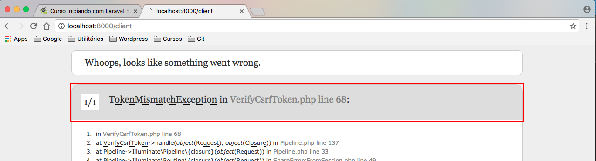

# Rotas amigáveis, post e formulários

Agora iremos aprofundar mais no assunto de rotas. Até o momento criamos rotas apenas do tipo get.

No caso de rotas do tipo post, teremos que brincar um pouco de html pra conseguirmos fazer algo mais palpável. Teremos que criar um formulário para que possamos fazer uma requisição post e assim podemos fazer um teste do tipo post.

# Criando rota para renderizar formulário

```php
Route::get('/client', function () {
    $html = <<<HTML
    <html>
        <body>
            <form method="post" action="client">
                <input type="text" name="value">
                <button type="submit">Enviar</button>
            </form>
        </body>
    </html>
HTML;

    return $html;
});
```

Neste caso acima temo um campo de texto e um botão para que o usuário possa submeter um texto para nossa aplicação. É um formulário bem simples, mas da pra gente exemplificar bem a nossa rota do tipo post.

Repare que temos a action apontando para uma rota chamada **client**, mas ainda não criamos esta rota, do tipo post, para receber os dados do formulário, então vamos criar a rota post.

# Criando rota post para receber a requisição

```php
Route::get('client', function () {
    return "Formulário enviado!!";
});
```

Vamos testar agora para ver se está tudo funcionado. Primeiro vamos acessar a rota client depois enviar algum valor para a aplicação, se tudo estiver correto teremos a mensagem **Formulário enviado!!** conforme configuramos em nossa rota do tipo post.

Resultado:



Este erro é recorrente para que esta iniciando com Laravel. Pessoas que não consultam a documentação e já querem sair desenvolvendo. As vezes a pessoa acaba abandonando o framework por causa de erros assim, não querem mais utilizar, mas precisamos entender como o Laravel trabalha.

Toda vez que vamos enviar dados, como post, o Laravel trabalha com a segurança do CsrfToken, ou seja, teremos que gerar um hash de um token, que ficará guardado na sessão do Laravel e quando alguém enviar um post para o servidor, vai ter que enviar este token também para que seja validado a requisição. Seria uma segurança a mais para aplicação e isso não é nada específico do Laravel e nem do PHP, você pode trabalhar com CsrfToken em qualquer linguagem que esteja desenvolvendo sua apalicação web.

Então teremos que criar o campo no formulário com este token. Antes do HTML iremos criar uma variável para armazenar este token utilizando uma função, nativa do Laravel, que pode gerar pra gente. A função se chama **csrf_token()**. Funções deste tipo nós costumamos chamar de Helper, são funções que nos auxiliam durante o desenvolvimento. Após guardar o token na variável iremos criar um campo do tipo hidden e passar o token na propriedade value deste campo.

A propriedade **name** deste campo deve sempre se chamar **_token**, pois é um padrão utilizado pelo Lavavel.

O código ficaria assim:

```php
Route::get('client', function () {
    $csrfToken = csrf_token();
    $html = <<<HTML
    <html>
        <body>
            <form method="post" action="client">
                <input type="hidden" name="_token" value="$csrfToken">
                <input type="text" name="value">
                <button type="submit">Enviar</button>
            </form>
        </body>
    </html>
HTML;

return $html;
});
```

Quando o Laravel recebe uma requisição, de um formulário, ele verificar se existe este campo do tipo **hidden** com o name **_hidden**, depois verifica se o valor deste campo é um token válido. Caso seja ele valida o formulário e não teremos mais o erro acima.


Agora podemos verificar que nossa requisição chegou até nossa rota e ela trabalhou corretamente, nos devolvendo a mensagem configurada em nossa função. Portanto concluímos nossa primeira rota do tipo post.

# Pegando valores do formulário

O Laravel nos fornece um objeto chamado request, que abrange toda nossa requisição, sempre que um formulário é submetido para nossa rota. Desta forma podemos pegar os valores submetidos pelo formulário e utilizar em nossa rota. Em nosso caso, iremos retornar o valor submetido para a nossa view. Veja o código abaixo:

```php
Route::post('client', function (Request $request) {
    return $request->get('value');
});
```

Como só temos um campo em nosso formulário, estamos restagatando apenas ele, mas lembre-se, o objeto Request possui todos os campos que existirem em seu formulário.

# Nomeando rotas

Imagine que exista a possibilidade de alguma rota, do seu projeto, passar por alteração. Você teria que sair alterando todos os lugares que utilizassem esta mesma rota. Nosso objetivo não é este e nem o objetivo do Laravel, este framework sempre irá nos ajudar e não complicar nossa vida. Portanto para melhorar a manutenção dos projetos existe o recurso de nomeação de rotas.

```php
Route::post('client', function (Request $request) {
    return $request->get('value');
})->name('client.store');
```

Repare que modificamos o final da nossa rota, aplicando o método name e passando nome de nossa rota. Desta forma passaremos a chama o nome da rota e não a rota diretamente. Para resgatar o caminho de nosso rota, através do nome, utilizamos um outro helper chamado **route('name')**. Veja abaixo:

```php
Route::get('/client', function () {
    $csrfToken = csrf_token();
    $action = route('client.store');
    $html = <<<HTML
    <html>
        <body>
            <form method="post" action="$action">
                <input type="hidden" name="_token" value="$csrfToken">
                <input type="text" name="value">
                <button type="submit">Enviar</button>
            </form>
        </body>
    </html>
HTML;

return $html;
});
```

Primeiro resgatamos o caminho de nossa rota e atribuímos a uma variável chamada **$action** depois no action de nosso formulário passamos esta variável. Desta forma não importa a rota que declare, basta não alterar o nome dela que sempre funcionará. Esta é, sem dúvida, uma grande dica para os desenvolvedores que trabalham com grandes projetos. Isso facilitará muito a manutenção, pois permite mudar a rota a hora que quiser, e o projeto inteiro estará funcionando corretamente.

Faça um teste de alterar sua rota após ter feito esta modificação em seu código. E verá que após submeter seu formlário a nova rota estará em funcionamento.

Exemplo de alteração de rota:

```php
Route::post('cadastro_cliente', function (Request $request) {
    return $request->get('value');
})->name('client.store');
```

Observe que alteramos a rota para **cadastro_cliente**, mas o nome não foi alterado. Pronto! Pode executar o teste e verá que o funcionamento continua o mesmo.