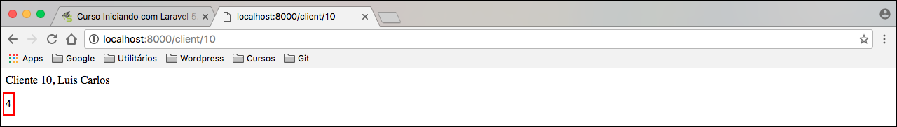
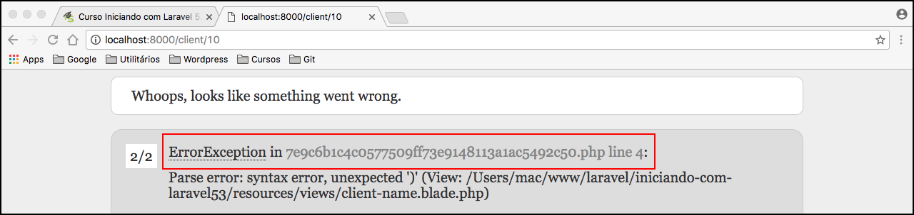

# Aprofundando na interpolação

Iremos aprofundar um pouco mais no Blade, para que possa entender melhor a ferramenta de template utilizada pelo Laravel.

Quando utilizamos a interpolação nós podemos passar qualquer expressão PHP dentro dela, não precisa ser somente para mostrar uma variável, conforme ensinamos anteriormente.

Exemplo em nosso template **client-name.blade.php**:
```php
<p>Cliente {{ $id }}, {{ $name }}</p>
<p>{{ 2 + 2 }}</p>
<p>{{ $name . " Diniz" }}</p>
```

Repare que fizemos uma operação matemática, uma concatenação da variável $name com uma string. Veja o resultado:



O Blade interpretará qualquer expressão que colocamos dentro da interpolação e criará aquele arquivo que mostramos anteriormente dentro da pasta **storage/framework/views** e este arquivo será responsável pela renderização.

Caso ele encontre alguma expressão que não exista ou um erro de sintax, o Laravel mostrará um erro. Portanto não se preocupem durante o desenvolvimento, o erro será mostrado no arquivo criado pelo Blade. Vejamos um exemplo:




