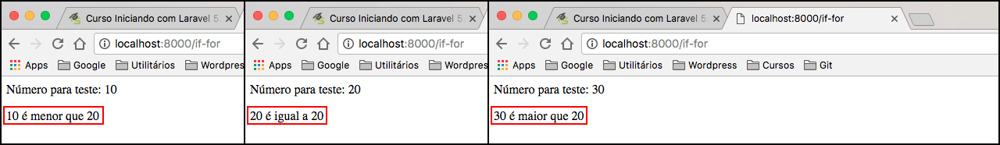
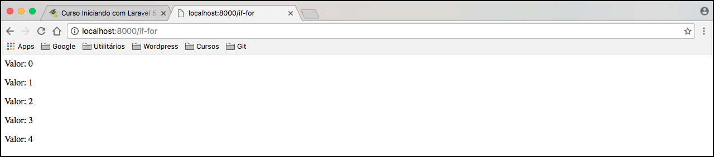
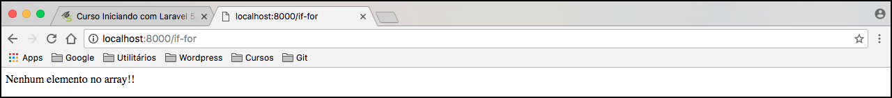

# Blade - estruturas condicionais e repetição

Vamos começar a trabalhar com estruturas condicionais e repetição com o Blade. Lembrando que estes dois assuntos são sempre muito utilizados em qualquer aplicação. Portanto aproveite ao máximo este conteúdo.

Para exemplificar criaremos uma nova rota em nosso arquivo de rotas. Aproveite para ir praticando.

```php
Route::get('if-for', function () {
    return view('if-for');
});
```

Crie também uma view chamada **if-for.blade.php** para que possamos trabalhar nossos exemplos.

Dentro de nosso arquivo de template nós iremos imaginar que exista uma variável. Não iremos passar nenhuma variável como parâmetro para esta nossa view. Decidimos ensinar vocês a criar uma variável dentro do próprio template, então a rota continuará igual a citada acima, sem passagem de parâmetros.

# Criando uma variável dentro de um template Blade

Até a data da criação deste conteúdo, ainda não existe uma forma de criar variável com o Blade, portanto a criação de variáveis, infelizmente, mantém o padrão do php. Temos que inserir as tags do php e inserir a variável normalmente, como se tivessemos em um arquivo php de fato.

# Condicional if com Blade

Para conseguirmos criar uma estrutura condicional com Blade é muito simples. Basta utilizarmos a estrutura seguinte, já aproveitaremos para mostrar o exemplo de variáveis em um só código:

```php
<?php
$num = 10;
?>

<p>Número: {{ $num }}</p>

@if( $num < 20 )
    <p>Número é menor que 20"</p>
@elseif( $num == 20 )
    <p>Número é igual a 20"</p>
@else
    <p>Número é maior que 20"</p>
@endif
```

Primeiro tivemos a criação de nossa variável, como já dissemos, não existe uma forma ainda para declarar uma variável com Blade. Depois repare que utilizamos o **@** para criar a nossa estrutura condicional. Sempre que o Blade encontrar o @ ele entenderá que temos uma estrutura a ser processada, seja ela condicional, repetição ou alguma estrura própria. O importante é você saber que o Blade reconhece estas estrutura por este símbolo.

Dentro das estruturas condicionais podemos colocar um bloco html para ser renderizado caso seja verdadeira. Foi o que fizemos no exemplo acima. Se o valor da variável **$num** for menor que 20 cairá na primeira condicional, se for igual a 20, cairá na segunda ou cairá na terceira condição caso não senja nenhum dos dois primeiros casos.

O Blade torna estas estruturas muito visuais, o código fica muito limpo e organizado. Se você estiver utilizando uma IDE que tenha suporte à sintaxe do Blade, você terá uma experiência visual ainda melhor. Porque ela deixará de outra cor as estrutura que tiverem @ no início.

Vejamos um exemplo que seja menor, um maior e um que seja igual, para que tenhamos certeza do funcionamento da estrura.



Pronto! Podemos ver que a estrutura condicional está funcionando corretamente. Não necessariamente você precisará definir uma variável para este teste, poderia passar uma variável através da rota por exemplo. Como foi feito na rota client.

# Estruturas de repetição for com Blade

Para estruturas de repetição também utilizaremos o símbolo @ para informar o Blade. Esta é a sintaxe do temblate engine.

```php
@for( $i = 0; $i < 5; $i++)
    <p>Valor: {{ $i }}</p>
@endfor
```

Percebam que a estrutura é muito parecida com o **for** convencional do php, a única alteração é na chamada da estrutura e na finalização. Não precisamos também do uso de chaves para delimitar o bloco de repetição.



O resultado está ok. Como se fosse uma repetição normal, porém utilizando a sintaxe do Blade. Para que a imagem não ficasse muito grande colocamos apenas 5 repetições, em nosso exemplo, mas você pode testar com um número maior de repetições, já que irá visualizar em seu browser.

# Estruturas de repetição while com Blade

```php
<?php
$k = 0;
?>

@while( $k < 5 )
    <p>Valor: {{ $k }}</p>
    <?php
    $k++;
    ?>
@endwhile
```

O resultado desta estrutura de repetição **while** deverá ser a mesma da imagem anterior, referênte à repetição **for**. Você pode escolher qual a maneira mais se adapta melhor ao seu projeto.

# Estrutura de repetição foreach com Blade

```php
<?php
$array = [1,2,3,4,5];
?>

@foreach( $array as $value )
    <p>Valor: {{ $value }}</p>
@endforeach
```

Esta é a estrutura **foreach** utilizando o Blade. Ela é também muito parecida com a estrutura do php. E teremos, também, o mesmo resultado da repetição for e while em nosso exemplo. Faça o teste em seu browser para conferir. Nossos 3 exemplos citados terão o mesmo resultado.

No caso do foreach existe uma variável reservada, chamada **loop**, para que possamos resgatar os índices, do array, durante a iteração. Com a variável **$loop** conseguimos até contar quantos elementos temos em nosso array. Esta é uma funcionalidade que nós não teríamos com o php, mas com o Blade basta colocarmos `{{ $loop->count }}` e já teremos o número de elementos em nosso array.

Veja exemplo:

```php
<?php
$array = [1,2,3,4,5];
?>

@foreach( $array as $value )
    <p>Chave {{ $loop->index }}, Valor: {{ $value }}</p>
@endforeach
```

Resultado:


Existe outra funcionalidade que podemos utilizar quando estamos listando registros do banco de dados, por exemplo. Imagina que não exista nenhum registro no banco de dados e você quer exibir uma mensagem avisando o usuário. Com php você teria que fazer um if para ver se existiria, ou não, elementos no banco e ai sim inserir a mensagem, no Blade não precisa fazer nada disso, é tudo mais simples.

```php
<?php
$array = [];
?>

@forelse( $array as $value )
    <p>Chave {{ $loop->index }}, Valor: {{ $value }}</p>
@empty
    <p>Nenhum elemento no array!!</p>
@forelse
```

O próprio Blade faz esta lógica pra você. Se o array não for vazio ele trabalha como uma foreach normal, mas se estiver vazio ele cai na parte do **@empty** e executa o bloco que você inserir.

Em nosso caso, exibimos uma mensagem avisando que o array está vazio. Veja no exemplo:

