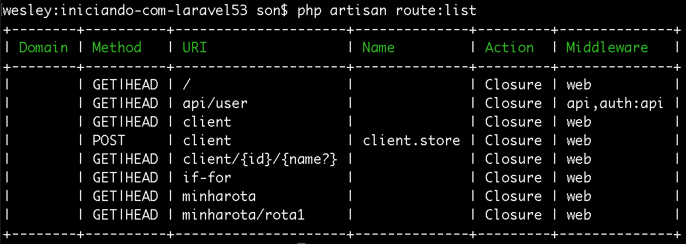

# Console Artisan

Até o momento não falamos muito sobre o artisan. Mas você já sabe que, com ele, tem como subir um servidor embutido do php. E assim podemos rodar nossa aplicação.

Nós temos este conceito de que todo desenvolvedor, que trabalha com Laravel, é um artesão e não apenas um programador, somos algo muito maior do que isso. Estamos fazendo arte, porque trabalhar com Laravel não é trabalhar com qualquer código php.

O Taylor, que desenvolveu este framework, criou este console para nos ajudar em todo o desenvolvimento de uma aplicação. Então o artisan é um cosole que vai permitir que façamos inúmeros comandos, por exemplo:

* Criar controllers
* Listar as rotas que temos em nossa aplicação
* Criar filas
* Criar seeders
* Criar migrations
* Criar modelos

Existe uma infinidade de comando para nos ajudar. O artisan será o seu melhor amigo, juntamente com a documentação do Laravel, quando você estiver desenvolvendo.

Se digitarmos, no terminal, `$ php artisan`, teremos uma listagem dos comandos. Nós não precisamos conhecer todos os comandos existentes, mas precisamos conhecer pelo menos os básicos. Lembre-se que para acessar os comandos você deve estar dentro da pasta raiz do projeto, caso contrário este comando não terá efeito algum.

Muitos dos comando que iremos utilizar estará na sessão **make** da listagem de comandos. Porque a grande maioria dos comando de desenvolvimento utilizam o comando make do artisan.

Exemplos:

* make: migration
* make: model
* make: seeder

O mais interessante é que podemos criar muito código apenas com um comando do artisan. Isso nos pouco muito tempo de desenvolvimento, tornando a programação mais prazerosa.

Podemos gerar a nossa chave criptografada com apenas um comando: `$ php artisan key:generate`. Se, por algum motivo, sua aplicação ainda não tiver nenhuma chave criada.

Temos a possibilidade de subir nosso servido com o comando que já conhecemos: `$ php artisan serve`. Este comando substitui o comando abaixo:

`php -S localhost:8000 -t public public/index.php`

Para você ter uma ideia se como o artisan pode nos facilitar a vida. Imagina ter que digitar este comando toda vez que precisar subir sua aplicação?

***

Podemos listar todas as rotas de nossa aplicação com o comando: `$ php artisan route:list`

Coluna | Descrição
--------- | ------------
Method | Tipo da rota ou verbo http
URI | url que deverá ser acessada
Name | Nome da rota, caso tenha definido
Action | Ação que será executada ao acessar a rota, neste caso tudo está como **closure** porque só utilizamos funções, mas quando utilizamos controllers, o controller será informado.
Middleware | Não falaremos agora, falaremos mais pra frente

Então caso esteja desenvolvendo em equipe ou pegar alguma aplicação pronta para dar manutenção, você pode mapear todas as rotas da aplicação rodando este comando. Será muito mais fácil de entender todo o processo envolvido na aplicação.

Resumindo o artisan, podemos falar que temos muitas ferramentas que irão nos auxiliar durante o desenvolvimento, são muitos comando. Acostumem-se a utilizar o artisan sempre e não se preocupe, porque não vai conseguir pegar e decorar todos os comando logo de cara. Você vai utilizando e gravando aos poucos os comandos.