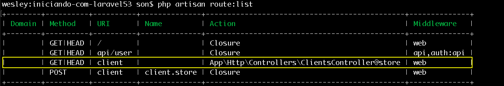

# Criando controllers

Acabamos de ler sobre alguns comandos do artisan e também vimos como listar as rotas de nossa aplicação. Dois assuntos preciosos para quem trabalha ou quer trabalhar com Laravel. São assuntos de extrema importância no mundo do desenvolvimento com este framework maravilhoso.

E falando em listagem de rotas, gostaria de dar mais atenção agora para a coluna **action** que aparece quando rodamos o comando `$ php artisan route:list`. Acompanhando nosso conteúdo você pode ver que em nossa aplicação, até agora, só tivemos actions do tipo **closure**, porque até o momento só utilizamos funções em nossas rotas. Não foi, por acaso, realmente quando estamos aprendendo Laravel é muito importante começar com funções, porque são mais simples de ensinar e também você fixa mais rápido a ideia de rotas.

Porém chegou a hora de darmos um passo a mais em relação a nossas rotas e falarmos sobre os Controllers. Como foi falado anteriormente temos duas opções para as actions de nossas rotas:

* Funções
* Controllers

Como o Laravel trabalha com o padrão MVC, podemos utilizar os controllers que possuem as actions embutidas neles. Você entenderá melhor com os exemplos.

Nós passamos até agora, conceitos de views. Agora chegou a hora de conhecerem a letra C do padrão MVC, que são os controllers.

# Criando primeiro controller

Como será lógica deste controller em nossa aplicação Laravel?

O controller nada mais é do que uma classe, então o que iremos fazer é criar uma classe. Nesta classe existirão métodos e estes métodos que serão as nossas actions, que estarão ligadas as nossas rotas. Quando falamos que os controllers tem actions embutidas é sobre isso que estamos falando.

Vamos criar um controller chamado ClientsController com um método chamado **index**. Este método será responsável por retornar nossa view client, onde se encontra nosso formulário. Geralmente quando trabalhamos com CRUD de qualquer entidade, costumamos utilizar o nome no plural e sempre adicionamos **Controller** ao nome, para realmente sabermos que é um controller. Por isso o nome do controller será ClientsController.

Você pode criar manualmente, caso queira, mas iremos utilizar o artisan para fazer esta criação. Pois é muito mais simples e rápido. Somente um comando e já teremos nossa classe para começar a trabalhar.

`$ php artisan make:controller ClientsController`

Depois deste comando rodado, podemos ir até nossa aplicação que teremos a nossa classe criada automaticamente. Onde encontrar os controllers criados?

* app
    * Http
        * Controllers

Vejam que o nome da classe é o último parâmetro do comando.

Aos poucos vamos entendendo como a arquitetura do Laravel funciona. A pasta **app** irá abrigar todo código e lógica da aplicação tirando somente nossas views que já sabemos onde ficam.

Ao abrir nosso primeiro controller **ClientsController** podemos ver que a classe extende de uma outra classe, abstrata, chamada Controller que por sua vez extende de uma outra classe chamada BaseController. É desta classe que sai toda a mágica do Laravel, toda facilidade que verá daqui pra frente é herdada desta classe. Portanto todas as classes que criarmos, deverá extender a classe Controller, caso queira criar o seu controller manualmente, não se esqueça deste detalhe importantíssimo.

A classe BaseController usa algumas traits que adicionam algumas funcionalidades aos nossos controllers como: Autorização de nossas requisições, validações para nossas requisições entre outras. Tudo isso já vem implementado em nossa classe por herança. Caso queira criar alguma funionalidade, para suas classes, é na classe BaseController que deverá implementar, pois desta forma, você terá acesso às funcionalidades em qualquer classe de sua aplicação.

 O próximo passo será criarmos o método público, ou action, com o nome de create. Esta action retornará a nossa view. Este nome nós que determinamos você pode criar a action com o nome que achar melhor.

```php
<?php

namespace App\Http\Controllers;

use Illuminate\Http\Request;

class ClientsController extends Controller
{
    public function create()
    {
        return view('client');
    }
}
?>
```

Criado o controller e a action temos agora que ligar esta action à nossa rota. É o que iremos fazer agora:

Modo sem controller:
```php
Route::get('client', function () {
    return view('client');
});
```

Modo com controller:

```php
Route::get('client', 'ClientsController@create');
```

Vejam a diferença principal que é a ausência de função quando vamos chamar um controller. Basta informarmos o nome do controller seguido de @ e depois o nome da action que queremos ligar à nossa rota. O restante continua da mesma forma anterior.

Agora pode acessar o browser nesta rota **/client** que o nosso formulário já será renderizado normalmente.

Deixamos somente esta última rota ativa e também a rota do tipo post, o restante das rotas que tínhamos criado até agora, nós comentamos, para que não confunda o conteúdo. Após comentar todas as rotas e deixar somente estas duas rota citadas, rodamos o comando `$ php artisan route:list` novamente e o resultado obtido foi este:



Veja que reduzimos o número de rotas e deixamos somente as últimas, em questão, e veja também que não temos mais todas as actions como sendo closure, mas agora o comando nos mostra que existe um controller e a action que está ligada a rota. Isso é maravilhoso, para termos o controle da aplicação.

Nós alteramos a nossa rota, do tipo post, para utilizar o nosso controller. A rota e a action store ficaram assim:

Rota store:

```php
Route::post('client', 'ClientsController@store')->name('client.store');
```

Action store:

```php
    public function store(Request $request)
    {
        return $request->get('value');
    }
```

Na verdade não modificamos nada, só alteramos o modo de chamar a action, ao invés de função closure agora temos uma action ligada a um controller. Liste mais uma vez suas rotas no terminal e verá que agora as nossas rotas não são mais closure.

Só temos que ficar atentos, quando criarmos a action store, se realmente estamos importanto o Request corretamente, senão pode ser que tenha problema. Fique atento.

# Quando utilizar closure e quando utilizar Controllers?

Quando não se tem muita experiência com Laravel, esta é uma dúvida que sempre acompanha o principiante. Imagine que você possui um problema para resolver em sua aplicação. E este problema possui várias ações relacionadas.

Um exemplo seria um sistema de cadastro de clientes. As ações relacionadas seriam: cadastro, atualização e remoção. O nosso famoso CRUD.

Se tiver com este cenário, com certeza, deverá utilizar o controller, porque você consegue centralizar todas as ações dentro de um mesmo arquivo com responsabilidade única. Você vai ter um controller só para cliente, que será responsável por alimentar todas suas rotas de clientes.

Tente ir multiplicando seu sistema e imagine que tenha clientes, produtos, fornecedores e muitos outros. Ficaria inviável e insustentável fazer tudo utilizando closures. Seu arquivo de rotas ficaria imenso e com toda responsabilidade para ele.

Portanto a resposta seria: Utilize sempre controllers a não ser que seja um exemplo ou um teste rápido que deseja fazer ou uma lógica muito simples de uma aplicação muito simples. Do contrário sempre controllers.

Seu código ficará muito mais limpo e estará utilizando boas práticas de programação.