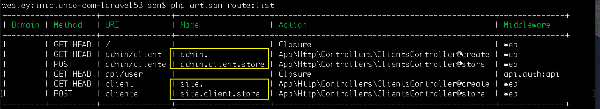

# Agrupamento de rotas e organizações

O exemplo que iremos pegar para explicar é o mesmo citado anteriormente. Imagine que estamos criando uma administração de clientes e com certeza você não irá deixar tudo somente na URI client ou cliente. Muito provavelmente você precisará colocar prefixos para organizar melhor suas rotas. Exemplos:

* admin/client
* admin/cliente

Mas imagine que sua aplicação vai crescendo e chega uma hora que você tem um emaranhado de rotas e comece a ficar complicado de controlar tudo e você pode se perder, mesmo utilizando prefixos como no exemplo acima. Sem falar que pode começar a ficar cansativo, toda vez que for criar uma rota de administração ter que colocar o admin na frente de sua rota.

Imagine também que depois de ter muitas rotas com o prefixo **admin** você, por acaso, precise modificar. Tudo bem que pode fazer um replace em sua IDE, porém o Laravel lhe possibilita trabalhar de uma forma bem melhor e mais organizada. Existe uma maneira para se trabalhar com prefixos.

Iremos criar um grupo de rotas. Utilizando a mesma facade **Route** mudaremos o método chamado para **group**. Este método recebe um array de configurações como primeiro parâmetro e depois uma closure.

Exemplo:

```php
Route::group([ ],function (){

});
```

Dentro desta função que iremos colocar nossas rotas e adicionar a configuração de prefixo a todas as rotas dentro do grupo de uma só vez.

```php
Route::group(["prefix" => "admin"],function (){
    Route::get('client', 'ClientsController@create');
    Route::post('cliente', 'ClientsController@store')->name('client.store');
});
```

Pronto! Listando as rotas com o artisan vão perceber que à partir deste grupo todas as rotas terão um prefixo **admin**. Portanto não conseguirá mais acessar as rotas somente por client, mas sim admin/client, ou admin/cliente. Veja também que o nosso nome da rota continua o mesmo, não houve alteração alguma. Porém é interessante, quando temos um prefixo nas rotas, atribuir o prefixo ao nome da rota também. Desta forma vamos atribuir o nome como sendo **admin.client.store**. Lembre também de alterar na sua view, para não ter um erro do Laravel.

Mas vai ter que renomear rota por rota? Não, fiquem tranquilos, porque existe uma configuração para atribuir prefixos para os nomes também, assim como as rotas. Basta adicionar a configuração abaixo e todas as rotas presentes no grupo terão o mesmo prefix para o nome também:

```php
Route::group(["prefix" => "admin" , "as" => "admin."],function (){
    Route::get('client', 'ClientsController@create');
    Route::post('cliente', 'ClientsController@store')->name('client.store');
});
```

Desta forma você adiciona o **admin.** antes de todas as rotas que tiverem nomeadas. Faça uma listagem de rotas com o artisan e irão entendem melhor o que acontece. Depois de ter visualizado as rotas suba o servidor novamente e faça o teste em seu browser, para ter certeza de que tudo continua funcionando com o agrupamento de rotas.

Este recurso de agrupamento de rotas é muito bom e organiza demais nosso código. E também é um recurso que será utilizado a todo momento no Laravel.

***

Vamos supor que estejamos criando um site administrativo e teremos a rota administrativa e a rota de nosso site que será acessada pelos usuários, não administrativos:

```php
Route::group(["prefix" => "admin" , "as" => "admin."],function (){
    Route::get('client', 'ClientsController@create');
    Route::post('cliente', 'ClientsController@store')->name('client.store');
});

Route::group(["prefix" => "" , "as" => "site."],function (){
    Route::get('client', 'ClientsController@create');
    Route::post('cliente', 'ClientsController@store')->name('client.store');
});
```

Veja que a título de exemplo duplicamos as rotas, mas só para mostrar a vocês que podemos utilizar o prefix das rotas em branco também. E veja agora a diferença na listagem de rotas:



O único problema de estar utilizando as mesmas rotas é que estamos também utilizando as mesmas views, portanto se acessar a url /client conseguirá acessar normalmente, mas quando submeter o formulário será redirecionado para admin/client, mas o objetivo era mostrar que podemos utilizar prefixo de rotas em branco e também.

Não precisamos utilizar os mesmos controllers também, então iremos criar um novo controller, porque será uma outra lógica e uma outra entidade diferente. Duplicamos o controller e renomeamos para **SiteClientsController** e vamos ter que renomaer a classe também.

Para resolver o problema de estar utilizando as mesmas views, iremos criar views diferentes também. Dentro da pasta views que já conhecemos, iremos criar duas pastas: admin e site.

E cada pasta será responsável por abrigar as views independentes de casa segmento.

# Admin

Depois de criado a pasta admin vamos criar outra pasta dentro chamada client. Dentro de client estará nossa view client.blade.php.

Conteúdo do arquivo view:

```php
<html>
    <body>
        <h1>Admin Client</h1>
        <form method="post" action="{{ route('admin.client.store') }}">
            <input type="hidden" name="_token" value="{{ csrf_token() }}">
            <input type="text" name="value">
            <button type="submit">Enviar</button>
        </form>
    </body>
</html>
```

Conteúdo do controller ClientsController:

```php
<?php

namespace App\Http\Controllers;

use Illuminate\Http\Request;

class ClientsController extends Controller
{
    public function create()
    {
        return view('admin.client.client');
    }

    public function store(Request $request)
    {
        return $request->get('value');
    }
}
?>
```

Reparem que mudamos o chamada da nossa view. Cada subnível de pasta deverá ser separado por ponto final **(.)**, por este motivo orientamos a não criar views com nomes compostos separados por pontos. Teríamos problemas nesta hora de chamar nossa view.

# Site

Depois de criada a pasta site iremos criar um arquivo view chamado client.blade.php.

Conteúdo do arquivo view:

```php
<html>
    <body>
        <h1>Site Client</h1>
        <form method="post" action="{{ route('site.client.store') }}">
            <input type="hidden" name="_token" value="{{ csrf_token() }}">
            <input type="text" name="value">
            <button type="submit">Enviar</button>
        </form>
    </body>
</html>
```

Conteúdo do controller SiteClientsController:

```php
<?php

namespace App\Http\Controllers;

use Illuminate\Http\Request;

class SiteClientsController extends Controller
{
    public function create()
    {
        return view('site.client');
    }

    public function store(Request $request)
    {
        return $request->get('value');
    }
}
?>
```

Como só existe uma pasta antes de chegar em nossa view colocamos apenas o nome da pasta e o nome do arquivo separados por ponto final. Assim como no exemplo acima.

# Conclusão

Este conteúdo ficou um pouco extenso, mas lendo com calma e fazendo os testes necessário, acredito que irá entender tranquilamente. Esta é a hora de treinar bastante e fazer bastante teste para fixar. Porque este realmente é um assunto muito importante e utilizará o tempo todo no desenvolvimento com Laravel.

Faça por partes os testes para não se confundir, porque os arquivos são muito parecidos. Fique tranquilos que em um caso real não será tão parecido assim, em nosso caso como são apenas exemplos isso pode acontecer.

O mais importante é entender que para cada entidade, teremos um grupo de rotas um controller e uma estrutura de pastas para as views de cada entidade. Desta forma sempre teremos muita organização e nossas aplicações sempre serão mais fáceis de serem matidas. Isso é uma convenção e uma dica nossa para vocês, não quer dizer que precisam fazer desta forma, se entenderem a dinâmica poderão fazer da maneira que quiserem e acharem melhor.

Treinem bastante antes de proceguir com o próximo conteúdo.