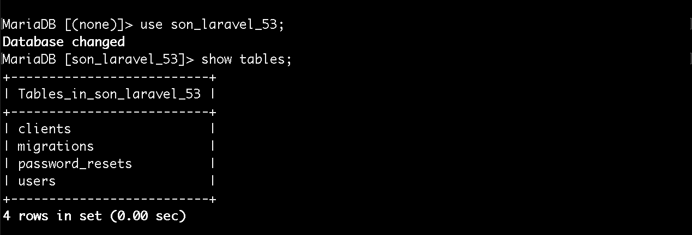

# Trabalhando com migrations

Agora chegou o momento de trabalhar com nossa migração, nós acabamos de aprender como rodar um comando que cria um modelo e uma migração juntos. Porém uma migração é só um arquivo até que nós coloquemos ela para trabalhar.

Portanto vamos aprender a configurar uma migration certinho para que ela crie tudo que quisermos, de forma correta, quando rodarmos o comando no artisan para criação das tabelas.

Toda vez que o artisan cria uma migração ele vai pegar o ano, o mês, o dia atual e também um número randômico para atribuir juntamente ao nome da migration. Ele cria o nome desta maneira, para que não exista conflitos de arquivos com o mesmo nome.

Existe uma convenção para criação de tabelas. Geralmente utilizamos o **create** seguido do **nome da tabela no plural** e o sufixo table. Todos separados por **underscore**. Você pode utilizar o nome da tabela no singular se quiser, mas você terá mais trabalho para configurar os seus modelos, no Laravel e o Eloquent.

Temos várias opções de utilização das nossas migrações, além da criação da tabela de fato. Podemos refazer alguma coisa no banco de dados, criar views, triggers, etc.

Quando criamos uma migração, o nome da classe será o final do nome do arquivo, com as primeiras letras maiúsculas e sem o underscore. Exemplo: **CreateClientsTable**. Esta migração irá extender de uma outra classe chamada **Migration** com dois métodos: up e down.

Método | Função
---------- | ---------
up | Quando executada ela cria a tabela no banco de dados.
down | Comando para desfazer o comando up. Executa um Drop na tabela correspondente.

```php
public function up()
{
    Schema::create('clients', function (Blueprint $table) {
        $table->increments('id');
        $table->timestamps();
    });
}

public function down()
{
    Schema::dropIfExists('clients');
}
```

Nós administramos tudo através da facade **Schema**. Reparem que quem dispara os comandos de criação e de drop é o Schema.

Esta facade recebe dois parâmetros, primeiro é o nome da tabela, no plural, como tínhamos falado, e o segundo é um função que recebe uma instância do Blueprint.

À partir deste segundo parâmetro nós conseguimos criar os campos que precisamos. Por padrão, sempre que criamos uma migração para criação de tabela, nós já temos a chave primária **id** e também o **timestamp**.

Elemento | Função
------------ | ----------
`$table->increments('id');` | o MySQL já adiciona o auto-incremento e passa a ser nossa chave primária.
`$table->timestamps();` | Irá criar dois campos em nossa table, por padrão, created_at e updated_at. Um para gravar a data de gravação no banco e outro para gravar a última atualização.

Os dois campos acima, são de controle do Laravel. Portanto, caso não queria trabalhar com o timestamp você pode comentar ou apagar esta linha de sua migration.

Para concluirmos nossos exemplos e explicar melhor o conceito de migrations iremos criar mais dois campos, em nossa tabela clients.

```php
$table->string('name');
$table->string('address');
```

Desta forma você pode criar quantos campos quiser ou forem necessários, em sua aplicação. Existem vários métodos que podem ser utilizados através desta variável **$table**.

Exemplos:

* $table->float()
* $table->integer()
* $table->boolean()

Existem muitos tipos, se você utiliza uma IDE ela pode lhe ajudar a encontrar os métodos existentes ou você pode pesquisar na documentação, que irá encontrar o que precisa.

Uma vez que nossa migration está definida, conforme fizemos acima, basta fazer com que ela seja executada. Iremos fazer isso através do artisan, um comando muito importante e muito utilizado também.

Sabemos que assim que for executado ele utilizará o método **up** para criar a tabela e os campos, porém ainda não criamos o banco de dados. Então este será o próximo passo antes de executar este comando.

# Criando e configurando banco de dados

Primeiro passo é acessar o nosso .env e configurar os dados de acesso ao banco de dados.

```
DB_CONNECTION=mysql
DB_HOST=127.0.0.1
DB_PORT=3306
DB_DATABASE=homestead
DB_USERNAME=homestead
DB_PASSWORD=secret
```

Estas configurações, acima, são configurações padrões da instalação que fizemos. Portanto sabemos que o Laravel trabalha com MySQL de forma padrão. Deveremos informar o host, a porta, o banco, o user e a senha. Passando estas configurações corretamente, nosso comando não terá problema algum em criar nossa tabela.

Crie um banco de dados em seu servidor local utilizando os comando abaixo:

`$ mysql -uroot -proot`

`$ create database son_laravel_53;`

`$ exit;`

Lembre-se que você deverá ter o mysql instalado em seu terminal para poder acessá-lo e criar o banco de dados com os comandos acima. Tenha atenção também ao informar o usuário e a senha corretos. No caso do exemplo acima o usuário é root e a senha também, mas no seu servidor local pode ser outra configuração.

Agora, depois de criado o banco de dados, estamos prontos para rodar o comando que executa as migrations e teremos, finalmente, a tabela criada no banco de dados.

`$ php artisan migrate`

Ele irá rodar todas as migrations que tiverem criadas, em nosso caso serão 3.

* CreateUsersTable
* CreatePasswordResetsTable
* CreateClientsTable

Duas padrões e a nossa migration. Não existem limites, poderiam existir quantas migrations fossem necessárias.

Vamos acessar o banco de dados para ter certeza de que as tabelas foram criadas:

`$ mysql -uroot -proot`

`$ use son_laravel_53;`

`$ show tables;`

Teremos o seguinte resultado:



Podemos ver que as tabelas foram criadas e que possui uma tabela a mais. Esta tabela chamada migrations é criada pelo Laravel para controle de todas as migrations da aplicação. Se acessarmos esta tabela e fazer um select veremos este resultado:


Desta forma pode verificar que os registros de migrations de nossa aplicação está sendo controlada via banco de dados pelo Laravel.

Existem outros comando complementares para migrate:


Comando | Função
------------ | ----------
migrate:install | Iniciamos o repositório da migração
migrate:refresh | Podemos fazer um refresh nas migrations executando todas novamente, caso tenha efetuado alguma alteração em alguma delas
migrate:reset | Retorna ao estado incial
migrate:rollback | Retorna um nível de alteração.
migrate:status | Para ver o status das migrações se estão ativas ou não

Rodamos um **migration:status**, veja o resultado:


Conseguimos ver o que temos na tabela **migrations** do banco de dados e quais estão ativas.

Se quisermos podemos também executar tudo novamente pode dar um refresh. Ele executa um **rollback** em todas as migrations e roda todas novamente.


Pela imagem você percebe que ele executa o mesmo comando em todas, se tivesse 10 migrations ele executaria 10 rollbacks e 10 migrates novamente.

Com estes comandos de migrações nós conseguimos controlar, de fato, as versões dos nossos banco de dados. Nós não precisamos mais criar um arquivo **.sql** para criar o backup do banco de dados da aplicação, porque os backups serão as migrations criadas. Cadas vez que executada ela criará a cópia fiel do banco de dados que necessita para sua aplicação. Basta ir desenvolvendo sua aplicação e ir criando suas migrations e quando for subir para o servidor, no ambiente de produção, terá somente que rodar o comando `$ php artisan migrate` e já terá seu banco de dados inteiro montado.

Se precisar adicionar um novo campo à tabela você não irá abrir uma migration já criada e adicionar, você deverá criar outra migration, desta forma você vai mantendo sempre o histórico de suas migrações. É este o conceito de migrations, depois só precisará rodar um migrate novamente e o Laravel só irá rodar as migrations que ainda não foram executadas, desta forma os campos serão adicionados e os campos já criados não sofrerão nenhuma mudança.

Trabalhar com migrations e muito importante, então se precisar releiam este conteúdo. Sempre estarão em contato com as migrations.