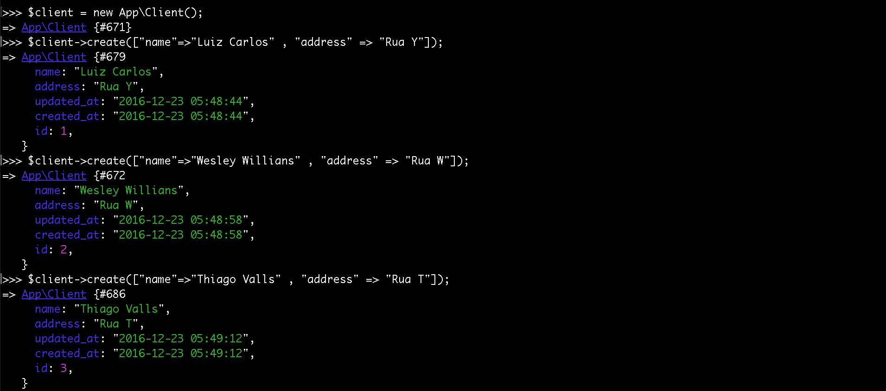

# Mass Assignment e fillable

Acabamos de ver alguns comandos do tinker e você pode ficar se perguntando: Quando executamos o comando **save**, como que o Laravel sabe que ele tem que salvar na tabela de Clientes? A resposta é: Ele sabe pela convenção que ele mesmo possui.

Temos a configuração do modelo e quando executamos o comando save o Laravel vai analisar este modelo. Ele vai perceber que o nome da classe é Client então, por convenção própria ele sabe que a tabela que é relacionada, a este modelo, é a clients. Que é o mesmo nome só que no plural. Por isso falamos que a criação da migration deveria ser no plural. É uma convenção do próprio Laravel que nos ajuda no desenvolvimento das aplicações.

O Laravel trabalha como que chamamos de COC (Convention Over Configuration). Algumas vezes, quando estamos criando uma aplicação, se não tivermos algum paradigma e não criarmos em cima de algo já pronto, nós teremos que tomar uma série de decisões para organizar a aplicação. Dependendo destas decisões tomadas, você pode estar sujeito ao fracasso, porque sua aplicação pode estar mal organizada, você não vai conseguir manter, a sua aplicação pode não servir, de fato, para o cliente final e, o pior de tudo, você está perdendo dinheiro.

Então tudo que estamos fazendo com o Laravel são convenções que o framework está impondo pra gente. Óbviamente este fato tem o lado bom e o ruim.

**Vantagens:** Não cabe a nós ficar tomando estas decisões. Podemos tocar a aplicação pra frente e focar no desenvolvimento apenas. E também estamos trabalhando de forma organizada. Pelo fato de ter criado as migrations e do model já estar conectado com as tabelas do banco de dados.

**Desvantagens:** Podemos ficar um pouco preso às convenções, mas o Laravel permite que saiamos um pouco das convenções. Não iremos falar sobre isso neste conteúdo, mas se quisermos trabalhar com outro tipo de nome de tabela nós podemos, basta informar ao modelo, se quisermos mudar a estrutura de pastas a gente pode, mas isso seria um outro conteúdo a ser tratado.

# Adicionando campos fillables

No model, temos outro recurso que é a possibilidade de adicionar campos fillables. Atribuindo este recurso, nós estamos dando uma segurança a mais ao modelo. O que significa isso que acabamos de informar?

Imagina que precisássemos criar 10 clientes, para efetuar algum teste na aplicação. Já imaginou termos que criar um por um da maneira que acabamos de ensinar, utilizando o tinker? Pior ainda, imagina se fossem 50 clientes.

Existe uma maneira de criar dados em massa com o tinker, o que chamamos de **Mass Assignment**. Desta forma nós conseguimos criar um cliente passando todos os dados de uma só vez. Porém se não adicionarmos os campos fillables, no model, o Laravel bloqueia este tipo de atividade, por segurança. Portanto se quisermos efetuar este tipo de cadastro em massa, precisamos configurar os fillables. Acredito que agora tenha ficado mais claro esta questão.

A atribuição dos fillables é feita da seguinte forma:

```php
class Client extends Model
{
    protected $fillable = [
      "name" , "address"
    ];
}
```

Existe uma variável reservada, para cada modelo, chamada fillable. Esta variável é um array onde listaremos todos os campos que nós permitiremos o Mass Assignment.



Repare que nós fizemos a criação de novos clientes utilizando apenas uma linha, não precisamos mais atribuir campo a campo e depois rodar um save. Desta forma é só ir duplicando e alterando os campos. Caso não tivéssemos inserido os campos fillables não seria possível executar estes comandos e o tinker lançaria um erro. Você pode fazer o teste para verificar.

É importante dizermos que qualquer valor, a mais, que seja colocado no array do método create, será ignorado pelo Eloquent. Também se adicionar somento o campo name no fillable e tentar passar o address, no create, também terá um erro. Isso tudo é a segurança que falamos anteriormente, se algum usuário tentar forçar o cadastro de algum campo que não exista, o Eloquent retornará um erro sql e não permitirá. Portanto você deve prestar atenção, ao adicionar os campos no fillable, para que possa criar elementos utilizando o Mass Assignment.