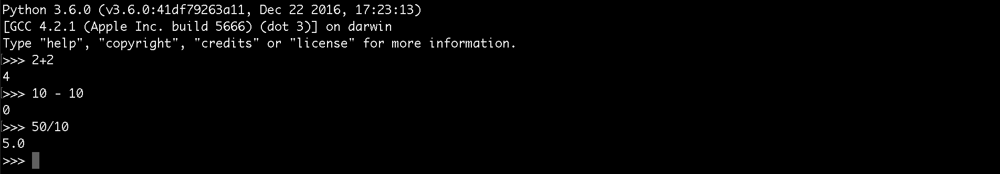

# Meu primeiro programa

Vamos começar a colocar a mão na massa a partir de agora. No conteúdo passado chegamos a abrir o interpretador no console para ver a versão do python, mas agora queremos ir mais longe com a utilização desta ferramenta e mostrar o quão poderosa ela é.

Então, no terminal, digitaremos **python**, para quem instalou pela primeira vez e **python3** para quem está com as duas versões instaladas. Desta forma estaremos abrindo o interpretador do python. O importante é que tenham acesso a versão 3.

Uma coisa que é muito interessante do interpretador é que você consegue desenvolver um programa inteiro dentro dele. Isso é muito poderoso porque você pode utilizar como prova de conceito.

Quando falamos que podemos desenvolver um programa dentro do interpretador estamos falando que podemos rodar os comando direto e já teremos os resultados. Veja um exemplo simples abaixo:



Esta é a grande vantagem de trabalhar com o interpretador do python. Você consegue testar os seus comandos, importar módulos, testar funções, fazer testes e brincar com a linguagem de uma forma bem interativa, sem ter que criar arquivo nenhum, caso não queira.

Você pode criar variáveis e funções e já executá-las diretamente. Nós falaremos sobre isso nos módulos futuros, mas você precisa entender o poder que tem em mãos utilizando uma linguagem muito simples.

Muitas vezes, no decorrer deste conteúdo, de python, nós estaremos dentro deste interpretador para fazer testes e falar sobre exemplos.

### Saindo do interpretador

Para finalizar a execução do interpretador podemos digitar `exit()` e dar enter ou digitar **control + d**. Ambas as formas são capazes de interromper o interpretador do python.

### Criando arquivo para executar função

Criaremos um arquivo, pelo terminal mesmo, com o nome de **hello.py**.

`vim hello.py`

Veja o conteúdo do arquivo hello.py:

```python
def say_hello():
    return "Hello World"

print(say_hello())
```

Nós apenas definimos uma função chamada **say_hello**, que retorna uma string **Hello World**, e depois imprimimos esta função. Para executarmos este arquivo basta digitar o comando abaixo, no terminal:

`python3 hello.py`

Teremos a string **Hello World** no terminal, porque o arquivo foi executado e a função interna imprime esta string.

O fato de ter utilizado o **python3** antes do nome do arquivo, significa que utilizamos o interpretador, mas de forma indireta. Estamos dizendo para o terminal: "Interprete, utilizando o interpretador do python, o arquivo hello.py". E o interpretador é acionado, executa a função interna e retorna o print no próprio terminal. Este é o processo que está envolvido por trás do comando.

# Conclusão

Nós gostaríamos que você pudesse brincar, da mesma forma que nós brincamos, com a linguagem. Faça, pelo menos, estes testes que fizemos, para que possa começar a sentir a linguagem e perceber como é fácil trabalhar com python. O ideal seria que fizessem mais testes e criassem outros arquivos, executando-os da mesma forma.

Assim com certeza você irá fixar melhor o conteúdo.