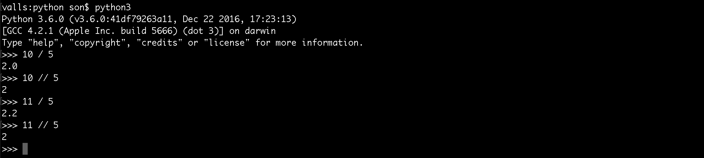

# Trabalhando com números

Agora que você já é um especialista no interpretador do python, vamos falar de um assunto muito importante, que são os números. Iremos tentar deixar o assunto o menos tedioso possível, porque temos que passar por este conteúdo, independente se quem está lendo tenha, ou não, alguma experiência com programação. Então se já tem, tenha um pouco de paciência e saiba que é importante passar por este passo na aprendizagem.

Vale a pena todos lerem, porque existem algumas dicas e regras específicas do python.

Primeiramente vamos acessar o interpretador. Digite o comando `python` ou `python3`, no terminal.

# Particularidade da divisão

Basicamente as características, dos números e operações, são muito semelhantes as demais linguagens, mas existe uma particularidade. Veja os tópicos abaixo:

* Se somarmos, ou subtrairmos, um número inteiro com outro número inteiro, teremos o retorno de um número inteiro
* Se somarmos, ou subtrairmos, um número inteiro com um número flutuantes, teremos o retorno de um número flutuante
* O mesmo vale para a multiplicação. Se multiplicarmos dois inteiros teremos um resultado inteiro, mas se um dos dois números for flutuante, teremos um resultado flutuante.
* Para a divisão temos uma particularidade.
    * Mesmo que tenhamos a divisão de dois números inteiros, sempre teremos um resultado do tipo flutuante.

Apesar de existir esta particularidade, é possível que peguemos apenas a parte inteira de uma divisão, caso seja necessário. Basta que alteremos o operador. Veja exemplo abaixo:



Ao invés de usar o operador convencional de divisão (/) alteramos para (//) e pronto. Desta forma já podemos pegar a parte inteira da divisão. Para pegar o resto da divisão podemos utilizar o mesmo operador da maioria das linguagens, que é o módulo (%).

Existe também o operador de exponencial. Basta utilizar (**). Veja exemplo:

`2 ** 3 = 8`

O código acima é interpretado como sendo 2 elevado ao cubo, que é 8. Seria a mesma coisa que fazer `2 * 2 * 2 = 8`.

# Expressões matemáticas

No python não podemos utilizar **[]** nem **{}** para executar uma expressão matemática, mas você pode substituir tudo por parênteses. Desta forma o python irá interpretar que o que estiver dentro dos parênteses deverá ser executado antes de qualquer outra operação. Vale também a regra matemática de que multiplicação e divisão são executadas antes de adição e subtração, caso não haja parênteses. Veja exemplo:

```
# Resultado 10
2 + 2 * 4
# Resultado 16
( 2 + 2 ) * 4
```

Veja que se você não inserir os parênteses o python irá fazer a multiplicação primeiro. No segundo caso ele executou a adição primeiro e depois a multiplicação.

Se você já trabalha com alguma linguagem de programação, isso não deve ser nenhuma novidade para você. Caso nunca tenha visto, você já sabe que deve utilizar os parênteses para informar a ordem das operações a serem executadas.