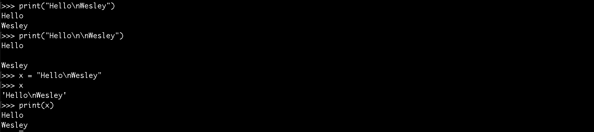
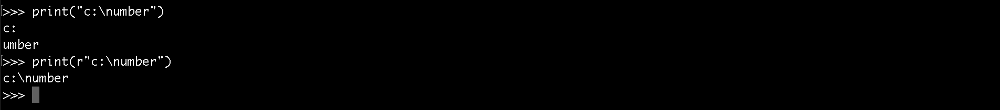
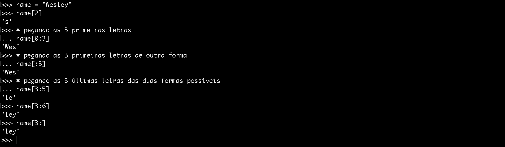

# Manipulando strings

Para manipular strings utilizaremos, novamente, o interpretador. 
Tentaremos fazer com que o conteúdo fique o menos entediante possível, assim como no conteúdo anterior. 
Acreditem, temos que passar por tudo isso, mesmo que seja muito básico, porque a linguagem possui algumas pegadinhas, que podem levá-los ao erro, caso não aprendam da maneira correta.

Programadores que já sabem manipular uma string, tenham paciência e prestem atenção nas particularidades.

# Strings, função print e \n

Para definirmos uma string, utilizamos aspas duplas ou simples, tanto faz. Qualquer uma que utilizem, terão o mesmo resultado. O que vocês **não** podem fazer é iniciar com um tipo e terminar com outro, porque o python interpretará como um erro.

Um exemplo em que aspas podem ser mescladas é quando, na string, existe uma aspa simples. Como no nome próprio **Levi's**, por exemplo.


***

Outra coisa muito interessante é que temos uma função, nativa do python, que é chamada de print. O print imprime um resultado na tela. Podemos rodar o comando abaixo, para ter **hello** impresso. Já utilizamos esta função, em um exemplo anterior.

`print("hello")`

Suponham que quisessem imprimir uma palavra, depois pular uma linha e imprimir outra. Basta utilizar o **\n** para que a função print faça isso.

```python
print("Hello\nWesley")
```

Assim, teremos Hello em uma linha e Wesley na outra. O interpretador entende que deve pular uma linha assim que vir o **\n**. Saibam que somente a função **print** que interpreta este /n e pula uma linha. 
Caso vocês atribuam uma string com \n a uma variável e depois imprima esta variável, não terão o mesmo efeito, porque o \n é interpretado como uma string, realmente.



Vejam na imagem, acima, os exemplos. Quando colocamos duas vezes o \n, o print pulou duas linhas. Quando atribuímos uma string com \n a uma variável e a imprimimos, sem o print, o interpretador não pulou linha. Depois, imprimindo a mesma variável, com o print, ele pulou.

Fizemos isso só para mostrarmos que somente o print interpreta o \n, como uma quebra de linha, no python. Suponha que exista, realmente, uma situação que o \n faça parte da string e vocês não queiram que o print pule a linha. Existe uma forma de forçar o print a não interpretar o \n como uma quebra. Vejam abaixo:



Basta colocar a letra **r**, antes da string, desta forma a função print irá interpretar somente como string e não pulará linha.

# Concatenando strings

```python
name = "Wesley"
last_name = "Silva"
name + " " + last_name
```

O símbolo responsável por concatenar é o da adição(+), assim como na linguagem javascript.

O código, acima, nos retornará **Wesley Silva**, porque concatenamos também o espaço, em forma de string. Caso concatenem apenas as variáveis, não teremos o espaço interno, mas sim **WesleySilva**. Façam esse teste no interpretador.

# Multiplicando strings

No python é possível multiplicar até strings. Vejam o código abaixo:

```python
name = "Wesley"
last_name = "Silva"
(name + " " + last_name) * 2
```

Assim, teremos o seguinte resultado: **Wesley SilvaWesley Silva**.

# Slice



Vejam, na imagem acima, os comandos que são possíveis com o **slice**. Notem que, sempre o primeiro número é o índice de referência inicial e o segundo, a referência final. Vale lembrar que, os índices sempre começam em 0.

Quando colocamos `name[0:4]` queremos pegar os elementos de 0 ao 4. Na verdade o primeiro parâmetro só é necessário quando estamos querendo pegar elementos internos. 
Observem que, se quisermos pegar do 0 ao 4 não precisamos colocar o 0, podemos fazer desta forma: `name[:4]`. A linguagem já entenderá que estamos tomando, como referência, o início da string, e o mesmo se aplica quando queremos pegar os elementos até o último item, não precisamos informar o último elemento, basta fazermos desta forma: `name[4:]`. 
Assim, estamos pegando os elementos do índice 4 até o final, independente de quantos sejam estes elementos.

O conceito do slice é muito utilizado no python, não somente em strings, mas quando queremos fazer paginação ou quando fazemos uma busca no banco de dados e queremos listar elementos de tal a tal. 
Brinquem com os exemplos deste módulo, porque ele realmente é muito importante. Façam muitos testes, até fixarem os conceitos.