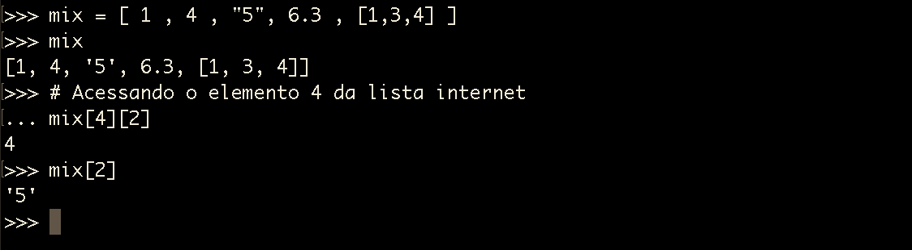
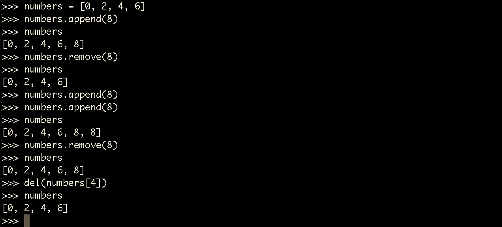

# Brincando com listas

Iremos falar de outro tipo de dado que podemos trabalhar com python. Este módulo será sobre listas.

As aplicações, desenvolvidas com python, utilizam listas a todo momento, então este assunto, sem dúvida, é muito importante.

Existem listas de clientes, listas de resultados e muitos outros tipos de lista. E iremos ensinar vocês a trabalharem com estas listas.

O primeiro detalhe, que você precisa saber, é que as listas recebem qualquer tipo de dado dentro dela. Não precisa ser só string, flutuante ou inteiro. Podemos ter todos os tipos de dados dentro de uma mesma lista.

# Declarando listas

`numbers = [0, 2, 4, 6]` | `numbers2=[10, 12, 14, 16]`

# Concatenando listas

`numbers + numbers2`

# Slice em listas

Podemos utilizar o método slice, da mesma forma que utilizamos com strings, porém ao invés de caracteres agora temos elementos independentes. Veja imagem abaixo:

Da mesma forma que as strings possuem índices as listas também os possuem, por este motivo o **slice** funciona, da mesma forma, para os dois tipos de dados.

Vamos imaginar uma lista com vários tipos de dados, inclusive uma lista dentro desta outra lista. Veja como trabalhar com este tipo de situação:

Veja que basta você ir controlando os índice para chegar até o elemento que deseja acessar.

# Listas mutáveis

Falar que uma lista é mutável quer dizer que ela pode sofrer alterações. Em uma lista, já criada, podemos adicionar ou remover elementos. Veja no exemplo abaixo:

Para adicionar, um elemento a uma lista, utilizamos o comando **append()**.

Para remover elementos, de uma lista, existem duas formas. Preste muita atenção para não se confundir.

Método | Exemplo    | Característica
---------- | -------------- | ----------------
remove | remove(8) | Remove o elemento pelo valor, apagando apenas a primeira ocorrência encontrada
del        | del(numbers[4]) | Remove o elemento de acordo com seu índice

A principal diferença entre **del** e **remove**, além da estrutura, é que *del* apaga por índice e *remove* apaga por valor. Com o *remove* você corre o risco de apagar elemento errado, que tenha o mesmo valor, com *del* você tem a certeza de estar apagando o elemento de acordo com o índice. Veja qual se adequa melhor ao seu projeto ou a situação em que se encontra.

Pratiquem bastante este assunto de listas, porque, apesar de ser simples, é muito utilizado durante a programação com python.