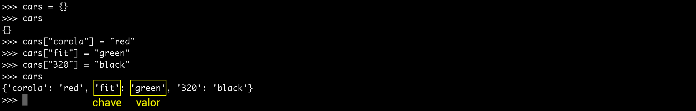
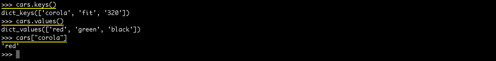

# Trabalhando com dicionários

Ensinaremos uma outra estrutura de dados que podemos trabalhar com python. Esta estrutura se chama dicionário.

Muitas pessoas acham que o python é parecido com o PHP, que tem o array e que podemos fazer o que quisermos dentro destes arrays. 
Na realidade, o python trabalha com **dicionários** e estes dicionários são similares aos arrays associativos do PHP. Um dicionário é sempre composto por chave e valor.

Criem um novo arquivo chamado dict.py, para seguirem os exemplos, ou utilizem o próprio interpretador. 
Neste caso, achamos mais dinâmico a utilização do interpretador, porque vocês observam os resultados a medida que os elementos são adiconados ao dicionário.

# Estrutura de um dicionário

```python
cars = {}
```

Assim, temos a declaração de um dicionário, chamado cars, que está em branco, inicialmente. Começaremos a atribuir valores a ele.

```python
cars['corola'] = "red"
cars['fit'] = "green"
cars['320'] = "black"
```

Vejam, abaixo, o resultado no interpretador do python:



Trabalhar com dicionários é muito importante. Na verdade, trabalhar com esta estrutura de chave e valor, em qualquer linguagem, é essencial para o controle de dados, de uma aplicação. Deêm atenção especial a este assunto. 
Vejam mais algumas funcionalidades que os dicionários nos proporcionam.



Comando | Resultado
------------- | --------------
cars.keys() | Retorna todas as chaves do dicionário
cars.values() | Retorna todos os valores do dicionário
cars.["corola"] | Retorna o valor referente a chave informada

Um exemplo que podemos dar, do uso de dicionários, é quando vocês utilizam o **Django**, que é um framework de python para desenvolvimento web. 
Utilizando este framework, vocês utilizam dicionários a todo momento, porque vocês precisam criar estas estruturas para conseguirem trabalhar com o fluxo de dados.

# Outras formas de criar um dicionário

```python
# Declarando um dicionário usando dict
people = dict(Wesley='Father',Mariana="Mother",Sarah="baby")

# Declarando um dicionário com chaves
family = {
    'wesley' : 'Father'
}

# Verificando se existe uma chave antes de imprimir
if 'Wesley' in people:
    print(people['Wesley'])
```

Vejam que, além de criarmos dicionários de formas diferentes, nós mostramos uma forma de verificar se existe uma chave, dentro do dicionário, antes de imprimir. Desta forma, evitamos erros, durante a programação.

# Conclusão

O que vocês precisam entender é que, dicionários são estruturas com chave e valor. Há a possibilidade de existir um dicionário dentro de outro dicionário.

Outro fato importante que devem ter atenção, é na estruturação dos seus dicionários. Vocês devem estruturar muito bem, para consiguirem trabalhar de forma organizada. 

Um exemplo simples que podemos citar é o seguinte:

Suponham que, vocês desenvolverão uma aplicação de pagamento, via cartão. O sistema irá pegar dados de um formulário, preenchido pelo usuário. Neste formulário, o usuário preencherá: nome, endereço, número do cartão, entre outros dados. 
Depois de receber estes dados, do formulário, vocês deverão configurar um dicionário, com a mesma estrutura que o sistema de pagamento exige.

Desta forma, vocês estão adequando a estrutura de vocês, exatamente, à estrutura exigida pelo sistema de validação do cartão. Sendo assim, terão a aplicação se comunicando, corretamente, com o sistema de pagamento. Isso quer dizer que vocês criam, da maneira que quiserem e na ordem que quiserem, seus dicionários.

Este conceito de biblioteca é muito importante. Estudem bastante e tentem entender todo funcionamento. 
Criem exemplos e testes próprios, para irem se acostumando com a estrutura e o conceito.