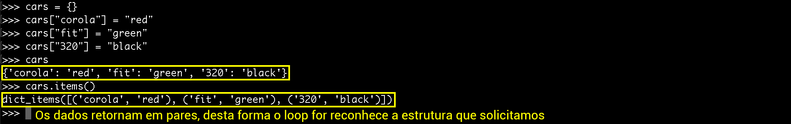

# Iterando em dicionários

Para finalizarmos o conteúdo de dicionários, precisamos ensinar a fazer uma iteração nos dicionários. 
Assim, conseguirão percorrer um dicionário inteiro e trabalhar com a estrutura de dados que ele fornece.

Alguns programadores trabalham da seguinte forma:

```python
cars = {
    "Corola" : "red",
    "Fit" : "green",
    "320" : "black"
}

for car in cars:
    print(car + " - " + cars[car])
```

Isso pode parecer, e na verdade é, uma "gambiarra". Não pode ser normal fazermos uma iteração e dentro, precisarem utilizar o  dicionário, novamente, passando as chaves, para resgatar os dados. Mesmo sendo uma gambiarra, não está totalmente errado, porque funciona, corretamente, mas "cheira mal".

Isso ocorre porque a iteração de um dicionário, com o for, só consegue retornar as chaves. Logo, precisamos colocar o dicionário e passar a chave, para conseguirmso pegar o valor, a cada iteração.

### Forma correta de iterar um dicionário

Antes de falarmos da forma correta, devemos lembrar que mostramos algumas funções, no módulo anterior, que retornam alguns valores, referentes a um dicionário. Falamos sobre **cars.keys()** e também **cars.values()**. Com estes métodos, nós conseguimos pegar os valores ou as chaves. Mas e se precisássemos pegar os dois juntos?

Existe um outro método para pegarmos os valores em pares: **cars.items()**. Sabendo disso, mostraremos a melhor maneira de iterar um dicionário.

```python
cars = {
    "Corola" : "red",
    "Fit" : "green",
    "320" : "black"
}

for key, value in cars.items():
    print(key + " - " + value)
```

Observem as mudanças:

1. Nós passamos dois parâmetros de resgate para a iteração: key e value
2. Como separamos em dois parâmetros de resgate, devemos passar dois parâmetros para a iteração, também. Por isso, passamos cars.items() e não somente cars.
3. Em seguida, para iteração, utilizamos os valores diretos, porque o for nos retornará, corretamente, as chaves e os valores, nas variáveis **key** e **value**.

Notem que, se fizermos da forma, abaixo, não daria certo:

```python
cars = {
    "Corola" : "red",
    "Fit" : "green",
    "320" : "black"
}

for key, value in cars:
    print(key + " - " + value)
```

Esta estrutura não funciona porque estamos pedindo para o for separar o retorno em dois parâmetros, mas estamos passando um dicionário, que não está configurado em pares, por isso que o for não consegue interpretar. Se passarmos da primeira maneira, o for consegue interpretar, corretamente. 
Vejam a diferença entre uma forma e a outra:



Falamos que esta é a forma correta de se iterar um dicionário, porque estamos trabalhando de uma forma muito mais elegante, e que "soa" ser correta. Isso porque, estamos trabalhando com cada elemento, separadamente, **key** e **value**. 
Lembrando que não tem como trabalhar desta forma com listas, porque listas não possuem chaves e valores. Listas possuem, apenas, os valores diretamente.