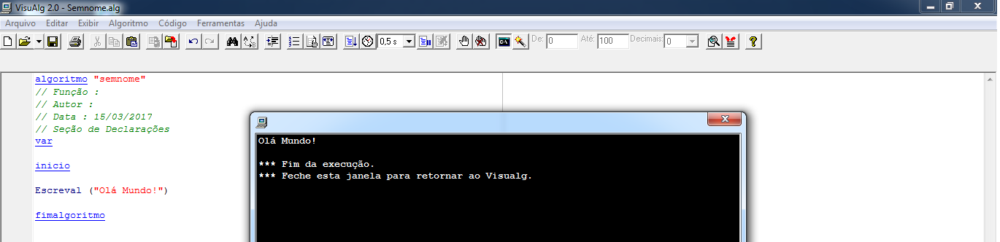

# Entendendo fases de um algorítmo

Neste módulo, criaremos o primeiro "programinha", que será bem simples. Dará a base para entendermos as fases de um algorítmo. Criaremos o famoso **Olá Mundo!**.

Este programa que criaremos será, basicamente, um comando que imprime, qualquer coisa que quisermos, na tela do usuário.

Vejam o código do programa:

```
algoritmo "semnome"
// Função :
// Autor :
// Data : 02/27/2017
// Seção de Declarações
var

inicio

Escreval ("Olá Mundo!")

fimalgoritmo
```

Observem que o comando para impressão é o **Escreval** onde passamos, dentro dos parênteses, a frase que queremos imprimir. Após adicionarem este comando, cliquem em **F9**, que é o comando de execução ou, acessem o menu **Algoritmo/Execução**.

Teremos o seguinte resultado:



Já rodamos o primeiro programa, entenderemos as fases deste algorítmo. Entenderemos como o programa compila tudo até a impressão na tela do usuário.

A estrutura básica para o VisuAlg se inicia com o nome do algoritmo, que vocês devem nomear com um nome bem intuitivo, para que as pessoas saibam o que aquele programa faz.

Logo depois, temos a parte de declaração de variáveis. Nós próximos módulos, vocês entenderão o que significa uma variável e para que ela serve.

O próximo bloco refere-se ao início do algorítmo, onde colocaremos todas as instruções. Este bloco também é conhecido como **corpo** do algorítmo.

Em seguida, temos o fim do algorítmo.

Após a criação desta estrutura, a primeira fase que o algorítmo passa é, a fase de entrada de dados. Neste momento, devemos declarar alguma informação ao algorítmo ou, até mesmo, fazer com que o usuário informe algum dado.

A próxima fase refere-se ao processamento de dados. Neste momento, o algorítmo executará todas as instruções, utilizando os dados de entrada, caso existam. Esta fase é responsável por chegar ao objetivo final do algorítmo.

Por fim, temos a fase de saída de dados. Neste momento, os dados já foram processados, o nosso objetivo foi concluído e nos resta, apenas, mostrar ao usuário o resultado. Existem outras formas de saída, além de uma mensagem ao usuário. Podemos ter um armazenamento deste resultado, em algum local, ou qualquer outro tipo de ação.

O importante é saberem que podem fazer o que quiserem com este resultado, uma vez que ele já foi processado e concluído. Lembrando que, um algorítmo nem sempre é para resolução de problemas. Podemos criar um algorítmo para detectar problemas. Neste caso, poderíamos ter uma mensagem positiva ou, até mesmo, mensagens de erro, como uma resposta.

Sabendo estes conceitos, analisaremos o nosso algorítmo. Como não adicionamos nenhum dado de entrada, o fluxo irá direto ao processamento e este processamento será muito simples, porque uma vez que não temos dados de entrada a execução não será muito complexa. Em nosso caso, temos, apenas, a impressão de uma frase. Ele processa o comando **Escreval**, de impressão, e retorna, como resultado de saída de dados, a nossa frase.

Associaremos à nossa vida real. Suponham um escrivão, como um algorítmo.

Primeiro, temos a entrada de informações, que será o depoimento de algum indivíduo. Este escrivão está recebendo os dados de entrada. Ele processa a melhor forma de escrever e escreve. A saída, será a folha em que ele está escrevendo, para depois arquivar, em algum local.

Desta forma, vocês observam que é muito simples associar a programação à nossa vida real e, sempre será desta forma. Os programas são desenvolvidos para resolver um problema real, de nosso dia a dia ou, facilitar um processo que é muito repetitivo.