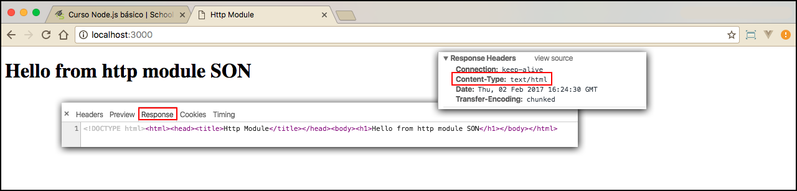

# Trabalhando com http

Neste módulo aprenderemos a utilizar a classe **http**. Criaremos o primeiro web server, utilizando Node.js.

Passaremos algumas noções básicas sobre módulos, antes de continuarmos, para que entendam o funcionamento do http.
Falaremos melhor sobre este assunto, nos próximos capítulos.
O Node é uma plataforma que tem várias APIs por trás de seu funcionamento. Cada API tem uma resposabilidade. Temos API **http**, que é responsável por lidar com a internet, possuímos a de arquivo, que é responsável por lidar com tudo que envolve arquivos, em seu projeto, entre outras.

Node é uma linguagem como qualquer outra, com base em javascript. Sabendo disso, nós podemos importar módulos, presentes nas APIs, de acordo com a necessidade do projeto.

Nós devemos utilizar o **require**, seguido do nome do módulo, como parâmetro. Podemos utilizar este recurso, tanto para módulos nativos do Node, quanto para bibliotecas que foram gerenciadas e instaladas pelo npm.

Falaremos mais sobre gerenciamento de arquivos, durante o conteúdo. Sobre como montar estruturas e carregar arquivos externos. 
O foco deste módulo é informar que existe uma palavra reservada chamada require, que tem a função de requerer, como o próprio nome diz, o arquivo ou módulo que estamos passando como argumento.

```js
var http = require('http');

function handle(request,response){
    response.end('Hello from http module');
}

var server = http.createServer(hangle);

server.listen(3000, function(){
    console.log('Server is listening as port 3000');
});
```

No código acima, nós importamos o **módulo http** para a **variável http**. Em seguida, criamos uma função chamada **handle*, com dois parâmetros: um é a requisição, feita pelo usuário, e o outro é a resposta que o servidor retornará.

Neste caso, não estamos fazendo nenhuma lógica para que o servidor possa processar. Estamos, apenas, retornando uma mensagem e finalizando o acesso ao servidor, com o método **end**.

Logo depois, nós criamos um server, utilizando a função **createServer** e passamos a função handle, como parâmetro.  
Depois, o atribuimos a uma variável chamada server. Em seguida, nós utilizamos o método **listen**, para habilitar a porta que o servidor receberá os dados de entrada. Passamos a porta 3000, que é o padrão utilizado. 
Vocês podem informar outra porta, só tomem cuidado para não utilizarem portas que o sistema operacional utiliza ou alguns programas, isso acarretrá conflitos.

Para acessarem este arquivo, no browser, e conseguirem ver o resultado dele, temos que rodar um comando no terminal, capaz de executar este arquivo. Somente depois da execução deste comando, teremos o nosso servidor rodando.

Comando: `node app.js`

Vejam o resultado quando acessamos o browser, no seguinte endereço: **http://localhost:3000**.


# Retornando um html como response

```js
var http = require('http');

function handle(request,response){

    response.writeHead(200,{
       'Content-Type': 'text/html'
    });

    response.write("<!DOCTYPE html>");
    response.write("<html>");
    response.write("<head><title>Http Module</title></head>");
    response.write("<body>");
    response.write("<h1>Hello from http module SON</h1>");
    response.write("</body>");
    response.write("</html>");

    response.end();
}

var server = http.createServer(handle);

server.listen(3000, function(){
    console.log('Server is listening as port 3000');
});
```

Notem que alteramos a nossa função handle. Agora, ela não retorna, apenas, uma mensagem simples do tipo **text/plain**. Alteramos o Content-Type da response para **text/html**. Isso fará com que o browser interprete como um html e não mais como um texto simples.

Depois de alterarmos o content type, nós adicionamos uma estrutura básica de html, utilizando o método **write** e finalizamos a response, sem mensagem nenhuma. Não adicionamos mensagem, porque já inserimos conteúdo à ela.

Agora, basta irem ao terminal e rodarem o arquivo, novamente. Se não rodarem, não terão as alterações efetivadas: 

`node app.js`



Observem como foi fácil gerar o html no browser, utilizando o módulo http do Node. Alteramos, apenas, o content type e depois adicionamos os elementos, com um método simples.

Através do html, surgiram todos os frameworks node.js voltados para web. Os criadores do node, tornaram o trabalho com http muito mais fácil, simples e dinâmico, para utilizarmos. 
A prova disso é que, nosso arquivo tem menos de 25 linhas e já fizemos um exemplo funcional.