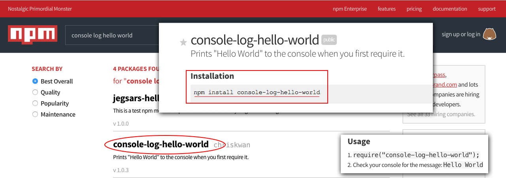

# Adicionando pacotes externos

Vamos ensinar trabalhar com pacotes externos, que é uma tarefa muito simples. O npm já faz esta tarefa pra gente.

Você vai aprender a pesquisar e adicionar algo que seja externo em seu projeto. Basta entrar no site <https://www.npmjs.com/> e pesquisar o pacote que desejar.

Para exemplificar iremos pesquisar por um pacote chamado **Hello World**, que é responsável apenas por dar um console log em nosso projeto.



Na imagem você pode ver o resultado da busca e também a página interna do pacote, onde mostra o comando para instalação. Então vamos rodar o comando abaixo:

`npm install console-log-hello-world`

Com este comando acima, teremos já o pacote instalado, porém se você olhar o arquivo **package.json** você não terá informação nenhuma de que seu projeto possui este pacote ou que ele dependa deste pacote.

Portanto para resolver este problema basta que adicionemos um parâmetro ao comando de instalação. Rode o comando abaixo novamente:

`npm install console-log-hello-world --save`

Desta forma será adicionada a dependência no arquivo package.json e quando você for rodar seu projeto em outro local, basta rodar o compando:

`npm install`

Que todas as dependências que estiverem relacionadas serão instaladas automaticamente pelo npm. Esta é a vantagem de utilizar o gerenciador. Então prestem atenção quando for instalar algum pacote e decida se ele faz parte do desenvolvimento apenas ou se ele faz parte do projeto geral, pois existem dois parâmetros a serem adicionados como dependência: desenvolvimento e produção.

Parâmetro | Tipo | Descrição
-------------- | ------ | -------------
--save | Produção | Pertence ao ambiente de produção e ao ambiente de desenvolvimento
--save-dev | Desenvolvimento | Pertence somente ao ambiente de desenvolvimento

Depois que o pacote é instalado, você pode reparar que é criada uma pasta chamada **node_modules** onde estarão instaladas todas as dependências do seu projeto.

# Importando pacote externo

```js
require('console-log-hello-world');
```

Como é um pacote externo utilizamos somente o require seguido do nome da pasta criada dentro da pasta node_modules. Você pode também verificar a chamada na imagem acima ou, se utilizar uma IDE ela também irá te ajudar com o auto complete.

Depois de instalado e importado em nosso arquivo app.js, iremos rodar o arquivo no terminal.

`node app.js`

E reparem que teremos o Hello World sendo impresso, isso quer dizer que a biblioteca está devidamente funcionando.

# Conclusão

Não deixe de verificar o seu arquivo package.json para ver as dependências que foram adicionadas, desta forma você entenderá o funcionamento do npm.

Para treinar seria interessante fazer a instalação de mais um pacote e não se esqueça de adicionar como dependência do projeto ou de produção.