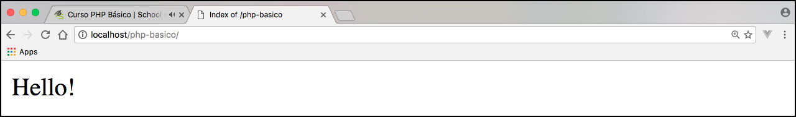

# Como instalar o PHP

Primeiro passo é acessar o site: <https://secure.php.net/downloads.php>. 
Acessando este link vocês encontrarão as versões do PHP disponíveis. 
Iremos instalar a versão 7.0, para continuar com o conteúdo de PHP Básico.

Quando estiverem lendo este material, pode ser que existam versões superiores, mas nos basearemos na versão 7.0.

Cuidado com o download. É necessário verificar o sistema operacional que estão utilizando. 
Baixem o arquivo, de acordo com o sistema da máquina que estiverem utilizando.

É possível instalar o PHP, por terminal de comando, basta pesquisar como instalar o PHP no sistema operacional que estiverem utilizando. 
No Mac, por exemplo, tem o comando **brew** que auxilia a instalação. No ubuntu pode instalar via **apt-get**. 
Há muito material disponível, na internet, para auxiliar a instalação. 
Em muitos casos, o PHP já vem instalado e configurado na máquina, porém, com versões anteriores.

O mais importante, depois de concluir a instalação, é configurar as variáveis de ambiente, para consiguirmos rodar o PHP, utilizando o terminal. 
Digitando `$ php -v`, no terminal, teremos como retorno a versão do PHP, instalada na máquina. 
Se rodarmos este comando e obtivermos a versão, como resposta, quer dizer que o PHP está devidamente instalado e rodando.

No Windows, precisamos copiar o caminho onde extraimos o download e adicionar nas variáveis de ambiente. 
Devemos ir em: meu computador, clicar com o botão direito e ir em propriedades. Em configurações avançadas encontraremos as variáveis de ambiente. 
Precisamos localizar a variável **path**, encontrando, clicamos em editar e adicionar, o caminho copiado, ao final de todos que já existirem, separado por ponto e vírgula(;).

A variável de ambiente já está configurada. Indicamos que seja criada uma pasta chamada PHP, no diretório **c:** da máquina e que seja extraído o PHP lá dentro, no caso de Windows. 
Podemos instalar em outro local, mas este é o local mais utilizado. O path seria **c:\php**, caso utilizem este caminho.

O próximo passo será criar uma pasta que abrigará todos os arquivos do projeto, que iremos desenvolver, durante o curso.
Dentro desta pasta criaremos um arquivo chamado, **index.php**. Será o arquivo de entrada dos nossos estudos.

#### Conteúdo arquivo index.php

```php
<?php
echo "Hello!";
?>
```

# Rodando servidor embutido

Para rodar um servidor embutido do PHP, basta acessar a pasta onde está o arquivo index.php e rodar o seguinte comando, no terminal.

`$ php -S localhost:8080`

O terminal irá  mostrar a url de acesso, via browser, para que possamos acessar a página inicial do projeto. 
Neste caso: **http://localhost:8080**. Pode ser outra porta.

Resultado do browser, após rodar o servidor embutido do PHP:

