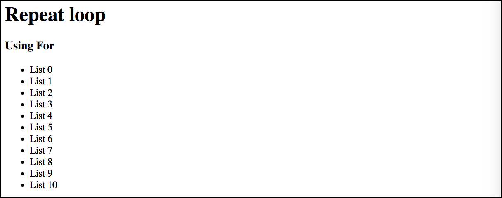

# For

Falaremos sobre laços de repetição. Mais conhecido como Loops.

Utilizamos este recurso, sempre que precisamos repetir, várias vezes, uma mesma tarefa, ou duplicar, várias vezes, algum código ou valor, por exemplo.

Na programação,vocês utilizarão para a criação de tabelas, galerias de imagens, slide de imagens, listas e muitas outras coisas, que necessitem deste laço de repetição.

Este conceito é essencial para trabalharem com repetições, em qualquer linguagem. 
Tentem aprender o conceito, pois é muito importante. Assim como variáveis e condicionais, também são. 
As estruturas de repetições são muito parecidas em qualquer linguagem e todas possuem. 
Vocês aprenderão como fazer no PHP. No futuro, se forem aprender outra linguagem, não terão problemas, pois terão que saber, apenas, qual a estrutura dessa linguagem.

Iremos mostrar exemplos básicos, integrados com o HTML, para entenderem como se utiliza em uma aplicação.

# Estrutura

```php
<?php
for ( $i=0 ; $i<10 ; $i++ ){
    //Lógica
}
?>
```

Notem que temos 3 elementos, passados entre parênteses, para a repetição for.

1. Valor inicial que terá o contador da iteração
2. Condição para iteração
3. Incremento do contador

### O que estes 3 parâmetros querem dizer?

Para entender a repetição de maneira completa, devemos fazer teste de mesa. 
Enquanto não tiverem prática para entender, deverão fazer passo-a-passo, conforme abaixo:

Devemos analisar, uma pergunta e uma execução:

1. Análise: qual o valor da variável $i?
2. Pergunta: O $i satisfaz a condição?
    * Em nosso exemplo a pergunta seria: $i é menor do que 10?
3. Caso a pergunta anterior seja positiva o código é executado e consequentemente a variável $i aumenta de acordo com o último parâmetro.
    * Em nosso exemplo, o incremento é de 1 em 1. Poderia ser de 2 em 2. Sempre analisem. Na maioria das vezes é de 1 em 1.

# Exemplo prático

```php
<?php
for ( $i=0 ; $i<10 ; $i++ ){
    echo "list " . $i . "<br/>";
}
?>
```

Resultado:



Tentaremos fazer um teste de mesa, rápido, para que possam entender. Veja abaixo:

Valor de $i | Condição ($i < 10) | Resposta Condição | Execução | Incremento (**$i++**)
-------------- | ------------------------- | -------------------------- | ------------- | -----------------------------
0 |  0 < 10 | Sim | Imprime list 0 | 0 + 1 = 1
1 |  1 < 10 | Sim | Imprime list 1 | 1 + 1 = 2
2 |  2 < 10 | Sim | Imprime list 2 | 2 + 1 = 3
3 |  3 < 10 | Sim | Imprime list 3 | 3 + 1 = 4
4 |  4 < 10 | Sim | Imprime list 4 | 4 + 1 = 5
5 |  5 < 10 | Sim | Imprime list 5 | 5 + 1 = 6
6 |  6 < 10 | Sim | Imprime list 6 | 6 + 1 = 7
7 |  7 < 10 | Sim | Imprime list 7 | 7 + 1 = 8
8 |  8 < 10 | Sim | Imprime list 8 | 8 + 1 = 9
9 |  9 < 10 | Sim | Imprime list 9 | 9 + 1 = 10
10 | 10 < 10 | Não | para execução | para incremento

Observem a tabela acima, linha por linha. Primeiro vemos que o $i começa em 0, porque nós atribuimos o 0. Depois analisamos se ele passa na condição do for e concluimos que passa, portanto executamos o bloco que estiver entre chaves.
Após ser executado, o for incrementa um, ao valor anterior, que era 0. 
A partir deste ponto, começamos, novamente, a mesma análise. O que muda é o valor de $i, porque foi incrementado.

Notem que o incremento é que faz com que a repetição tenha um fim. Se não fosse desta forma, teríamos um loop infinito e travaria o seu navegador. O servidor não conseguiria encontrar um final, porque $i seria 0, sempre, e, consequentemente, seria menor do que 10. 
Isso nunca teria fim. Este é o papel do incremento **$i++**. Vocês podem fazer testes com incrementos maiores como: $i+=2 ou $i+=3 ou $i+=4 ...

Acredito que esta tabela seja capaz de mostrar todo processo, do início ao fim, do laço de repetição. 
Com este laço, vocês têm o poder de imprimir 1000 vezes na tela, basta alterar o número 10 da condicional. 
Se inserirmos 1000, ele imprimirá 1000 vezes. Se for 200 ele imprimirá 200, assim por diante.

Este é o poder do laço de repetição, imaginem se tivéssemos que colocar, manualmente, 1000 resultados na tela? Ou uma galeria com 200 fotos, tudo manual, uma a uma?

# Exemplo HTML sem repetição

```html
<h1>Repeat loop</h1>
<h3>Using For</h3>
<ul>
    <li>List 0</li>
    <li>List 1</li>
    <li>List 2</li>
    <li>List 3</li>
    <li>List 4</li>
    <li>List 5</li>
    <li>List 6</li>
    <li>List 7</li>
    <li>List 8</li>
    <li>List 9</li>
</ul>
```

# Exemplo HTML com repetição for

```php
<h1>Repeat loop</h1>
<h3>Using For</h3>
<ul>
    <?php
    for($i = 0;$i<=10;$i++):
        ?>
            <li>List <?= $i ?></li>
        <?php
    endfor;
    ?>
</ul>
```

 Nós utilizamos apenas 10 repetições para não ficar extenso. Imaginem se fossem 1000 linhas de listagem? 
 Além de dar um trabalho enorme para desenvolver, manualmente, o arquivo ficaria muito grande. 
 Analisem o exemplo com repetição **for**. Ele não modifica o tamanho e é muito reduzido.

 Se quisermos imprimir 10 ou 1000 ou 10.000 não importa, basta alterarmos o valor da condição, o código se mantém intacto.

# Conclusão

Vocês podem ver o grande poder que possuem em suas mãos, durante a programação. Criem novos testes.

Aconselhamos que sejam feitos muitos testes. Alterem o valor inicial do $i, alterem a lógica e alterem o incremento. 
Os testes farão com que vocês entendam, cada vez mais, como funciona a estrutura de repetição.

A variável que utilizamos como contador foi a variável $i, mas vocês podem colocar o nome que acharem melhor. 
Colocamos $i, porque é a mais utilizada pelos programadores e, como convenção, sempre é utilizada em exemplos.