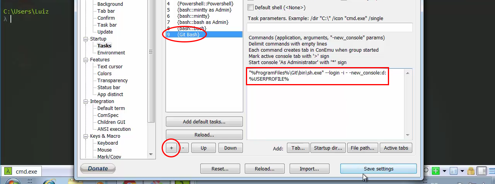

# Windows - Instalando Git Bash e Cmder

Neste módulo ensinaremos a configurar o ambiente de desenvolvimento, de nossa aplicação, para o sistema operacional Windows.

Começaremos pelo terminal, porque, no Windows, temos dois terminais nativos que são: **cmd** e o **powershell**. Não é aconselhável utilizar o DOS para desenvolver porque não temos uma gama muito grande de comandos e também acabamos não tendo exposição aos comandos do ambiente unix. Então, caso não queira instalar os terminais que lhe apresentaremos, neste módulo, aconselhamos que utilize o powershell.

Ensinaremos a instalar o terminal **Git Bash**, que já vem com o Git instalado e também com a opção de trabalhar com **abas**, caso queira trabalhar com vários terminais ao mesmo tempo. Com este terminal, nós teremos os mesmos comandos de um ambiente Unix, o que é bom, principalmente, para ir se familiarizando com os comando.

Mostraremos também uma outra opção de terminal, que também é muito boa, chamada **Cmder**.

## Git Bash

Então o Git Bash é um terminal que é preparado para trabalhar com Git e com os comandos Unix.

Ele é muito simples de instalar, basta baixar o instalador, referênte ao seu sistema operacional, no site abaixo:

<https://git-scm.com/downloads>

No Linux e no Mac não será necessária a instalação porque você pode utilizar o shell nativo.

Como pode gerar alguma dúvida, nós comentaremos as opções que você deve, ou não, marcar durante a instalação.

Abra o instalador, faça a leitura do contrado e terminos, e depois clique em next. Na próxima tela deixe marcadas as opções abaixo:

* Windows Explorer integration
    ** Git Bash Here
    ** Git GUI Here
* Associate .git* configuration files with the default text editor
* Associate .sh files to be run with Bash

Você pode também marcar a primeira opção para que o instalador crie um ícone em sua área de trabalho.

A opção **Git Bash Here** serve para criar uma opção ao clicar com o botão direito dentro de uma determinada pasta, onde você poderá acessar o terminal a partir daquele caminho relativo.

Depois de selecionar os itens acima clique em avanção e na próxima tela não precisaremos modificar nada, portanto avance novamente.

Na tela de **Adjusting yuor PATH environment** você tem que prestar atenção porque é um passo importante da instalação. Você pode usar o o Git somente no Git Bash, ou você pode deixar a segunda opção marcada para poder utilizar também no cmd do Windows. Nós aconselhamos deixar esta segunda opção marcada, porque se, por acaso, precisar rodar um comando no DOS você também poderá rodar.

Na próxima tela você também não precisa alterar nada, pode avançar com a seleção padrão.

Na tela **Configuring the line ending conversions** nós deixaremos a primeira opção marcada, para utilizar o **checkout Windows-style**.

Avançando nós não precisaremos alterar nada na tela de Configuração do Emulador, deixe marcada a opção **Use MinTTy**.

Em **Configuring extra options** deixaremos somente a primeira opção ativa e vamos avançar para começar a instalação. Esta última opção serve para que o terminal salve os últimos comandos para que você possa reutilizar.

No final da instalação, já teremos o Git Bash disponível para uso. Então abra o terminal para testar e rode o comando `ls`, que irá listar os arquivos e pastas do local atual em que você se encontra.

Por padrão sempre que abrir o Git Bash você estará em sua pasta de usuário. Caso queira acessar o diretório **c:**, você deverá voltar dois níveis rodando duas vezes o comando `cd ..`.

## Cmder

Este terminal também foi desenvolvido para trabalhar em Windows, mas ele tem algumas funcionalidades a mais, ele trabalha com outros terminais em conjunto, possui a opção de alterar as cores e muito mais.

Caso não queira instalar o comando você não precisa, poderá instalar apenas o Git Bash.

Nós não entraremos em detalhes das características de cada terminal, mas você pode pesquisar sobre os dois e escolher qual utiliza. Até o final deste conteúdo nós utilizaremos o **Cmder**.

Este terminal não precisa ser instalado, basta descompactar e mover para algum local. Depois você abre o executável e já pode utilizar normalmente. Você poderá ter uma mensagem, na primeira vez que for executar o programa, onde você terá que permitir a execução do ConEmu e depois disso já terá o seu terminal aberto.

O Cmder permite a integração de outros terminais, então nós integraremos com o Git Bash. Para isso criaremos uma nova tarefa, clicando em **Create new console**, no canto inferior direito, onde existe um símbolo de adição verde, e depois em **Setup Tasks**.

Depois de adicionado você já pode abrir o Git Bash clicando no mesmo local onde criou o novo console. Veja imagem abaixo:

Uma das vantagens de trabalhar com o Cmder é poder criar outros terminais, inclusive de outros tipos, como o Git Bash, e estar em apenas uma janela. Você pode ir selecionando o terminal através de abas, que são abertas na parte inferior do terminal.

# Conclusão

O nosso objetivo é que você tenha mais produtividade e portanto mostramos as melhores opções para se trabalhar com terminais no Windows. Caso não queira utilizar o Cmder, utilize o Git Bash apenas.

Caso não queira utilizar nenhum dos dois terminais mostrados utilize o **powershell** que é muito melhor do que o **cmd**.