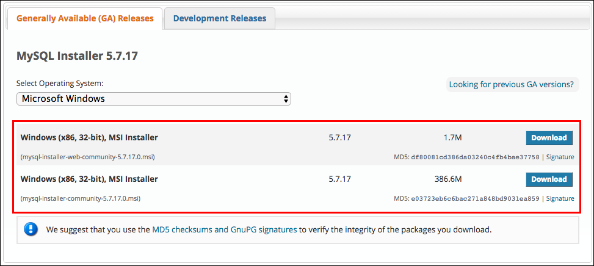
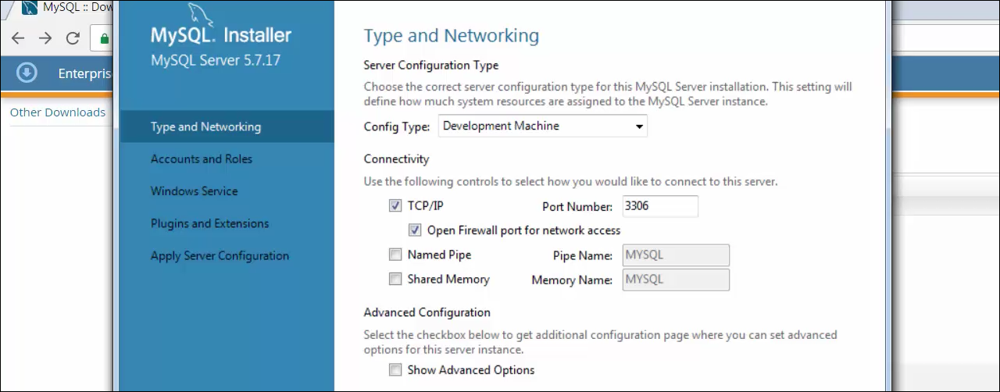

# Windows - Instalando MySQL

Já temos o Composer e o PHP 7.1 configurados, instalaremos o banco de dados que a nossa aplicação utilizará.

O PHP com o MySQL foi uma "casamento" que deu muito certo. Existem algumas maneiras de instalar. Ensinaremos, utilizando o **MySQL Installer**.

Este instalador nos permite escolher quais ferramentas queremos instalar, porque o MySQL não possui apenas o banco de dados. Ao selecionar, o instalador baixa, automaticamente, e já instala. É uma forma mais simples de instalar as ferramentas necessárias.

Existem duas versões para download: full e a compacta. Vejam na imagem abaixo:



Baixaremos a versão de menor tamanho, que não possui todos os recursos que o MySQL disponibiliza.

Durante a instalação, selecionem a opção **custom** e selecionem os seguinte itens, apenas:


Nas próximas etapas de instalação, vocês poderão ter que instalar outras ferramentas, necessárias, caso ainda não tenham, mas o próprio instalador, informará a necessidade.

Depois de instalado, partiremos para a configuração do banco de dados. Deixaremos as configurações originais do instalador. Vejam abaixo:



Avançando, vocês configurarão usuário e senha do banco de dados. Geralmente, configuramos o usuário como sendo **root** e a senha, também, **root**. Algumas pessoas gostam de deixar a senha em branco.

Não precisam alterar as duas próximas etapas, basta avançar.

Por último, o instalador aplicará as configurações do servidor e fará uma série de verificações. Depois, basta concluir a instalação.

Agora que temos o MySQL instalado, configuraremos uma variável de ambiente, da mesma forma que fizemos para o PHP, para que possamos administrar esta ferramenta, pelo terminal.

Se vocês não lembram, copiem o endereço da pasta binária da instalação, onde está o arquivo executável, e adicionem às suas variáveis de ambiente.

Para isso, devemos acessar: meu computador, clicar com o botão direito e ir em propriedades. Em configurações avançadas, encontraremos as variáveis de ambiente.
Precisamos localizar a variável **path**. Encontrando, clicamos em editar e adicionar o caminho copiado, ao final de todos que já existirem, separado por ponto e vírgula(;).

Depois de executarem estes passos, fechem o terminal e abram, novamente, para que ele possa carregar as variáveis de ambiente, novamente. Rodem os comandos abaixo:

```
// Acessar MySQL
mysql -uroot -proot

// Criar um banco de dados
create database php_teste

// Sair do MySQL
exit
```

O **-u** é o parâmetro para informar o usuário e o **-p** para informar a senha que vocês configuraram no mysql.

Observem que criamos um banco de dados, apenas, com um comando. Para testarem a conexão com o banco, criem um arquivo na área de trabalho.

Para criar um arquivo, pelo terminal, podem utilizar o seguinte comando:

`touch mysql.php`

## Código do arquivo mysql.php

```
try{
    new \PDO('mysql:host=localhost;dbname=php_teste','root','root');
    echo "Conexão efetuada com sucesso!\n";
}catch(\PDOException $ex) {
    echo $ex->getMessage();
}
```

Depois de colocarem este conteúdo no arquivo, executem o mesmo, no terminal.

`php teste.php`

Se tudo estiver correto, terão a conexão e a mensagem que adicionamos, caso coloquem um dado errado para conexão, vocês terão o seguinte erro:

**SQLSTATE\[HY000] [1049] Unknown database 'php_teste1'**

# Conclusão

Agora que já temos o PHP, Composer e MySQL, instalados. Temos o MySQL, integrado com o nosso PHP.

Com isso, temos nosso ambiente, completo, para iniciarmos nosso projeto de estudo.