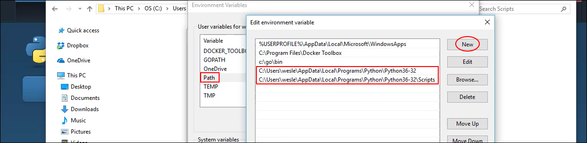

# Instalando python

Neste módulo instalaremos o Python, começando a colocar a mão na massa em nosso projeto.

Estamos partindo do princípio que você tenha um conhecimento básico de Python e que tenha uma noção básica de Django, caso não tenha, aconselhamos que analise os pré-requisitos deste conteúdo e busque-os para depois continuar. Desta forma você terá um melhor aproveitamento do conteúdo.

De qualquer forma faremos a instalação do Python, porém focaremos mais na configuração, apesar de seguir o passo a passo proposto no site do Python.

Existem algumas particularidades para quem utiliza Windows, mas em Linux e Mac a instalação é mais tranquila, basta utilizar alguns comandos e já temos a instalação concluída. Para Linux pode utilizar o **apt-get** e no Mac pode utilizar o **Homebrew**, por exemplo.

Para Windows você precisa fazer a configuração da variável de ambiente, porque muitas vezes a instalação não faz automaticamente.

No momento da criação deste conteúdo a versão atual do Python é a **3.6.1**, lembrando que você pode estar lendo este conteúdo e esta versão estar mais avançada.

Baixando o arquivo de instalação para Windows você poderá instalar, como qualquer outro programa, aceitando os termos e avançando até a conclusão, mas existem algumas particularidades que podem fazer com que o Python não funcione em seu terminal de comando do Windows.

Então siga os seguintes passos para configurar a variável de ambiente e não ter problema nenhum para utilizar a linguagem.

1. Acesse **Control Panel > System and Security > System** e vá até o menua lateral esquerdo **Advanced system settings**, ou **Configurações avançadas do sistema** depois acesse **Environment Variables** ou **Variáveis de Ambiente**.
2. Você deverá pegar o caminho de instalação do seu Python para configurar a variável de ambiente. Geralmente o caminho é **Users > Usuário > AppData > Local > Programs > Python > Python36-32**
3. Adicione este caminho da variável chamada **Path**, que já estará presente no Windows, no primeiro menu acessado.
4. Como precisaremos de alguns recursos do Python para a instalação das bibliotecas, vamos adicionar a pasta **Scripts** as variáveis de ambiente também. Então dentro do mesmo caminho anterior acesse a pasta Scripts e copie e caminho completo também. **Users > Usuário > AppData > Local > Programs > Python > Python36-32 > Scripts**
5. Adicione o caminho na variável chamada **Path**, que já estará presente no Windows, no primeiro menu acessado.



Depois de ter feito este procedimento abra seu terminal, indicamos o uso do **powershell**, ao invés do **cmd**, do Windows, ou alguns terminais como **gitbash** ou **cmder**.

Depois que abrir o terminal você pode digitar **python** e dar um enter. Se sua instalação estiver correta e sua variável de ambiente configurada corretamente, você deverá obter um resultado parecido com o exemplo abaixo:

```
Python 3.6.1 (v3.6.1:41df79263a11, Dec 22 2016, 17:23:13) 
[GCC 4.2.1 (Apple Inc. build 5666) (dot 3)] on darwin
Type "help", "copyright", "credits" or "license" for more information.
>>>
```

Para finalizar o processo basta rodar o comando abaixo:

`>>> exit()`

O comando **exit()** deve encerrar o processo que foi acessado com o comando **python**.

Faça o teste de digitar **pip**, em seu terminal, que é uma ferramenta do Python. Caso esteja configurado corretamente você terá uma lista de comandos em seu terminal.

No próximo módulo trabalharemos com o **virtualenvwrapper**. Esta biblioteca nos ajuda a separar nossos ambientes em python. Separar o ambiente é muito útil porque podemos ter vários projetos em Python, rodando separadamente, cada um com sua biblioteca relacionada sem que uma comprometa a outra.