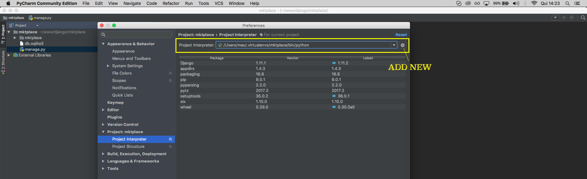

# Criando e configurando projeto

Neste módulo começaremos a organizar a estrutura de nosso projeto.

O Django trabalha com aplicações dentro de nosso projeto, ou seja, imagine que temos uma aplicação de fórum e uma aplicação de enquete, entre outras, o conceito é que criemos estas aplicações e que façamos uma integração, ou uma comunicação, entre elas. O mais importante é entender que a junção de todas as aplicações resultarão em nosso projeto final.

Criaremos uma aplicação, dentro do Django, chamada **portal**, para indicar ao Django que esta será a nossa aplicação base, ou seja, todas as outras rodarão a partir dela. O portal será a entrada do site, onde terão as categorias, os produtos e etc.

Para criar esta aplicação rodaremos o seguinte comando:

`.\manage.py startapp portal`

Depois de rodar este comando você terá a pasta da aplicação criada e terá também um arquivo de banco de dados local, chamado **db.sqlite3**. Quando for subir o projeto online você só precisará fazer a configuração do seu banco online.

O próximo passo é você definir qual IDE vai utilizar para o desenvolvimento. Existem IDEs específicas para trabalho com Python, como a **PyCharm - JetBrains**, que utilizaremos durante este conteúdo, mas você pode utilizar diversas outras ou até mesmo editores de textos, caso queiram.

Falando em PyCharm, existem duas versões: **community** e **professional**. A versão professional tem mais recursos, inclusive alguns recursos específicos para Django.

Não é porque utilizaremos o PyCharm que você não conseguirá seguir o conteúdo com outra IDE, você pode ficar livre para a escolha. A única diferença está em recursos e otimizações, onde temos mais facilidade de autocomplete, sintax Highlight entre outras vantagens, mas um Sublime ou qualquer outra IDE bem configurada pode chegar bem perto destes recursos.

Caso decida utilizar o PyCharm, você pode e deve configurar o **Project Interpreter**, em preferências. Veja a imagem abaixo:



Esta configuração serve para indicar à IDE de onde estão vindo os pacotes utilizados no projeto. Na imagem você pode ver que estamos selecionando o ambiente **mktplace**, que criamos no início deste conteúdo. Você pode ter mais do que um ambiente, então você pode selecionar outros, caso não exista nenhum na listagem você pode adicionar um novo, assim como a imagem também informa.

Com esta configuração o projeto será muito melhor interpretado pela IDE, fazendo toda parte de autocomplete e marcação de sintax corretamente.

Depois que abrir o projeto em sua IDE, verá que temos duas pastas e dois arquivos.

* mktplace
	* Pasta base de configuração do projeto
* portal
	* Pasta de nossa primeiro aplicação, criada com django
* db.sqlite3
	* Arquivo de banco de dados local
* managa.py
	* Arquivo de execução de tarefas referentes ao projeto

Dentro da pasta **mktplace**, existe um arquivo, chamado **settings.py**, que é responsável por toda configuração do projeto, inclusive o gerenciamento de aplicação pertencentes ao projeto principal.

Existe uma seção do arquivo que se chama **INSTALLED_APPS**, que informa quais aplicação fazem parte do projeto principal, então deveremos adicionar nossa aplicação **portal** nesta listagem.

```
INSTALLED_APPS = [
    'django.contrib.admin',
    'django.contrib.auth',
    'django.contrib.contenttypes',
    'django.contrib.sessions',
    'django.contrib.messages',
    'django.contrib.staticfiles',
    'portal',
]
```

Desta forma a aplicação *portal* será carregada juntamente com as demais aplicações.

Para conseguirmos ver a nova configuração funcionando rodaremos as **migrations** presentes no projeto. Rode o comando abaixo:

`.\manage.py migrate`

Este comando criará todas as tabelas iniciais para o django rodar. Isso inclui parte de autenticação, permissões, usuários e etc.

```
Operations to perform:
  Apply all migrations: admin, auth, contenttypes, sessions
Running migrations:
  Applying contenttypes.0001_initial... OK
  Applying auth.0001_initial... OK
  Applying admin.0001_initial... OK
  Applying admin.0002_logentry_remove_auto_add... OK
  Applying contenttypes.0002_remove_content_type_name... OK
  Applying auth.0002_alter_permission_name_max_length... OK
  Applying auth.0003_alter_user_email_max_length... OK
  Applying auth.0004_alter_user_username_opts... OK
  Applying auth.0005_alter_user_last_login_null... OK
  Applying auth.0006_require_contenttypes_0002... OK
  Applying auth.0007_alter_validators_add_error_messages... OK
  Applying auth.0008_alter_user_username_max_length... OK
  Applying sessions.0001_initial... OK
```

Se você analisar o arquivo de banco de dados **db.sqlite3**, verá que ele já tem tabelas criadas.

O próximo passo será criar um **super usuário**, ou seja, criar um usuário que tenha todas as permissões de admin, para que possamos acessar nosso framework e iniciar nossos trabalhos.

`.\manage.py createsuperuser`

```
Username (leave blank to use 'valls'): admin
Email address: admin@admin.com
Password: a1s2d3f4
Password (again): a1s2d3f4
Superuser created successfully.
```

Depois de rodar o comando você deverá preencher os dados do super usuário, conforme código acima.

Agora já temos o Django rodando, a aplicação funcionando, as tabelas, do bando de dados, criadas e o super usuário criado. Basta que rode o servidor novamente para poder acessar a area administrativa do Django.

`.\manage.py runserver`

Agora acesse **http://127.0.0.1:8000/admin/** e entre com o usuário e a senha, criados anteriormente. Você já tem acesso a grupos, usuários, permissões e todas as outras funcionalidades inciais do framework Django.

### Resumindo passos

| Comando | Descrição |
| ------- | --------- |
| `django-admin.exe startproject mktplace` | Comando de criação do projeto principal |
| `.\manage.py startapp portal` | Comando de criação de aplicação |
| `.\manage.py migrate` | Comando de criação de todas as tabelas do projeto |  
| `.\manage.py createsuperuser` | Comando de criação de super usuário para acesso à area administrativa |

Lembrando que logo depois de rodar o comando de criação da aplicação **portal**, nós tivemos que adicionar a aplicação ao arquivo **mktplace/settings.py**, dentro de **INSTALLED_APPS**. Adicione a aplicação ao projeto principal antes de rodar as migrações.

Estes foram os passos executados até agora, para que você possa entender, todo procedimento, e acompanhar o restante dos próximos módulos.